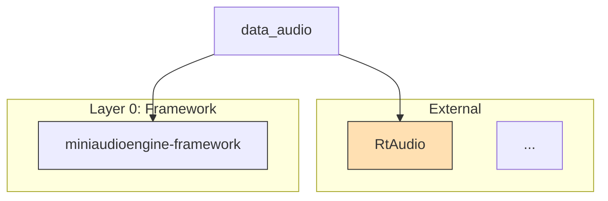

Generate a **Mermaid library dependency diagram** for this project by scanning the CMake build definitions.

## Step 1 — Read build definitions

Read the following CMakeLists files to discover all targets and their dependencies:

- [CMakeLists.txt](../../CMakeLists.txt) — root targets, vcpkg packages, install rules
- [src/CMakeLists.txt](../../src/CMakeLists.txt) — internal library targets
- [tests/CMakeLists.txt](../../tests/CMakeLists.txt) — test targets
- [examples/CMakeLists.txt](../../examples/CMakeLists.txt) — example targets

For each `add_library`, `add_executable`, or `target_link_libraries` call, record:
- **Target name** (the first argument)
- **Dependencies** listed in `target_link_libraries` — separate `PUBLIC`/`PRIVATE`/`INTERFACE`
- Whether it is an **internal target** (defined in this project) or an **external package** (vcpkg/system)

Also read [vcpkg.json](../../vcpkg.json) to get the canonical names of external dependencies.

## Step 2 — Classify nodes

Assign each target a category for styling:

| Category | Examples | Style |
|----------|---------|-------|
| `framework` | `miniaudioengine-framework`, logger, ringbuffer | `fill:#lightblue` |
| `data` | `miniaudioengine-data-audio`, `miniaudioengine-data-midi` | `fill:#lightgreen` |
| `processing` | `miniaudioengine-processing` | `fill:#lightyellow` |
| `control` | `miniaudioengine-control-audio`, `miniaudioengine-control-midi` | `fill:#lightsalmon` |
| `public` | `miniaudioengine` (public API) | `fill:#lightgray` |
| `external` | `RtAudio`, `RtMidi`, `libsndfile`, `GTest` | `fill:#ffe0b2` |
| `test` | `miniaudioengine-unit-tests` | `fill:#e1bee7` |
| `example` | `wav-audio-player`, `midi-device-input` | `fill:#fce4ec` |

## Step 3 — Render the Mermaid diagram

Produce a fenced Mermaid block using `graph TD` (top-down). Apply these conventions:

- Internal targets: use short readable names, e.g. `framework`, `data-audio`, `control-audio`
- External packages: prefix with `ext_`, e.g. `ext_RtAudio`
- Arrow direction: dependency arrow points **from dependent → dependency** (`A --> B` means A depends on B)
- Group related nodes with `subgraph` blocks matching the layer categories above
- Apply `style` directives using the colours from Step 2
- If an `${argument}` scope was provided, filter the diagram to only show targets relevant to that scope and their transitive dependencies; otherwise show the full graph

## Step 4 — Output

Emit only the Mermaid diagram block, preceded by a one-sentence summary of what the diagram covers. Do not emit explanatory prose after the diagram unless a discrepancy or ambiguity was found in the CMake files.

Example output format:

> Full library dependency graph for miniaudioengine — 3 external packages, 6 internal targets, 2 test/example targets.

