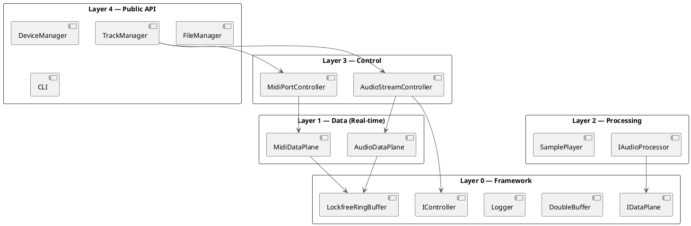
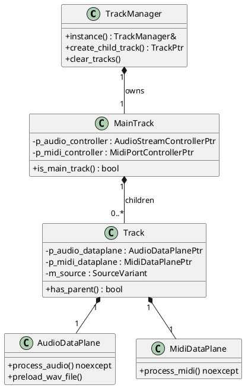

Perform a full architecture review of the miniaudioengine project.

## Layer Model

Dependencies must flow **upward only**. A lower-numbered layer must never `#include` a header from a higher-numbered layer.

```
Layer 4: src/public/
- TrackManager, DeviceManager, FileManager, CLI,
  AudioDevice, MidiDevice, WavFile, MidiFile,
  Sample, SamplePlayer
namespace: miniaudioengine

Layer 3: src/control/
- AudioStreamController, MidiPortController
namespace: miniaudioengine::audio / ::midi

Layer 2: src/processing/ (?)
- IAudioProcessor
namespace: miniaudioengine::audio

Layer 1: src/data/
- AudioDataPlane, MidiDataPlane (real-time callbacks)
namespace: miniaudioengine::core

Layer 0: src/framework/
- LockfreeRingBuffer, DoubleBuffer, Logger, IXxx
namespace: miniaudioengine::core
```

## Step 1 — Collect Headers

For each source file in `src/`, read its `#include` list. Build a map:
```
<file> → [included headers]
```
Focus on project-internal includes (quoted `"..."` headers), not system or external library headers (`<...>`).

## Step 2 — Assign Each File to a Layer

Use the directory prefix rules above to assign a layer number (0–4) to each source and header file.

For headers that live in `include/` subdirectories, assign them the same layer as their parent `src/` directory.

## Step 3 — Detect Violations

A **violation** is any include where:
- `including_file.layer > included_header.layer` is **false** — i.e. the file is at a lower layer but includes a header from a higher layer
- Specifically flag cases like a Layer 1 file including a Layer 3 or 4 header

For each violation, output:
```
[VIOLATION] src/data/audio/audiodataplane.cpp (Layer 1) includes "trackmanager.h" (Layer 4)
```

If no violations are found, state that explicitly.

## Step 4 — Real-Time Safety Audit (Layer 1 only)

Scan all files in `src/data/` for:
- `std::mutex`, `lock_guard`, `unique_lock`, `scoped_lock` → flag as `[RT-MUTEX]`
- `new`, `malloc`, `calloc`, `realloc`, `push_back`, `emplace_back`, `resize`, `insert` → flag as `[RT-ALLOC]`
- `std::this_thread::sleep`, `usleep`, `Sleep(` → flag as `[RT-BLOCK]`
- `MessageQueue` usage → flag as `[RT-QUEUE]`

Report each finding with file + line reference.

## Step 5 — Generate PlantUML Diagrams

The markdown report will be rendered as an A4 PDF, so design diagrams to fit that format. The components within each layer need to be clearly readable, and the dependency arrows should be clear without excessive crossing.
Use the following conventions:
- Components: rectangles with the component name inside
- Layers: group components into packages with the layer name as the package label
- Dependencies: arrows pointing from the including file's component to the included header's component

### Diagram A — Component/Layer Architecture

Show the 5 layers as packages, each containing its key components. Draw dependency arrows **upward** between packages to show allowed flow. If violations were found in Step 3, add a red-dashed arrow labelled `[VIOLATION]`.
Draw each layer vertically, with Layer 0 at the bottom and Layer 4 at the top. Use different colors or styles to distinguish layers and highlight any components involved in violations or real-time safety issues.



Extend or correct this diagram based on what you actually find in the codebase.

### Diagram B — Track Hierarchy (Structural)

Show the runtime object ownership tree:



Extend or correct based on actual source.

### Diagram C — Interface Hierarchy (Framework Layer 0)

Show `IController`, `IDataPlane`, `IManager`, `IProcessor`, `IDevice`, `IAudioDevice` and their key implementors across layers.

## Step 6 — Summary Report

Produce a structured report and write to a file named `ARCHITECTURE_REVIEW.md` in the project root:

```
# Architecture Review Summary

## Contents
[Generate a table of contents based on the sections below]

## Layer Dependency Check
- Files reviewed: N
[Show a table each layer, namespace, and number of violations found]
- Violations found: N (list each in a sub-heading, or "None")

### Violation [n for N violations]

## Real-Time Safety
- Files reviewed: N  
- Issues found: N (list each in a sub-heading, or "None")

### Issue [n for N issues]

## Observations
### Structural Concerns
- Any structural concerns not captured by the rules above
### Deprecated Components
- Any deprecated components still referenced (e.g. IAudioController)
### Missing Test Coverage
- Any components without test coverage

## Diagrams
- [Diagram A — Component Architecture] (PlantUML block)
- [Diagram B — Track Hierarchy] (PlantUML block)
- [Diagram C — Interface Hierarchy] (PlantUML block)
```

In the chat produce a compact summary of the observations.

## Scope Filtering

If the user provided a specific component or path argument, limit Steps 1–4 to that scope but still produce all three diagrams for the full architecture (greying out or omitting components outside scope in the diagrams).
