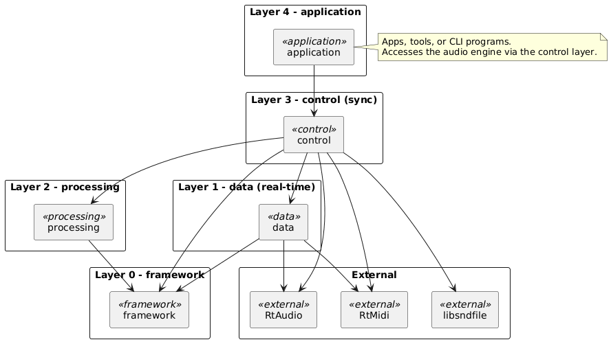

# Mini Audio Engine (C++)

# Introduction

`miniaudioengine` is a cross-platform, lightweight, audio processing C++ SDK. The intention is for audio applications written using this SDK to run on platforms as minimal as a Raspberry Pi.

---

# Contents

---

# Introduction

This specification documents the software design process used to create the  `miniaudioengine` C++ library.

---

# Requirements

## Functional Requirements

- Monitor **audio device** inputs.
- Read **WAV audio files**.
- Monitor **MIDI device** inputs and process **MIDI messages**.
- Read **MIDI files** and process MIDI messages.
- Playback to **audio output device**.
- Write to **WAV audio file**.
- Create **processing** components in between I/O.

## Non-Functional Requirements

- Real-time processing.
- Efficient resource management.
- Cross-platform on **x86** and **ARM64** architectures.
- Modern, C++ code following best practices.

---

# Background

## VST Audio Plugins

## Digital Audio Workstation

---

# High-Level Design

## System Architecture



## User Interface

### SDK

**I/O**

- Device Manager
- File Manager
- Audio Device
- MIDI Device
- WAV File
- MIDI File

**Tracks**

- Track Manager
- Track

## Control Layer

## Data Layer

## Processing Layer

## Framework/External Layer

---

# Software Implementation

## Project Structure

```
examples/
    sampler/
    wav-file-player/
    midi-controller-interface/
src/
    public/
        trackmanager/
        cli/
        io/
            devicemanager/
            filemanager/
    framework/
    control/
        audio/
        midi/
    data/
        audio/
        midi/
    processing/
    cli/
tests/
    mocks/
    unit/
samples/
cmake/
docker/
docs/
CMakeLists.txt
Dockerfile
vcpkg.json
```

## Build Environment

### Developing on Windows

**Requirements**

- Visual Studio 2022 or later (with C++20 support)
- CMake 3.25+
- vcpkg


**Build Steps**

```bash
# Configure with vcpkg integration
cmake -S . -B build -DCMAKE_EXPORT_COMPILE_COMMANDS=ON

# Build
cmake --build build
```

### Developing on Linux

**Requirements**

- GCC 11+ or Clang 14+ (with C++20 support)
- CMake 3.25+
- vcpkg or system packages (RtAudio, RtMidi, libsndfile)

**Build Steps**

```bash
# Configure
cmake -S . -B build -DCMAKE_EXPORT_COMPILE_COMMANDS=ON

# Build
cmake --build build
```

### Docker

For reproducible Linux builds across **x86_64** and **ARM64**

```bash
# Build multi-arch Docker image
cd docker
./docker-build.sh

# Run interactive container
./docker-run.sh

# Execute build inside container
cmake -S . -B build
cmake --build build
```

## Example Programs

### WAV File Player

1. Set up resource managers

```cpp
TrackManager &track_manager = TrackManager::instance();
DeviceManager &device_manager = DeviceManager::instance();
FileManager &file_manager = FileManager::instance();
```

1. Add a Track to the Track Manager

```cpp
size_t track_id = track_manager.add_track();
auto track = track_manager.get_track(track_id);
```

1. Set audio output device

```cpp
auto output_device = device_manager.get_audio_device(audio_output_device_id);

track_manager.set_audio_output_device(output_device);
```

1. Open WAV file

```cpp
auto wav_file = file_manager.read_wav_file(input_file_path);

track->add_audio_input(wav_file);
```

1. Set Track event callback for end of playback

```cpp
track->set_event_callback([](eTrackEvent event) {
    if (event == eTrackEvent::PlaybackFinished) {
        LOG_INFO("Track playback finished.");
        running = false;
    }
});
```

1. Start WAV file playback

```cpp
track->play();
```

1. Wait until Track playback has finished

```cpp
while (running) {
    std::this_thread::sleep_for(std::chrono::milliseconds(100));
}
```

1. Get Track statistics

```cpp
auto stats = track->get_statistics();
LOG_INFO("Playback statistics:\n", stats.to_string());
```

### MIDI Controller Interface

### Sampler

---

# Testing

## Unit Testing

## Profiling / Real-Time Testing

---

# Conclusion

---