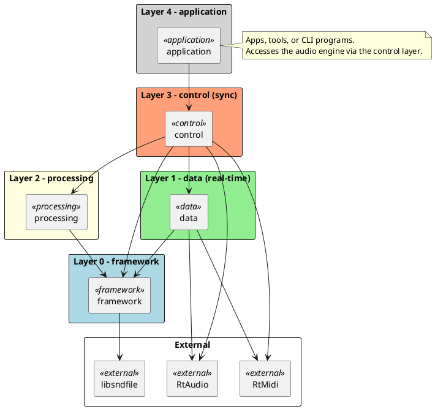
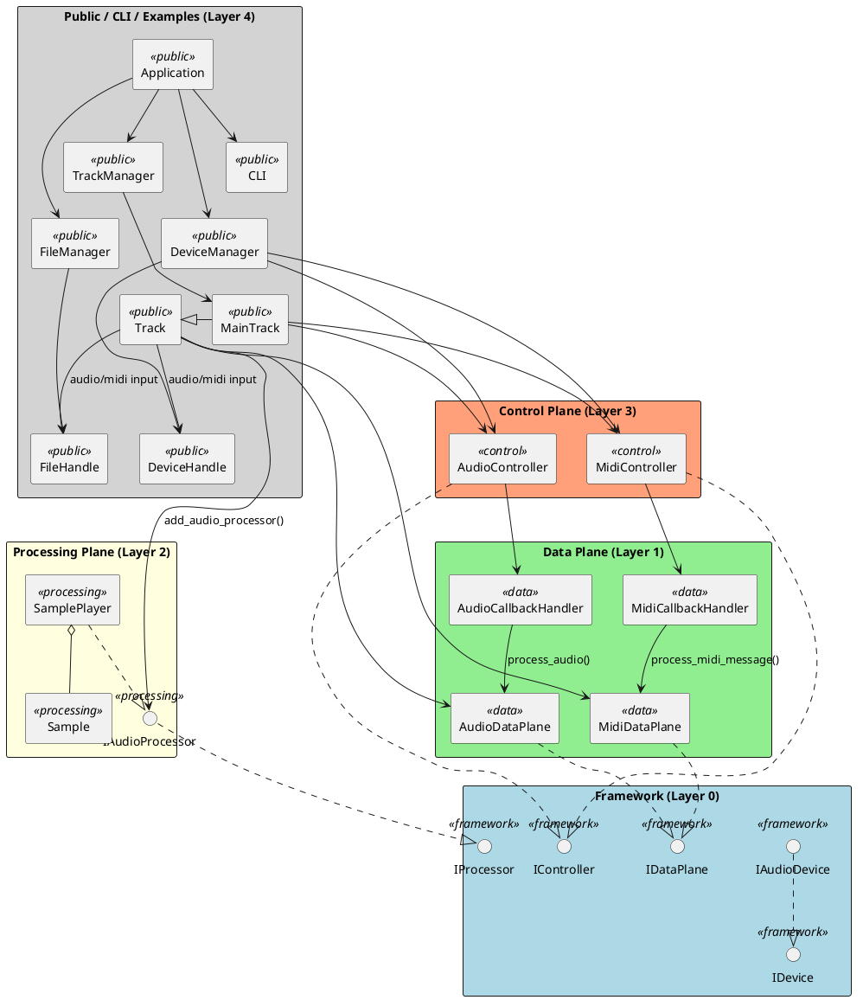

# Introduction

`miniaudioengine` is a cross-platform, lightweight, audio processing C++ SDK. The intention is for audio applications written using this SDK to run on platforms as minimal as a Raspberry Pi.

<div style="page-break-after: always;"></div>

# Contents

- [Introduction](#introduction)
- [Contents](#contents)
- [Requirements](#requirements)
  - [Functional Requirements](#functional-requirements)
  - [Non-Functional Requirements](#non-functional-requirements)
- [Background](#background)
  - [VST Audio Plugins](#vst-audio-plugins)
  - [Digital Audio Workstation](#digital-audio-workstation)
  - [Guitar Effects Pedals](#guitar-effects-pedals)
  - [Eurorack Modular Synthesizers](#eurorack-modular-synthesizers)
- [High-Level Design](#high-level-design)
  - [System Architecture](#system-architecture)
  - [Public API](#public-api)
  - [Control Layer](#control-layer)
  - [Data Layer](#data-layer)
  - [Processing Layer](#processing-layer)
  - [Framework/External Layer](#frameworkexternal-layer)
- [Software Implementation](#software-implementation)
  - [Project Structure](#project-structure)
  - [Build Environment](#build-environment)
    - [Developing on Windows](#developing-on-windows)
    - [Developing on Linux](#developing-on-linux)
    - [Docker](#docker)
    - [VS Code](#vs-code)
  - [Software Architecture](#software-architecture)
  - [Example Workflows](#example-workflows)
    - [Get Audio Devices and Set Output.](#get-audio-devices-and-set-output)
    - [Monitor Audio Input Device](#monitor-audio-input-device)
  - [C++ Coding Conventions](#c-coding-conventions)
    - [Naming Conventions](#naming-conventions)
    - [Specifiers \& Attributes](#specifiers--attributes)
    - [Smart Pointers](#smart-pointers)
    - [Singletons](#singletons)
    - [Comments](#comments)
- [Testing](#testing)
  - [Unit Testing](#unit-testing)
  - [Profiling / Real-Time Testing](#profiling--real-time-testing)
- [Conclusion](#conclusion)

<div style="page-break-after: always;"></div>

# Requirements

## Functional Requirements

- Monitor **audio device** inputs.
- Read **WAV audio files**.
- Monitor **MIDI device** inputs and process **MIDI messages**.
- Read **MIDI files** and process MIDI messages.
- Playback to **audio output device**.
- Write to **WAV audio file**.
- Create **processing** components in between I/O.

## Non-Functional Requirements

- Real-time processing.
- Efficient resource management.
- Cross-platform on **x86** and **ARM64** architectures.
- Modern, C++ code following best practices.

<div style="page-break-after: always;"></div>

# Background

## VST Audio Plugins

## Digital Audio Workstation

## Guitar Effects Pedals

## Eurorack Modular Synthesizers

<div style="page-break-after: always;"></div>

# High-Level Design

## System Architecture



## Public API

**I/O**

- Device Manager
- File Manager
- Audio Device
- MIDI Device
- WAV File
- MIDI File

**Tracks**

- Track Manager
- Track

## Control Layer

## Data Layer

## Processing Layer

## Framework/External Layer

<div style="page-break-after: always;"></div>

# Software Implementation

## Project Structure

```
cmake/
docker/
examples/
samples/
include/
src/
	public/
	framework/
	control/
	data/
	processing/
tests/
	mocks/
	unit/
CMakeLists.txt
CMakePresets.json
Dockerfile
vcpkg.json
```

<div style="page-break-after: always;"></div>

## Build Environment

### Developing on Windows

Requirements:

- Visual Studio 2022 or later (with C++20 support)
- CMake 3.25+
- vcpkg

Build steps:

```bash
# Configure with vcpkg integration
cmake -S . -B build -DCMAKE_EXPORT_COMPILE_COMMANDS=ON

# Build
cmake --build build
```

### Developing on Linux

Requirements:

- GCC 11+ or Clang 14+ (with C++20 support)
- CMake 3.25+
- vcpkg or system packages (RtAudio, RtMidi, libsndfile)

Build steps:

```bash
# Configure
cmake -S . -B build -DCMAKE_EXPORT_COMPILE_COMMANDS=ON

# Build
cmake --build build
```

### Docker

For reproducible Linux builds across x86_64 and ARM64:

```bash
# Build multi-arch Docker image
cd docker
./docker-build.sh

# Run interactive container
./docker-run.sh

# Execute build inside container
cmake -S . -B build
cmake --build build
```

### VS Code

Tasks

Instructions

Prompts

<div style="page-break-after: always;"></div>

## Software Architecture



<div style="page-break-after: always;"></div>

## Example Workflows

### Get Audio Devices and Set Output.

```cpp
DeviceManager device_manager = DeviceManager::instance();
TrackManager track_manager = TrackManager::instance();

// Get default audio input device
DeviceHandlePtr input_device = device_manager.get_default_audio_input_device();
DeviceHandlePtr output_device = nullptr;

// Get all audio devices and search for output
std::vector<DeviceHandlePtr> devices = device_manager.get_audio_devices();
for (DeviceHandlePtr device : devices)
{
  if (device->is_output())
  {
    output_device = device;
  }
}

// Audio output is global. Set it using the TrackManager
// (TODO - Move this to another component)
if (output_device)
{
  track_manager.set_audio_output_device(output_device);
}
```

<div style="page-break-after: always;"></div>

### Monitor Audio Input Device

```cpp
DeviceManager device_manager = DeviceManager::instance();
TrackManager track_manager = TrackManager::instance();

DeviceHandlePtr output_device = device_manager.get_default_audio_output_device();
DeviceHandlePtr input_device = device_manager.get_default_audio_input_device();

// Set audio output device
track_manager.set_audio_output_device(output_device);

// Create miniaudioengine Track
TrackPtr track = track_manager.create_child_track();

// Set audio device input to track
track->add_audio_input(input_device);

// Play track. Monitors audio input and routes it to audio output
track->play();
// ...
track->stop();
```

<div style="page-break-after: always;"></div>

## C++ Coding Conventions

### Naming Conventions

| Element | Convention | Example |
| --- | --- | --- |
| Classes | PascalCase | `AudioDataPlane`, `FileManager` |
| Interfaces | `I` prefix + PascalCase | `IController`, `IDataPlane` |
| Methods | snake_case | `get_output_device()`, `is_running()` |
| Data members | `m_` prefix | `m_running`, `m_stream_state` |
| Pointer members | `p_` prefix | `p_device`, `p_statistics` |
| Enums | `e` prefix + PascalCase type, PascalCase values | `eStreamState::Playing` |
| `shared_ptr` aliases | `Ptr` suffix | `IDataPlanePtr`, `AudioDataPlanePtr` |

### Specifiers & Attributes

- `override` used consistently on all derived virtual methods
- `noexcept` on real-time audio callbacks and time-critical methods
- `explicit` on single-parameter constructors
- `const` extensively applied to getters and parameters
- `constexpr` for compile-time constants/mappings

### Smart Pointers

- `std::shared_ptr` is the primary ownership mechanism
- `std::weak_ptr` for parent references (avoiding cycles)
- Raw pointers only for non-owning references (e.g., RtAudio callback buffers)
- `std::make_shared` used for allocation

### Singletons

- Thread-safe Meyers singleton via `static T& instance()` with private constructor and deleted copy

### Comments

- Doxygen format (`@brief`, `@param`, `@return`, `@throws`, `@deprecated`) on all public APIs
- Brief inline comments for non-obvious logic only

<div style="page-break-after: always;"></div>

# Testing

## Unit Testing

## Profiling / Real-Time Testing

<div style="page-break-after: always;"></div>

# Conclusion
