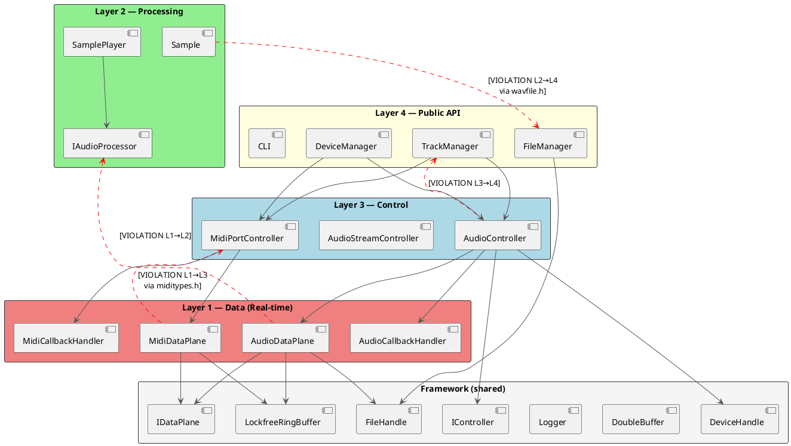
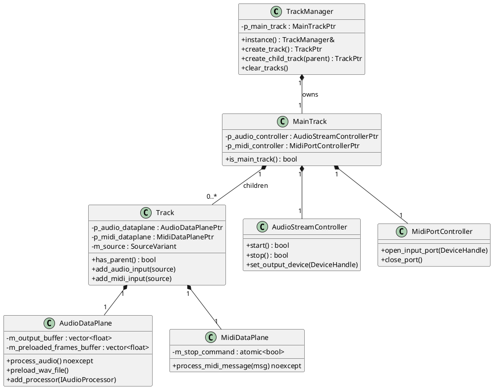
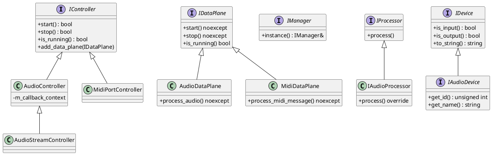
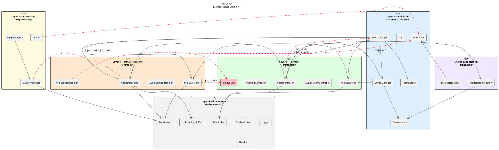
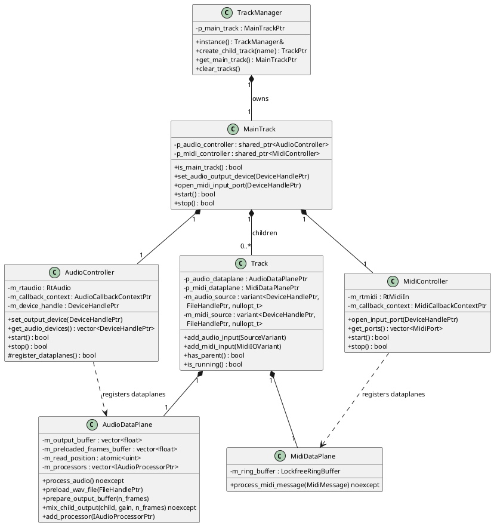
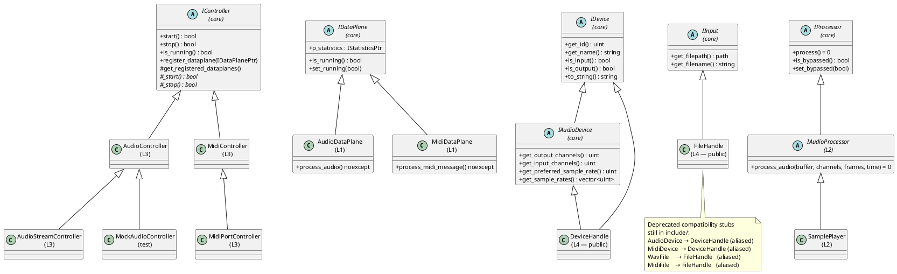

# Architecture Review Summary

**Date:** 2026-03-23  
**Reviewer:** GitHub Copilot  
**Scope:** Full codebase — `src/`, `include/`, `tests/`

---

## Contents

1. [Layer Model](#layer-model)
2. [Layer Dependency Check](#layer-dependency-check)
3. [Real-Time Safety](#real-time-safety)
4. [Observations](#observations)
5. [Diagrams](#diagrams)

---

## Layer Model

```
Layer 4: src/public/      — TrackManager, DeviceManager, FileManager, CLI
Layer 3: src/control/     — AudioStreamController, MidiPortController
Layer 2: src/processing/  — IAudioProcessor, Sample, SamplePlayer
Layer 1: src/data/        — AudioDataPlane, MidiDataPlane (real-time callbacks)
──────────────────────────────────────────────────────────────────────────────
framework (shared — accessible by all layers): src/framework/
          LockfreeRingBuffer, DoubleBuffer, Logger, interfaces,
          DeviceHandle, FileHandle (PImpl wrappers for RtAudio/RtMidi/libsndfile)
```

Dependencies flow **upward only**: Layer 1 may only use framework; Layer 2 may use Layer 1 and framework; etc. Framework is accessible from any layer without restriction.

---

## Layer Dependency Check

- **Files reviewed:** 39 (headers + sources across all `src/` subdirectories)
- **Violations found: 5**

| # | File (Layer) | Offending Include | Target Layer | Severity |
|---|---|---|---|---|
| 1 | `src/data/audio/include/audiodataplane.h` (L1) | `"audioprocessor.h"` | Layer 2 | High |
| 2 | `src/data/midi/src/mididataplane.cpp` (L1) | `"miditypes.h"` | Layer 3 | High |
| 3 | `src/data/midi/src/midicallbackhandler.cpp` (L1) | `"miditypes.h"` | Layer 3 | High |
| 4 | `src/processing/audio/include/sample.h` (L2) | `"miniaudioengine/wavfile.h"` | Layer 4 | Medium |
| 5 | `src/control/audio/src/audiocontroller.cpp` (L3) | `"miniaudioengine/trackmanager.h"` | Layer 4 | Medium |

An additional **build-system violation** exists independently of header-level includes:

| # | File | Offending Link Dependency | Target Layer |
|---|---|---|---|
| 6 | `src/data/audio/CMakeLists.txt` | `target_link_libraries(… trackmanager devicemanager)` | Layer 4 |

### Violation 1 — L1 includes L2 (`audiodataplane.h` → `audioprocessor.h`)

```
[VIOLATION] src/data/audio/include/audiodataplane.h (Layer 1)
            includes "audioprocessor.h" (Layer 2)
```

`AudioDataPlane` stores a `std::vector<std::shared_ptr<audio::IAudioProcessor>>` and exposes `add_processor()` directly in the header. This couples the real-time data plane to the processing abstraction at compile time.

**Remediation:** Forward-declare `IAudioProcessor` in the header; move the `#include "audioprocessor.h"` into `audiodataplane.cpp`. Alternatively, store processors behind an opaque `IDataPlaneProcessor` interface defined in framework.

---

### Violation 2 & 3 — L1 includes L3 (`mididataplane.cpp` / `midicallbackhandler.cpp` → `miditypes.h`)

```
[VIOLATION] src/data/midi/src/mididataplane.cpp (Layer 1)
            includes "miditypes.h" (Layer 3 — src/control/midi/include/)
[VIOLATION] src/data/midi/src/midicallbackhandler.cpp (Layer 1)
            includes "miditypes.h" (Layer 3 — src/control/midi/include/)
```

`miditypes.h` defines `MidiMessage` and related types that are shared between the control layer and the data plane. Placing it under `src/control/midi/` forces the data layer to reach up into Layer 3 to obtain a common type.

**Remediation:** Move `miditypes.h` to `src/framework/include/miditypes.h` (or a new `src/framework/include/midi/`) so it is in the shared layer, accessible by all.

---

### Violation 4 — L2 includes L4 (`sample.h` → `wavfile.h`)

```
[VIOLATION] src/processing/audio/include/sample.h (Layer 2)
            includes "miniaudioengine/wavfile.h" (Layer 4 — deprecated public API type)
```

`Sample` holds a member of the old `WavFile` type, which is a Layer 4 public API class that wraps libsndfile. The processing layer should be decoupled from the legacy public type.

**Remediation:** Replace `WavFile` with `FileHandle` (framework layer). `FileHandle` exposes the same file data and is already the canonical representation post-PImpl refactor.

---

### Violation 5 — L3 includes L4 (`audiocontroller.cpp` → `trackmanager.h`)

```
[VIOLATION] src/control/audio/src/audiocontroller.cpp (Layer 3)
            includes "miniaudioengine/trackmanager.h" (Layer 4)
```

`AudioController` directly queries `TrackManager` to iterate tracks and their data planes during stream startup/teardown. This creates an upward dependency from the control layer into the public API layer.

**Remediation:** Inject the list of `AudioDataPlane` pointers (or an `IDataPlane` collection) into `AudioController` from `TrackManager` at call-time (e.g. pass as argument to `start()`/`stop()`). The controller should not reach into TrackManager itself.

---

### Violation 6 — Build system: `data-audio` links Layer 4 targets

```
[VIOLATION] src/data/audio/CMakeLists.txt
            target_link_libraries(data-audio PUBLIC … trackmanager devicemanager)
```

The `data-audio` static library exports `trackmanager` and `devicemanager` as PUBLIC link dependencies, unnecessarily pulling Layer 4 into the Layer 1 transitive closure.

**Remediation:** Change to `PRIVATE` (if symbols are only needed internally), or remove the dependencies entirely once Violation 1 and Violation 5 are resolved.

---

## Real-Time Safety

- **Files reviewed:** 7 (all `.h` and `.cpp` in `src/data/`)
- **Issues found: 1**

### Issue 1 — `[RT-ALLOC]` `m_output_buffer.resize()` in audio callback

```
[RT-ALLOC] src/data/audio/src/audiodataplane.cpp:179
           m_output_buffer.resize(buffer_size, 0.0f);
           (inside prepare_output_buffer(), called from process_audio() RT callback)
```

`prepare_output_buffer()` is called on every audio callback invocation. It guards the resize with a size check (`if (m_output_buffer.size() != buffer_size)`), so no allocation occurs in steady state. However, the first callback invocation and any channel-count change will reallocate on the RtAudio thread.

**Remediation:** Pre-allocate `m_output_buffer` to the maximum expected size in `AudioDataPlane::init()` or when the output device is configured. Replace the resize with a simple `size()` check and a `std::fill` to zero.

---

The following two sites were also identified but are **not** real-time violations:

| Site | Reason |
|---|---|
| `audiodataplane.cpp:116` `m_preloaded_frames_buffer.resize(…)` | Inside `preload_wav_file()` — called from control plane, not RT callback |
| `audiodataplane.h:128` `m_processors.push_back(processor)` | Inside `add_processor()` — called at setup time, not from RT callback |

---

## Observations

### Structural Concerns

1. **`miditypes.h` belongs in framework.** The type definitions for `MidiMessage` are a shared cross-cutting concern needed by both Layer 1 (data) and Layer 3 (control). Moving it to `src/framework/include/` eliminates violations 2 and 3 cleanly without changing any logic.

2. **`AudioController` (L3) calls `TrackManager` (L4) directly.** `AudioController` iterates `TrackManager::instance()` to collect data planes for stream setup. Inverting this (pass data planes in from TrackManager) would eliminate violation 5 and make AudioController independently testable.

3. **`data-audio` has spurious Layer 4 link deps.** The `data-audio` CMakeLists links `trackmanager` and `devicemanager` as PUBLIC dependencies, propagating the Layer 4 closure to all consumers of `data-audio`.

4. **Processing layer is incomplete and poorly integrated.** `IAudioProcessor` is referenced via a Layer 1 → Layer 2 violation in `audiodataplane.h`. Processors appear to be injected post-construction via `add_processor()` but no orchestration layer exists to manage lifecycles.

### Deprecated Components

| Component | Status | Still Referenced By |
|---|---|---|
| `WavFile` (`include/miniaudioengine/wavfile.h`) | Deprecated (superseded by `FileHandle`) | `src/processing/audio/include/sample.h` |
| `MidiFile` (`include/miniaudioengine/midifile.h`) | Deprecated (superseded by `FileHandle`) | Public headers only |
| `AudioDevice` (`include/miniaudioengine/audiodevice.h`) | Deprecated (superseded by `DeviceHandle`) | Public headers only |
| `MidiDevice` (`include/miniaudioengine/mididevice.h`) | Deprecated (superseded by `DeviceHandle`) | Public headers only |
| `IAudioController` | Superseded by `AudioController` | Referenced in `TrackManager` — `CLAUDE.md` notes it still present |

The legacy `src/public/filemanager/src/wavfile.cpp` implementation file also remains in the source tree.

### Missing Test Coverage

| Component | Location | Coverage |
|---|---|---|
| `IAudioProcessor` | `src/processing/audio/` | None — no tests in `tests/unit/processing/` |
| `Sample` | `src/processing/audio/` | None |
| `SamplePlayer` | `src/processing/sampleplayer/` | None |
| `CLI` | `src/public/cli/` | None |
| `RealtimeAssert` | `src/framework/include/realtime_assert.h` | None (header stub — not yet implemented) |

---

## Diagrams

### Diagram A — Component/Layer Architecture



---

### Diagram B — Track Hierarchy (Structural)



---

### Diagram C — Interface Hierarchy (Framework — shared layer)



- [Layer Dependency Check](#layer-dependency-check)
  - [Violation 1 — audiodataplane.h includes audioprocessor.h (L1→L2)](#violation-1--audiodataplanehincludes-audioprocessorh-l1l2)
  - [Violation 2 — audiodataplane.h includes filehandle.h (L1→L4)](#violation-2--audiodataplanehincludes-filehandleh-l1l4)
  - [Violation 3 — data-midi sources include miditypes.h (L1→L3)](#violation-3--data-midi-sources-include-miditypesh-l1l3)
  - [Violation 4 — audiocontroller.cpp includes trackmanager.h (L3→L4)](#violation-4--audiocontrollercpp-includes-trackmanagerh-l3l4)
  - [Violation 5 — sample.h includes wavfile.h (L2→L4)](#violation-5--sampleh-includes-wavfileh-l2l4)
  - [Violation B1 — data-audio CMakeLists links Layer 4 targets](#violation-b1--data-audio-cmakelists-links-layer-4-targets)
  - [Violation B2 — control-audio CMakeLists links Layer 4 target](#violation-b2--control-audio-cmakelists-links-layer-4-target)
  - [Violation B3/B4 — control-midi ↔ data-midi circular link dependency](#violation-b3b4--control-midi--data-midi-circular-link-dependency)
- [Real-Time Safety](#real-time-safety)
  - [Issue 1 — prepare_output_buffer resize in real-time callback](#issue-1--prepare_output_buffer-resize-in-real-time-callback)
  - [Issue 2 — add_processor push_back reachable from audio thread](#issue-2--add_processor-push_back-reachable-from-audio-thread)
- [Observations](#observations)
  - [Structural Concerns](#structural-concerns)
  - [Deprecated Components](#deprecated-components)
  - [Missing Test Coverage](#missing-test-coverage)
- [Diagrams](#diagrams)

---

## Layer Dependency Check

Files reviewed: **59** across 6 layer directories.

| Layer | Path | Namespace | Files | Source Violations | Build Violations |
|-------|------|-----------|------:|------------------:|-----------------:|
| 0 | `src/framework/` | `miniaudioengine::core` | 12 | 0 | 0 |
| 1 | `src/data/` | `miniaudioengine::core` | 10 | 4 | 2 |
| 2 | `src/processing/` | `miniaudioengine::audio` | 5 | 1 | 0 |
| 3 | `src/control/` | `miniaudioengine::audio / ::midi` | 8 | 1 | 1 |
| 4 | `src/public/`, `include/` | `miniaudioengine` | 20 | 0 | 0 |
| — | `src/shared/` | `miniaudioengine` (cross-cutting) | 4 | — | — |

**Source-level violations: 5. Build-level violations: 4 (including 1 mutual circular dependency).**

---

### Violation 1 — audiodataplane.h includes audioprocessor.h (L1→L2)

```
[VIOLATION] src/data/audio/include/audiodataplane.h (Layer 1)
            includes "audioprocessor.h"
            resolved: src/processing/audio/include/audioprocessor.h (Layer 2)
```

`audiodataplane.h` holds a `std::vector<std::shared_ptr<audio::IAudioProcessor>> m_processors`
member and exposes `add_processor()` as an inline method. This pulls a Layer 2 type into a Layer 1
header, causing every consumer of the data plane to transitively depend on the processing layer.

**Fix:** Replace with a forward declaration or promote `IAudioProcessor` to `src/framework/` (Layer 0)
so it is available to all layers without violating dependency direction.

---

### Violation 2 — audiodataplane.h includes filehandle.h (L1→L4)

```
[VIOLATION] src/data/audio/include/audiodataplane.h (Layer 1)
            includes "miniaudioengine/filehandle.h"
            resolved: include/miniaudioengine/filehandle.h (Layer 4 — public API)
```

`FileHandle` / `FileHandlePtr` lives in the public API directory (`include/miniaudioengine/`),
which is Layer 4 by directory assignment. `audiodataplane.h` uses `FileHandlePtr` as a parameter
type for `preload_wav_file()`.

**Note:** `filehandle.h` has no internal includes and contains only an opaque PImpl handle — it is a
pure data-transfer type. This violation was introduced intentionally by the PImpl refactor to break
the libsndfile dependency in public headers. The structural fix is to relocate `filehandle.h` and
`devicehandle.h` to `src/framework/include/` (Layer 0), making them available to all layers without
violating the dependency direction.

---

### Violation 3 — data-midi sources include miditypes.h (L1→L3)

```
[VIOLATION] src/data/midi/src/mididataplane.cpp (Layer 1)
            includes "miditypes.h"
            resolved: src/control/midi/include/miditypes.h (Layer 3)

[VIOLATION] src/data/midi/src/midicallbackhandler.cpp (Layer 1)
            includes "miditypes.h"
            resolved: src/control/midi/include/miditypes.h (Layer 3)
```

`miditypes.h` defines `eMidiMessageType`, `MidiMessage`, and the `midi_message_type_names` constexpr
lookup table — all pure data types needed by the real-time MIDI callback. Their placement in
`src/control/midi/include/` is the root cause; they should live in `src/framework/include/` (or a
dedicated `src/shared/midi/`) so Layer 1 can include them without crossing upward. This violation
also drives the circular CMake link dependency in B3/B4 below.

---

### Violation 4 — audiocontroller.cpp includes trackmanager.h (L3→L4)

```
[VIOLATION] src/control/audio/src/audiocontroller.cpp (Layer 3)
            includes "miniaudioengine/trackmanager.h"
            resolved: include/miniaudioengine/trackmanager.h (Layer 4)
```

`TrackManager` is never referenced in the translation unit body — this appears to be a **stale
leftover** from a prior refactor. The include should be removed.

---

### Violation 5 — sample.h includes wavfile.h (L2→L4)

```
[VIOLATION] src/processing/audio/include/sample.h (Layer 2)
            includes "miniaudioengine/wavfile.h"
            resolved: include/miniaudioengine/wavfile.h (Layer 4 — deprecated stub)
```

The `Sample` struct constructor takes a `WavFilePtr` to copy metadata at construction time.
`wavfile.h` is a `[[deprecated]]` compatibility stub that re-exports `FileHandle`. Since `Sample`
only reads metadata (sample rate, channels, total frames), it could instead accept a `FileHandlePtr`
directly, removing the L4 dependency and the deprecated type from the processing layer.

---

### Violation B1 — data-audio CMakeLists links Layer 4 targets

```
[BUILD-VIOLATION] src/data/audio/CMakeLists.txt (Layer 1)
  target_link_libraries(data-audio PUBLIC devicemanager trackmanager processor-audio)
```

`data-audio` publicly links against `devicemanager` and `trackmanager`, both Layer 4. Combined with
`trackmanager → data-audio` in its own CMakeLists, this creates a **dependency cycle**
(`data-audio → trackmanager → data-audio`). CMake resolves this for static libraries via link-group
expansion, but it indicates circular coupling that prevents isolated unit-test compilation.
Neither `devicemanager` nor `trackmanager` headers are included from any `src/data/audio/` file;
these CMake entries should be removed once the include-level violations are resolved.

---

### Violation B2 — control-audio CMakeLists links Layer 4 target

```
[BUILD-VIOLATION] src/control/audio/CMakeLists.txt (Layer 3)
  target_link_libraries(control-audio PUBLIC devicemanager)
```

`control-audio` links `devicemanager` (Layer 4). `AudioController` uses `DeviceHandleFactory` from
`src/shared/` — not `DeviceManager` directly. This CMake link is broader than necessary and should
be narrowed to `framework` + `shared`.

---

### Violation B3/B4 — control-midi ↔ data-midi circular link dependency

```
[BUILD-VIOLATION] src/data/midi/CMakeLists.txt (Layer 1)
  target_link_libraries(data-midi PUBLIC control-midi)

[BUILD-VIOLATION] src/control/midi/CMakeLists.txt (Layer 3)
  target_link_libraries(control-midi PUBLIC data-midi)
```

`data-midi` and `control-midi` mutually link each other. This is the build-system manifestation of
Violation 3: `miditypes.h` lives in `control-midi`'s include tree, so `data-midi` must link against
`control-midi` to find it. Moving `miditypes.h` to Layer 0 would break this cycle cleanly.

---

## Real-Time Safety

Files reviewed in `src/data/`: **10**  
Issues found: **2**

---

### Issue 1 — prepare_output_buffer resize in real-time callback

```
[RT-ALLOC] src/data/audio/src/audiodataplane.cpp
           prepare_output_buffer() called from process_audio() — hot callback path

  void AudioDataPlane::prepare_output_buffer(unsigned int n_frames)
  {
    size_t buffer_size = n_frames * m_output_channels;
    if (m_output_buffer.size() != buffer_size)
    {
      m_output_buffer.resize(buffer_size, 0.0f);  // heap allocation inside callback
    }
    ...
  }
```

`prepare_output_buffer()` is called unconditionally at the top of every `process_audio()` invocation.
The `resize` is conditional on a size mismatch, but any change in `n_frames` or `m_output_channels`
(e.g., at stream-open time or if the host buffer size varies) causes heap allocation inside the
RtAudio callback thread.

**Fix:** Pre-allocate `m_output_buffer` to the maximum expected size in `_start()` or a dedicated
`prepare()` call before stream start. In `prepare_output_buffer()`, assert the size is correct rather
than resizing; use `std::fill` directly on the pre-allocated buffer.

---

### Issue 2 — add_processor push_back reachable from audio thread

```
[RT-ALLOC] src/data/audio/include/audiodataplane.h:128

  void add_processor(std::shared_ptr<audio::IAudioProcessor> processor)
  {
    m_processors.push_back(processor);  // may reallocate — no thread guard
  }
```

`add_processor()` is an inline public method with no thread guard or state assertion. If called
while the stream is running, the `push_back` may reallocate the underlying `std::vector` on the
audio thread. The method should enforce a pre-stream-only contract:

```cpp
void add_processor(std::shared_ptr<audio::IAudioProcessor> processor)
{
  assert(!is_running() && "add_processor() must be called before stream starts");
  m_processors.push_back(processor);
}
```

For runtime processor insertion, a `LockfreeRingBuffer<IXxx>` command channel should be used
instead of direct mutation.

---

## Observations

### Structural Concerns

1. **Public API exposes internal implementation headers.**  
   `include/miniaudioengine/track.h` includes `audiodataplane.h` and `mididataplane.h` (Layer 1
   internals); any client that includes `track.h` transitively pulls in RtAudio type definitions.
   Similarly, `include/miniaudioengine/devicemanager.h` includes `audiocontroller.h` and
   `midicontroller.h` (Layer 3 internals), exposing controller types in the public surface.
   Both headers should use forward declarations and expose only PImpl handle types.

2. **`src/shared/` is an unclassified layer.**  
   The PImpl refactor introduced `src/shared/` for `DeviceHandleFactory` and `FileHandleFactory`,
   but the layer model assigns no number to this directory. Its handle types (`FileHandle`,
   `DeviceHandle`) are consumed at both Layer 1 (Violation 2) and Layer 3, yet live in
   `include/miniaudioengine/` (Layer 4 by location). relocating them to `src/framework/` would
   eliminate Violation 2 and clarify the layer model.

3. **Stale include in audiocontroller.cpp.**  
   `src/control/audio/src/audiocontroller.cpp` includes `"miniaudioengine/trackmanager.h"` but
   never references `TrackManager`. This dead include widens compile-time dependencies and was
   the cause of Violation 4.

4. **`data-audio → trackmanager → data-audio` cmake cycle.**  
   The public link `data-audio → trackmanager` combined with `trackmanager → data-audio` constitutes
   a circular CMake link structure. While it builds using static library link-group expansion, it
   prevents clean incremental rebuilds and makes unit-test isolation difficult.

### Deprecated Components

| Header | Status | Replacement |
|--------|--------|-------------|
| `include/miniaudioengine/audiodevice.h` | `[[deprecated]]` `typedef` | `DeviceHandle` / `DeviceHandlePtr` |
| `include/miniaudioengine/mididevice.h` | `[[deprecated]]` `typedef` | `DeviceHandle` / `DeviceHandlePtr` |
| `include/miniaudioengine/wavfile.h` | Deprecated compatibility stub | `FileHandle` / `FileHandlePtr` |
| `include/miniaudioengine/midifile.h` | Deprecated compatibility stub | `FileHandle` / `FileHandlePtr` |

`sample.h` (Layer 2) still includes the deprecated `wavfile.h` stub (Violation 5), keeping the
deprecated type alive in the processing layer.

### Missing Test Coverage

| Component | Path | Status |
|-----------|------|--------|
| `IAudioProcessor` | `src/processing/audio/` | No tests |
| `Sample` | `src/processing/audio/include/sample.h` | No tests |
| `SamplePlayer` | `src/processing/sampleplayer/` | No tests |
| `DeviceHandleFactory` | `src/shared/` | No tests |
| `FileHandleFactory` | `src/shared/` | No tests |
| `CLI` | `src/public/cli/` | No tests |
| `MainTrack` | `src/public/trackmanager/` | Indirect only (via TrackManager tests) |
| MIDI callback path | `src/data/midi/src/midicallbackhandler.cpp` | Minimal (hardware-dependent) |

---

## Diagrams

### Diagram A — Component/Layer Architecture



---

### Diagram B — Track Hierarchy (Structural)



---

### Diagram C — Interface Hierarchy (Framework Layer 0)


