<style>
@page { @bottom-center { content: counter(page); } }
</style>

# Software Design Description

**miniaudioengine**

<div style="page-break-after: always;"></div>

## Table of Contents

- [Software Design Description](#software-design-description)
  - [Table of Contents](#table-of-contents)
  - [1 Introduction](#1-introduction)
  - [2 Stakeholders and Design Concerns](#2-stakeholders-and-design-concerns)
    - [2.1 Stakeholders](#21-stakeholders)
    - [2.2 Design Concerns](#22-design-concerns)
  - [3 Design Views](#3-design-views)
    - [3.1 Context View](#31-context-view)
    - [3.2 Composition View](#32-composition-view)
      - [3.2.1 miniaudioengine SDK](#321-miniaudioengine-sdk)
      - [3.2.2 Device Manager](#322-device-manager)
      - [3.2.3 File Manager](#323-file-manager)
      - [3.2.4 Track Manager](#324-track-manager)
    - [3.3 Logical View](#33-logical-view)
      - [3.4.1 Monitor Input Device Flow](#341-monitor-input-device-flow)
      - [3.4.2 Open File Flow](#342-open-file-flow)
      - [3.4.3 Play to Output Device Flow](#343-play-to-output-device-flow)
      - [3.4.4 MIDI Message Flow](#344-midi-message-flow)
      - [3.4.5 Audio Processing Flow](#345-audio-processing-flow)
      - [3.4.6 Multiple Track Flow](#346-multiple-track-flow)
    - [3.4 Dependency View](#34-dependency-view)
    - [3.5 Information View](#35-information-view)
      - [3.5.1 Devices](#351-devices)
      - [3.5.2 Files](#352-files)
      - [3.5.3 Tracks](#353-tracks)
    - [3.6 Interface View](#36-interface-view)
      - [3.6.1 Public SDK](#361-public-sdk)
      - [3.6.2 Example Programs](#362-example-programs)
    - [3.7 Interaction View](#37-interaction-view)
      - [3.7.1 Audio Input to Audio Output](#371-audio-input-to-audio-output)
      - [3.7.3 MIDI Input Processing](#373-midi-input-processing)
    - [3.8 Structure View](#38-structure-view)
      - [3.8.1 Project Structure](#381-project-structure)
  - [4 Design Rationale](#4-design-rationale)
    - [4.1 Architectural Design](#41-architectural-design)
      - [4.1.2 Track Hierarchy](#412-track-hierarchy)
      - [4.1.3 Control Flow](#413-control-flow)
      - [4.1.4 Data Flow](#414-data-flow)
    - [4.2 External Libraries](#42-external-libraries)

<div style="page-break-after: always;"></div>

## 1 Introduction

<div style="page-break-after: always;"></div>

## 2 Stakeholders and Design Concerns

### 2.1 Stakeholders

| Stakeholder | Responsibilities | Design Concerns |
| -- | -- | -- |
| Software User | - Monitor audio input device.<br>- Monitor MIDI input device.<br>- Read audio files<br>- Play audio to output device.<br>- Play MIDI to output device. | DC-01<br>DC-02<br>DC-03<br>DC-04<br>DC-05<br>DC-06 |
| Third-Party Developer | - Include SDK in C++ software application.<br>- Handle incoming MIDI messages.<br>- Process audio input.<br>- Route processed audio to output device.<br>- Manage audio in multiple tracks. | DC-07<br>DC-08<br>DC-09<br>DC-10<br>DC-11<br>DC-12<br>DC-13<br>DC-14<br>DC-17<br>DC-18 |
| Maintainer | - Maintain CI/CD pipeline.<br>- Manage code repo.<br>- Manage software releases. | DC-13<br>DC-14<br>DC-15<br>DC-16<br>DC-17 |
| Hardware | - Run on a Windows desktop.<br>- Run on an embedded Linux platform. | DC-13<br>DC-14 |

### 2.2 Design Concerns

| ID | Description | Relevant Views |
| -- | -- | -- |
| **DC-01** | Monitor audio input device. | Logical
| **DC-02** | Monitor MIDI input device. | Logical
| **DC-03** | Open and read WAV audio files. | Logical
| **DC-04** | Open and read MIDI files. | Logical
| **DC-05** | Route audio to output device. | Logical
| **DC-06** | Route MIDI to output device. | Logical
| **DC-07** | Processing incoming MIDI messages. | Logical
| **DC-08** | Processing incoming audio streams. | Logical
| **DC-09** | Manage multiple audio tracks. | Logical
| **DC-10** | Add one audio or MIDI input to a track. | Logical
| **DC-11** | Attach one audio or MIDI output to a track. | Logical
| **DC-12** | Chain multiple audio processors in one track. | Logical
| **DC-13** | Build software SDK on Windows and Linux. | Context
| **DC-14** | Build software SDK on x86_64 and ARM64 platforms. |
| **DC-15** | CI/CD pipeline builds and packages software on all compatible platforms. |
| **DC-16** | Complete unit testing and code coverage. |
| **DC-17** | Package software as an SDK used by third-party software. | Context, Composition
| **DC-18** | Third-party software developers manage audio tracks, system audio/MIDI devices, and filesystem. | Composition

<div style="page-break-after: always;"></div>

## 3 Design Views

### 3.1 Context View

Describes the software in context with its external environment. Define users, external components, and the interactions between.

| Design Concern | |
| -- | -- |
| **DC-13** | Build software SDK on Windows and Linux. |
| **DC-17** | Package software as an SDK used by third-party software. |

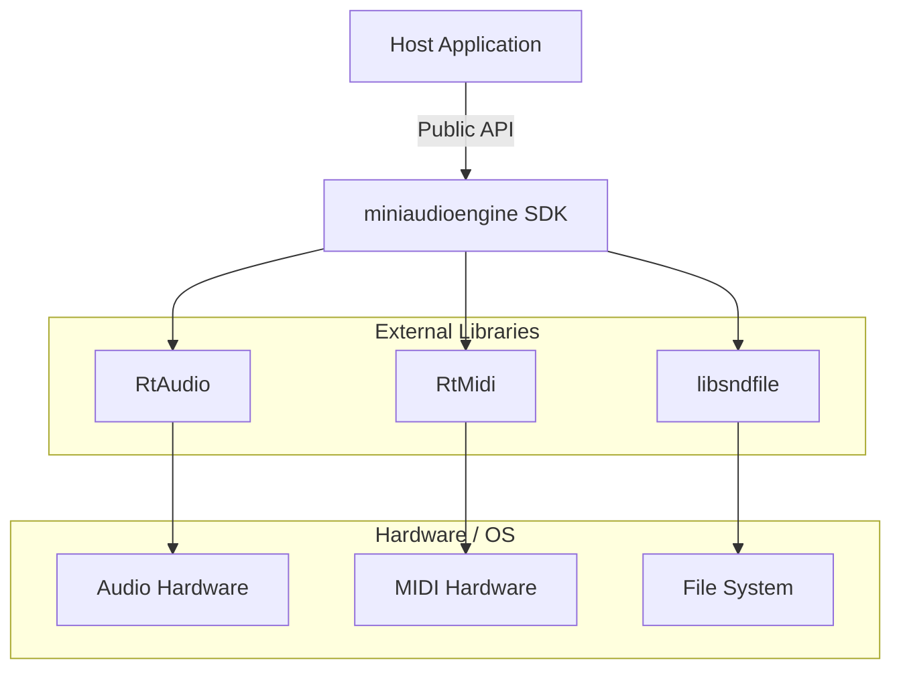

<div style="page-break-after: always;"></div>

### 3.2 Composition View

Describe the composition of the **miniaudioengine** SDK software libraries.

| Design Concern | |
| -- | -- |
| **DC-17** | Package software as an SDK used by third-party software. |
| **DC-18** | Third-party software developers manage audio tracks, system audio/MIDI devices, and filesystem. |

#### 3.2.1 miniaudioengine SDK

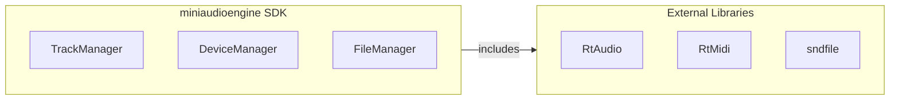

#### 3.2.2 Device Manager

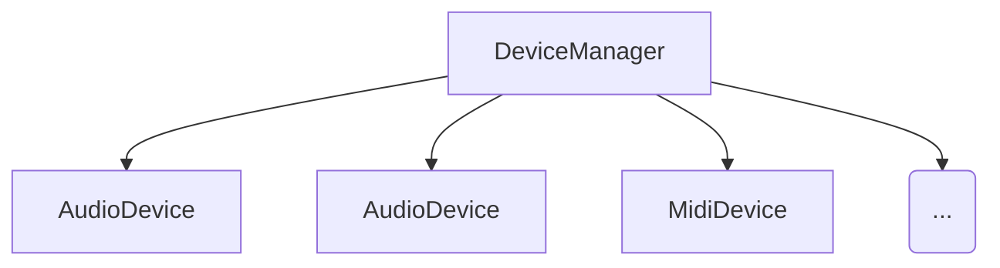

#### 3.2.3 File Manager

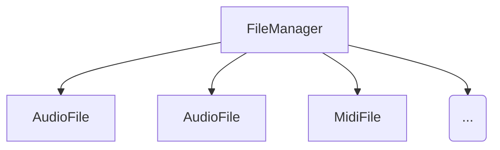

#### 3.2.4 Track Manager

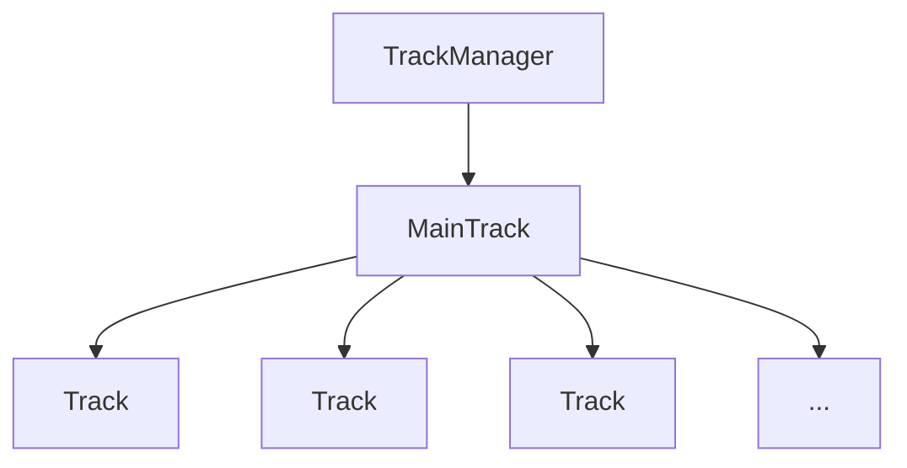

<div style="page-break-after: always;"></div>

### 3.3 Logical View

#### 3.4.1 Monitor Input Device Flow

| Design Concern |     |
| -------------- | --- |
| **DC-01** | Monitor audio input device.
| **DC-02** | Monitor MIDI input device.


#### 3.4.2 Open File Flow

| Design Concern | |
| -- | -- |
| **DC-03** | Open and read WAV audio files.
| **DC-04** | Open and read MIDI files.


#### 3.4.3 Play to Output Device Flow

| Design Concern |     |
| -------------- | --- |
| **DC-05** | Route audio to output device.
| **DC-06** | Route MIDI to output device.


#### 3.4.4 MIDI Message Flow

| Design Concern | |
| -- | -- |
| **DC-07** | Processing incoming MIDI messages.

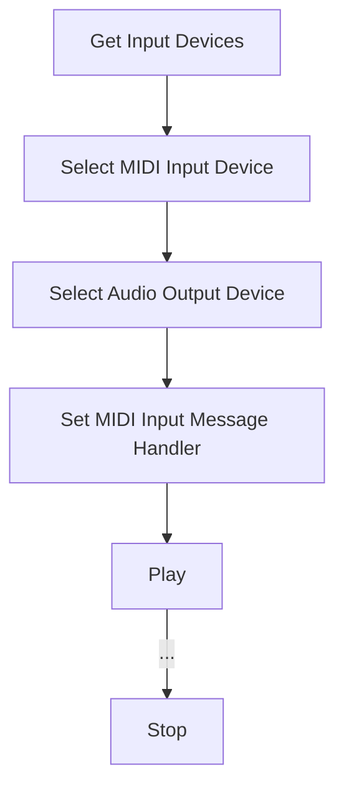

<div style="page-break-after: always;"></div>

#### 3.4.5 Audio Processing Flow

| Design Concern | |
| -- | -- |
| **DC-08** | Processing incoming audio streams.

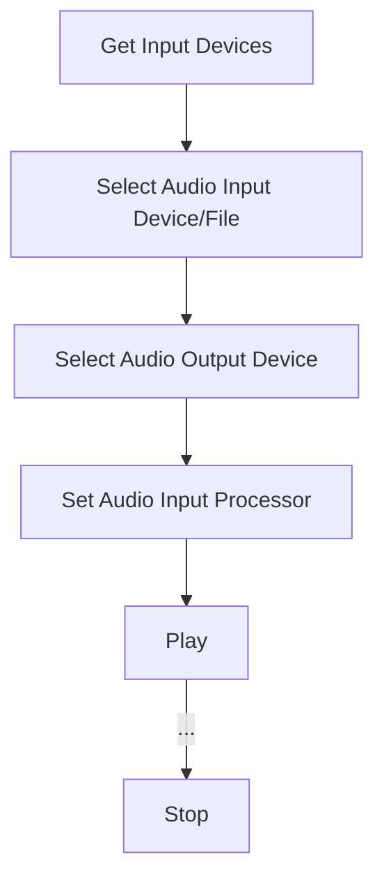

<div style="page-break-after: always;"></div>

#### 3.4.6 Multiple Track Flow

| Design Concern |                                               |
| -------------- | --------------------------------------------- |
| **DC-09**      | Manage multiple audio tracks.                 |
| **DC-10**      | Add one audio or MIDI input to a track.       |
| **DC-11**      | Attach one audio or MIDI output to a track.   |
| **DC-12**      | Chain multiple audio processors in one track. |

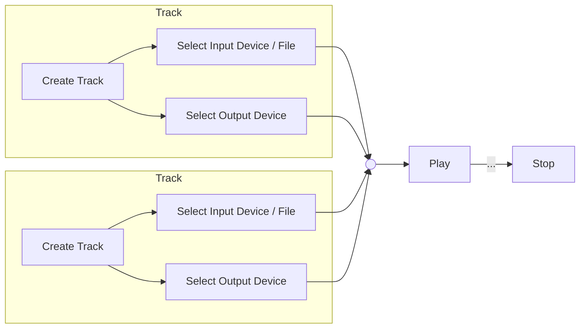

<div style="page-break-after: always;"></div>

### 3.4 Dependency View

<div style="page-break-after: always;"></div>

### 3.5 Information View

#### 3.5.1 Devices

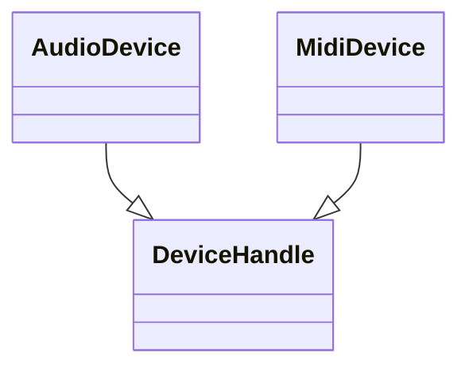

#### 3.5.2 Files

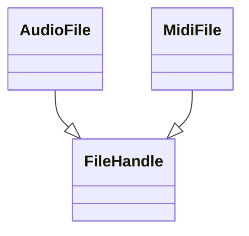

#### 3.5.3 Tracks


<div style="page-break-after: always;"></div>

### 3.6 Interface View

#### 3.6.1 Public SDK

```C++
// miniaudioengine.h

// Types
using DeviceHandlePtr = std::shared_ptr<DeviceHandle>;
using FileHandlePtr = std::shared_ptr<FileHandle>;
using TrackPtr = std::shared_ptr<Track>;

// Playback
bool miniaudioengine::play();
bool miniaudioengine::record();
bool miniaudioengine::stop();
bool miniaudioengine::is_running();

// Devices
std::shared_ptr<DeviceManager> miniaudioengine::get_device_manager();
std::vector<DeviceHandlePtr> miniaudioengine::get_audio_devices();
std::vector<DeviceHandlePtr> miniaudioengine::get_midi_devices();
bool miniaudioengine::set_output_device(DeviceHandlePtr device);
bool miniaudioengine::set_input_device(DeviceHandlePtr device);

// Files
std::shared_ptr<FileManager> miniaudioengine::get_file_manager();
std::vector<FileHandlePtr> miniaudioengine::get_audio_files(const std::filesystem::path &directory);
std::vector<FileHandlePtr> miniaudioengine::get_wav_files(const std::filesystem::path &directory);
bool miniaudioengine::set_input_file(FileHandlePtr device);

// Tracks
std::shared_ptr<TrackManager> miniaudioengine::get_track_manager();
std::vector<TrackPtr> miniaudioengine::get_tracks();
TrackPtr miniaudioengine::add_track();
bool miniaudioengine::remove_track(TrackPtr track);
bool miniaudioengine::clear_tracks();
```

<div style="page-break-after: always;"></div>

#### 3.6.2 Example Programs

<div style="page-break-after: always;"></div>

### 3.7 Interaction View

#### 3.7.1 Audio Input to Audio Output

**Control Plane**

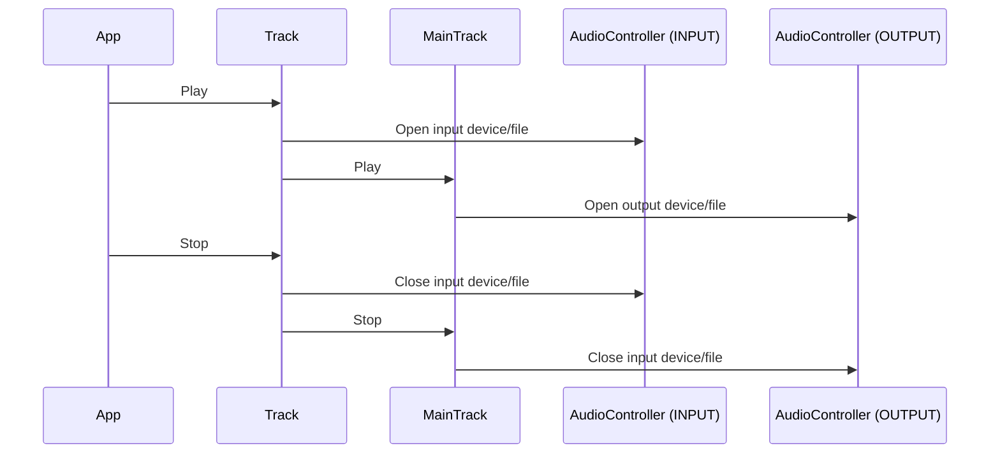

**Data Plane**

<div style="page-break-after: always;"></div>

#### 3.7.3 MIDI Input Processing

**Control Plane**

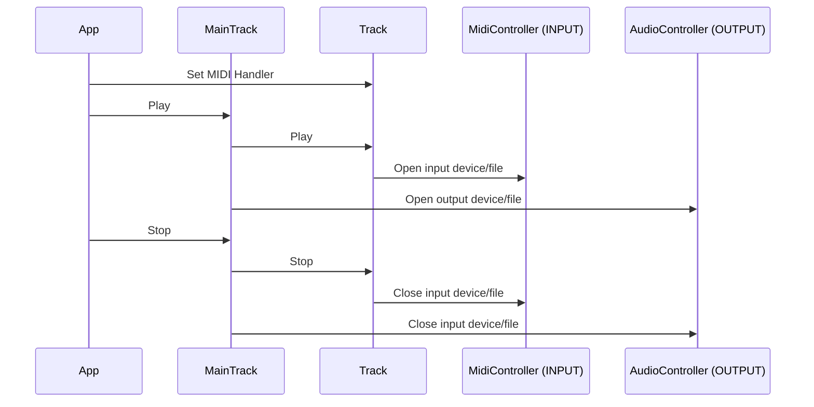

<div style="page-break-after: always;"></div>

### 3.8 Structure View

#### 3.8.1 Project Structure

```bash
cmake/
    miniaudioengine-config.cmake.in
docker/
    docker-build.sh
    docker-run.sh
    docker-setup.sh
    docker-exec.sh
docs/
examples/                   # Example programs using miniaudioengine SDK
samples/
include/
    miniaudioengine/
        miniaudioengine.h   # Public facing SDK
src/
    framework/              # Internal, core shared library
        audio/
        midi/
    devices/
    files/
    tracks/
tests/
CMakeLists.txt              # CMake instructions
CMakePresets.json           # CMake presets
Dockerfile                  # Build Docker image for build environment
vcpkg.json                  # Windows VCPKG dependencies
```

<div style="page-break-after: always;"></div>

## 4 Design Rationale

### 4.1 Architectural Design

#### 4.1.2 Track Hierarchy

#### 4.1.3 Control Flow

#### 4.1.4 Data Flow

### 4.2 External Libraries
