\newpage

# 1. Introduction

\newpage

# 2. Stakeholders and Design Concerns

## 2.1. Stakeholders

| Stakeholder | Responsibilities | Design Concerns |
| -- | -- | -- |
| Software User | - Monitor audio input device.\newline- Monitor MIDI input device.\newline- Read audio files\newline- Play audio to output device.\newline- Play MIDI to output device. | DC-01\newline DC-02\newline DC-03\newline DC-04\newline DC-05\newline DC-06 |
| Third-Party Developer | - Include SDK in C++ software application.\newline- Handle incoming MIDI messages.\newline- Process audio input.\newline- Route processed audio to output device.\newline- Manage audio in multiple tracks. | DC-07\newline DC-08\newline DC-09\newline DC-10\newline DC-11\newline DC-12\newline DC-13\newline DC-14\newline DC-17\newline DC-18 |
| Maintainer | - Maintain CI/CD pipeline.\newline- Manage code repo.\newline- Manage software releases. | DC-13\newline DC-14\newline DC-15\newline DC-16\newline DC-17 |
| Hardware | - Run on a Windows desktop.\newline- Run on an embedded Linux platform. | DC-13\newline DC-14 |

## 2.2. Design Concerns

| ID | Description | Relevant Views |
| -- | -- | -- |
| **DC-01** | Monitor audio input device. | Logical
| **DC-02** | Monitor MIDI input device. | Logical
| **DC-03** | Open and read WAV audio files. | Logical
| **DC-04** | Open and read MIDI files. | Logical
| **DC-05** | Route audio to output device. | Logical
| **DC-06** | Route MIDI to output device. | Logical
| **DC-07** | Processing incoming MIDI messages. | Logical
| **DC-08** | Processing incoming audio streams. | Logical
| **DC-09** | Manage multiple audio tracks. | Logical
| **DC-10** | Add one audio or MIDI input to a track. | Logical
| **DC-11** | Attach one audio or MIDI output to a track. | Logical
| **DC-12** | Chain multiple audio processors in one track. | Logical
| **DC-13** | Build software SDK on Windows and Linux. | Context
| **DC-14** | Build software SDK on x86_64 and ARM64 platforms. |
| **DC-15** | CI/CD pipeline builds and packages software on all compatible platforms. |
| **DC-16** | Complete unit testing and code coverage. |
| **DC-17** | Package software as an SDK used by third-party software. | Context, Composition
| **DC-18** | Third-party software developers manage audio tracks, system audio/MIDI devices, and filesystem. | Composition

\newpage

# 3. Design Views

## 3.1. Context View

Describes the software in context with its external environment. Define users, external components, and the interactions between.

| Design Concern | |
| -- | -- |
| **DC-13** | Build software SDK on Windows and Linux. |
| **DC-17** | Package software as an SDK used by third-party software. |

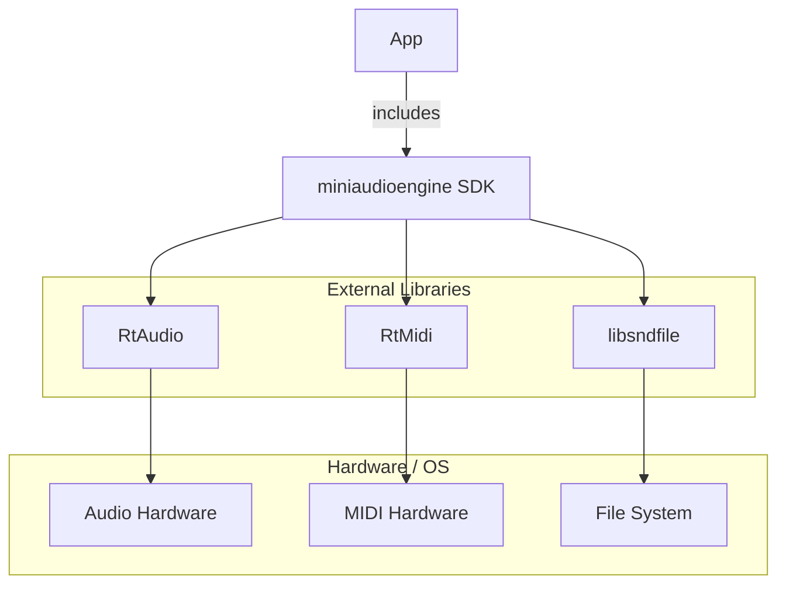

\newpage

## 3.2. Composition View

Describe the composition of the **miniaudioengine** SDK software libraries.

| Design Concern | |
| -- | -- |
| **DC-17** | Package software as an SDK used by third-party software. |
| **DC-18** | Third-party software developers manage audio tracks, system audio/MIDI devices, and filesystem. |

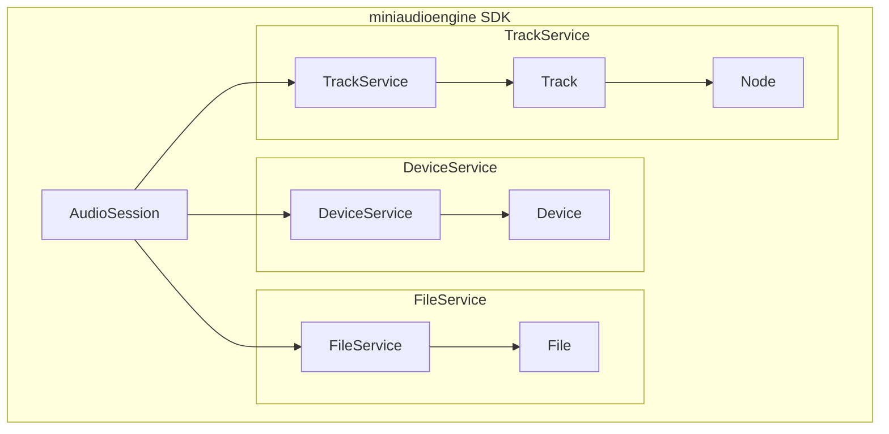

\newpage

## 3.3. Logical View

### 3.3.1. Record Audio/MIDI Input

| Design Concern |     |
| -------------- | --- |
| **DC-01** | Monitor audio input device.
| **DC-02** | Monitor MIDI input device.


### 3.3.2. Play Audio/MIDI File

| Design Concern | |
| -- | -- |
| **DC-03** | Open and read WAV audio files.
| **DC-04** | Open and read MIDI files.


### 3.3.3. Playback to Output Device

| Design Concern |     |
| -------------- | --- |
| **DC-05** | Route audio to output device.
| **DC-06** | Route MIDI to output device.


### 3.3.4. Read MIDI Messages

| Design Concern | |
| -- | -- |
| **DC-07** | Processing incoming MIDI messages.


\newpage

### 3.3.5. Audio Processing

| Design Concern | |
| -- | -- |
| **DC-08** | Processing incoming audio streams.


\newpage

### 3.3.6. Multiple Tracks

| Design Concern |                                               |
| -------------- | --------------------------------------------- |
| **DC-09**      | Manage multiple audio tracks.                 |
| **DC-10**      | Add one audio or MIDI input to a track.       |
| **DC-11**      | Attach one audio or MIDI output to a track.   |
| **DC-12**      | Chain multiple audio processors in one track. |

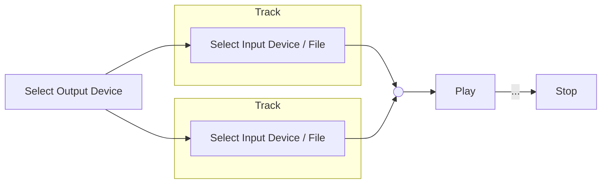

\newpage

## 3.4. Dependency View

The components in this SDK depend on the file system, audio and MIDI devices on the host system.
Separating devices and files into different services divides the dependency.

### 3.4.1. Layer Hierarchy

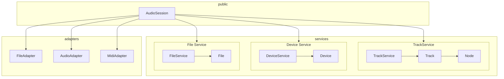

\newpage

## 3.5. Information View

### 3.5.1. Audio Session

### 3.5.2. Device Service

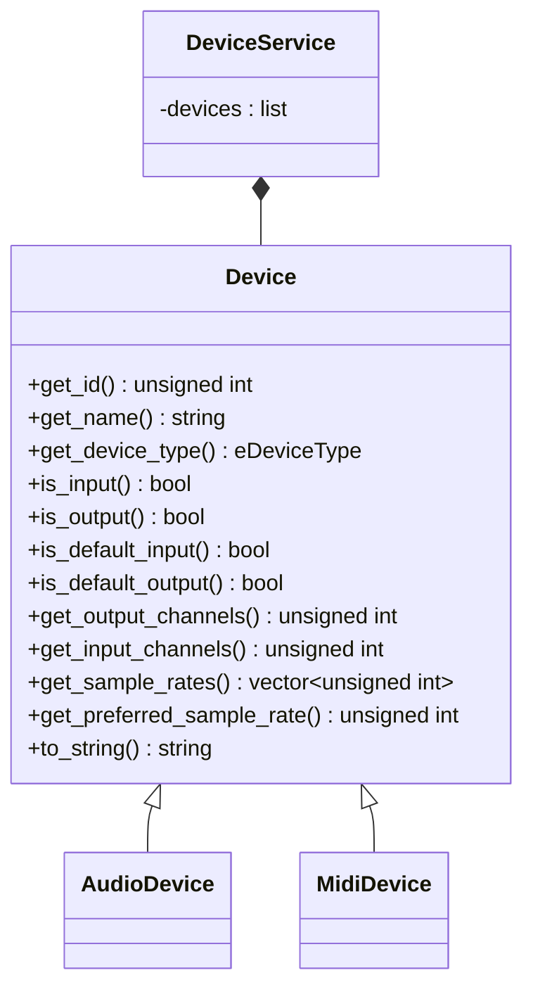

### 3.5.3. File Service

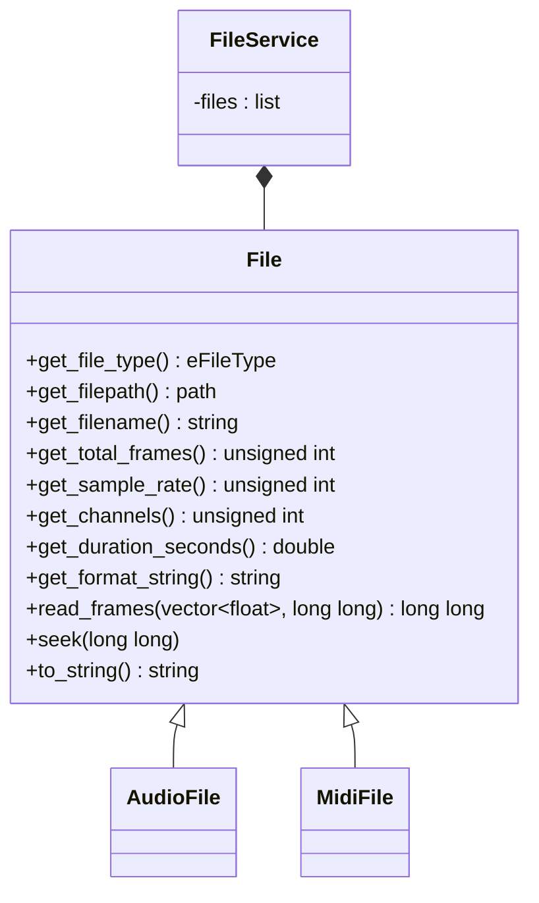

### 3.5.4. Track Service

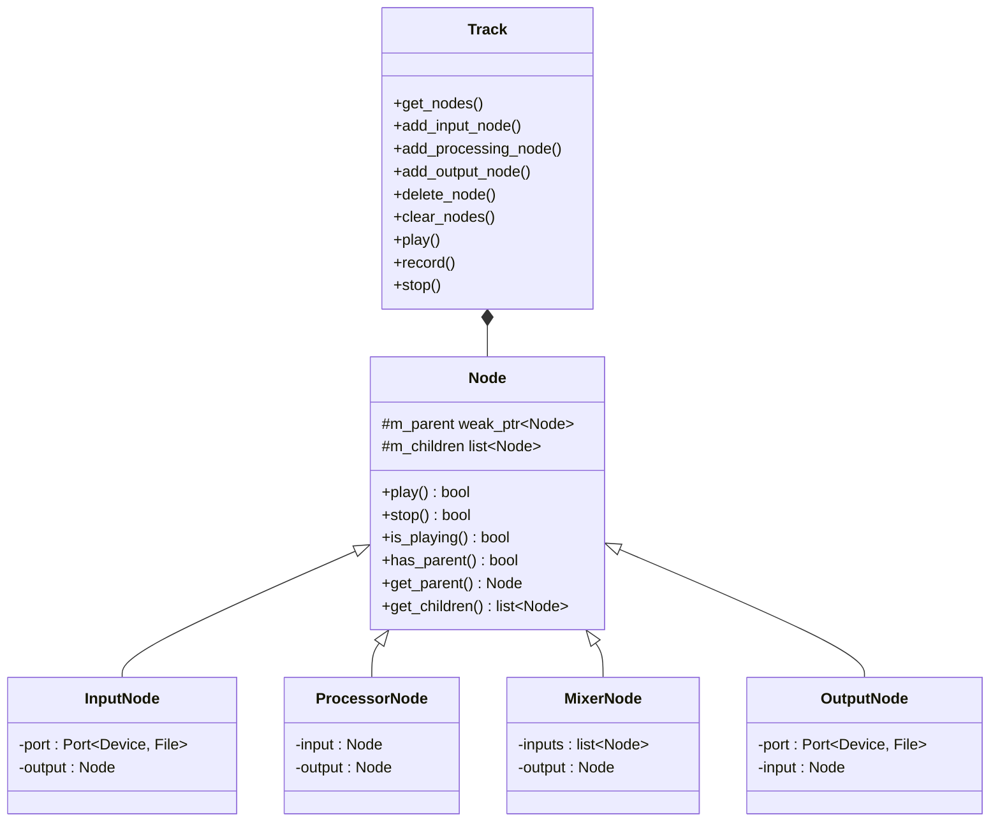

\newpage

## 3.6. Interface View

### 3.6.1. Public SDK

The user uses the software via the main `miniaudioengine` SDK library.

The following types need to be accessible to the user:\newline
- `Device`\newline
- `File`\newline
- `Node`\newline
- `Processor`\newline

The following operations need to be accessible to the user:\newline
- Get audio/MIDI devices.\newline
- Get audio/MIDI files.\newline
- Set audio/MIDI device as input or output.\newline
- Set audio/MIDI file as input or output.\newline
- Add a new track.
- Add and audio or MIDI processor to a track.\newline
- Start/stop playback.\newline
- Start/stop recording.\newline
- Start/stop monitoring.\newline

\newpage

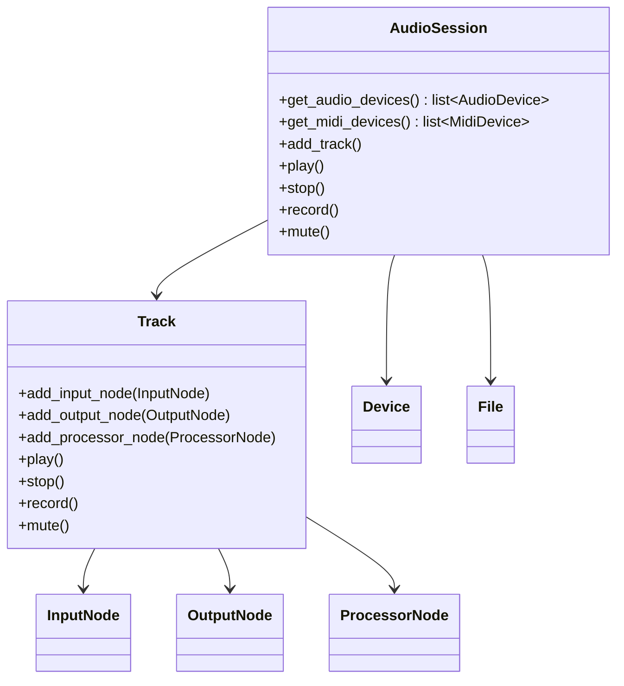

## 3.7. Interaction View

### 3.7.1 Play Audio File

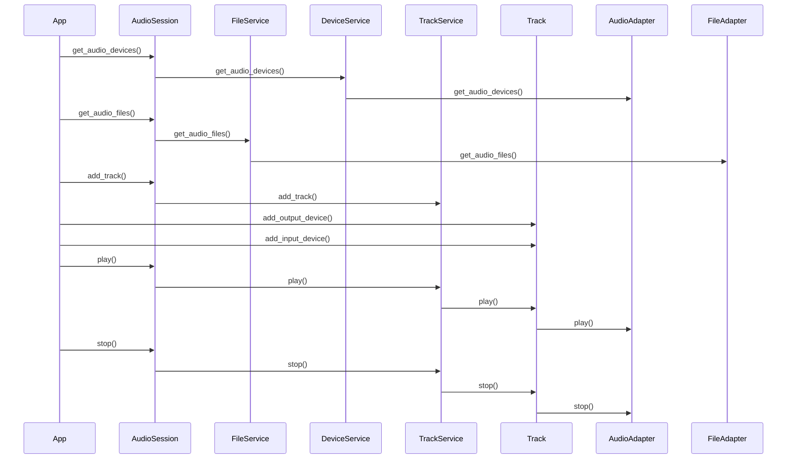

\newpage

## 3.8. Structure View

### 3.8.1. Library Structure

| Library | Description |
|---|---|
| framework |
| services |
| adapters |
| RtAudio |
| RtMidi |
| sndfile |

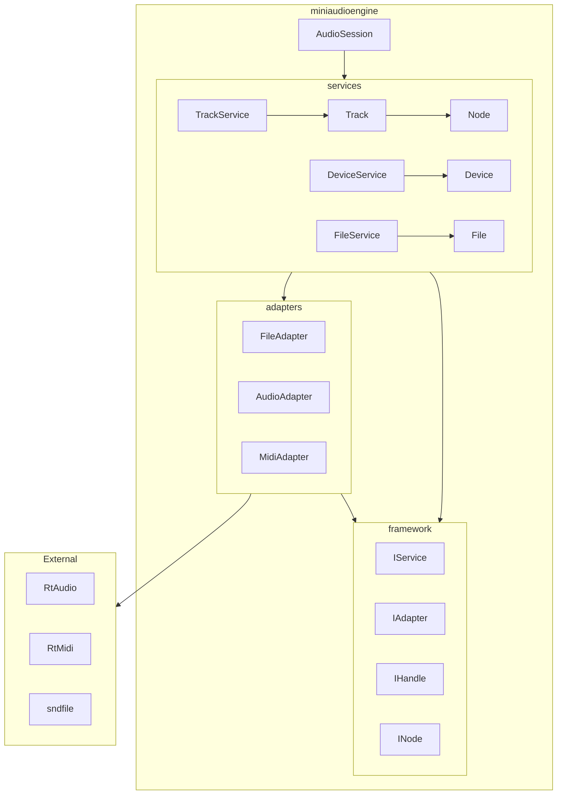

### 3.8.2. Project Structure

```bash
examples/           # Example programs using miniaudioengine SDK
include/
    miniaudioengine/
        audiosession.h          # using namespace miniaudioengine
        track/
            track.h             # using namespace miniaudioengine
            input.h             # using namespace miniaudioengine
            output.h            # using namespace miniaudioengine
            processor.h         # using namespace miniaudioengine
        device/
            audiodevice.h       # using namespace miniaudioengine
            mididevice.h        # using namespace miniaudioengine
        file/
            audiofile.h         # using namespace miniaudioengine
            midifile.h          # using namespace miniaudioengine
src/
    framework/
        include/
          interfaces/
              service.h         # using namespace miniaudioengine::interfaces
              adapter.h         # using namespace miniaudioengine::interfaces
              handle.h          # using namespace miniaudioengine::interfaces
              node.h            # using namespace miniaudioengine::interfaces
        src/
            audiosession.cpp
    services/
        track/
            include/
                trackservice.h          # using namespace miniaudioengine::services
                mixer.h
            src/
                trackservice.cpp        # using namespace miniaudioengine::services
                track.cpp
                input.cpp
                output.cpp
                processor.cpp
                mixer.cpp
        device/
            include/
                deviceservice.h         # using namespace miniaudioengine::services
            src/
                deviceservice.cpp       # using namespace miniaudioengine::services
                audiofile.cpp
                midifile.cpp
        file/
            include/
                fileservice.h           # using namespace miniaudioengine::services
            src/
                fileservice.cpp         # using namespace miniaudioengine::services
                audiofile.cpp
                midifile.cpp
    adapters/
        include/
            audioadapter.h              # using namespace miniaudioengine::adapters
            midiadapter.h               # using namespace miniaudioengine::adapters
            fileadapter.h               # using namespace miniaudioengine::adapters
        src/
            audioadapter.cpp            # using namespace miniaudioengine::adapters
            midiadapter.cpp             # using namespace miniaudioengine::adapters
            fileadapter.cpp             # using namespace miniaudioengine::adapters
tests/
```

### 3.8.3. Thread Structure

| Thread | Description |
|---|---|
| Main | Main execution thread.
| RtAudio | Real-time audio data processing.
| RtMidi | Real-time MIDI message handling. 


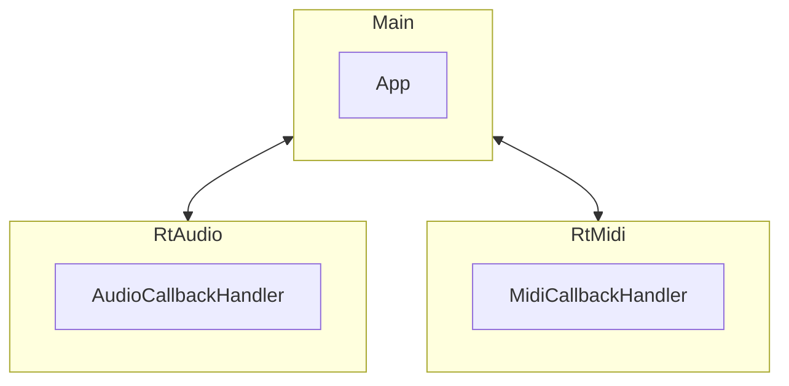

\newpage

# 4. Design Rationale

## 4.1. Architectural Design

I am keeping the control and data components of this library separate. The main component of the control section is the `AudioSession`. The `AudioSession` owns `Services` for different functionalities. `AudioSession` wraps function calls to the internal `Services` and exposes them to the programmer. `Services` own `Adapters` to interface with external hardware / libraries. `Services` return `Handle` objects for the programmer to interact with.

### 4.1.1. Layered Architecture

**Structural Roles**

| Concept | Control Plane |	Data Plane
| --- | --- | --- |
Entry point |	AudioSession	 | MainTrack (audio callback)
Per-track unit	| Node (configuration) |	AudioDataPlane / MidiDataPlane
Cross-thread comms	| Services (locks OK) |	LockfreeRingBuffer
Lifetime manager |	TrackService |	AudioController |

### 4.1.2. Node Hierarchy

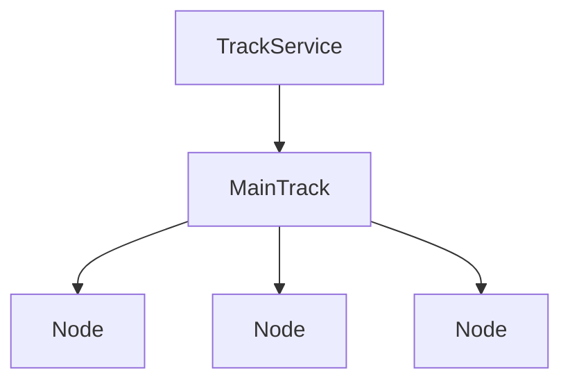

### 4.1.3. Software Design Patterns

**C++ PImpl**

**Facade**

This SDK uses the Facade pattern for the `AudioSession` object. `AudioSession` is a wrapper around the internal logic exposed to the programmer. An `AudioSession` owns a `DeviceService`, `FileService`, and `TrackService` that divides and implements the internal engine logic.

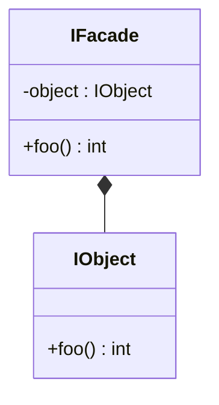

where

```cpp
int IFacade::foo() {
    return object.foo();
}
```

*e.g.*

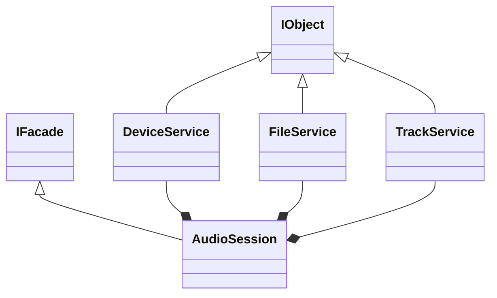

**Adapter**

**Factory**

This SDK uses the Factory pattern to create `Device`, `File`, and `Node` objects.

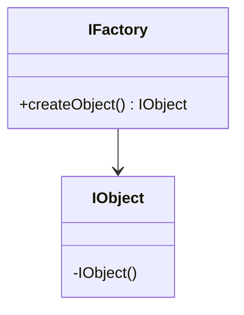

*e.g.*

```mermaid
classDiagram

    class IFactory
    class IObject

    class DeviceAdapter

    IFactory <|-- DeviceAdapter
    IObject <|-- Device

    DeviceAdapter --> Device
```

## 4.2. External Libraries
