\newpage

# 1. Introduction

\newpage

# 2. Stakeholders and Design Concerns

## 2.1. Stakeholders

| Stakeholder | Responsibilities | Design Concerns |
| -- | -- | -- |
| Software User | - Monitor audio input device.\newline- Monitor MIDI input device.\newline- Read audio files\newline- Play audio to output device.\newline- Play MIDI to output device. | DC-01\newline DC-02\newline DC-03\newline DC-04\newline DC-05\newline DC-06 |
| Third-Party Developer | - Include SDK in C++ software application.\newline- Handle incoming MIDI messages.\newline- Process audio input.\newline- Route processed audio to output device.\newline- Manage audio in multiple tracks. | DC-07\newline DC-08\newline DC-09\newline DC-10\newline DC-11\newline DC-12\newline DC-13\newline DC-14\newline DC-17\newline DC-18 |
| Maintainer | - Maintain CI/CD pipeline.\newline- Manage code repo.\newline- Manage software releases. | DC-13\newline DC-14\newline DC-15\newline DC-16\newline DC-17 |
| Hardware | - Run on a Windows desktop.\newline- Run on an embedded Linux platform. | DC-13\newline DC-14 |

## 2.2. Design Concerns

| ID | Description | Relevant Views |
| -- | -- | -- |
| **DC-01** | Monitor audio input device. | Logical
| **DC-02** | Monitor MIDI input device. | Logical
| **DC-03** | Open and read WAV audio files. | Logical
| **DC-04** | Open and read MIDI files. | Logical
| **DC-05** | Route audio to output device. | Logical
| **DC-06** | Route MIDI to output device. | Logical
| **DC-07** | Processing incoming MIDI messages. | Logical
| **DC-08** | Processing incoming audio streams. | Logical
| **DC-09** | Manage multiple audio tracks. | Logical
| **DC-10** | Add one audio or MIDI input to a track. | Logical
| **DC-11** | Attach one audio or MIDI output to a track. | Logical
| **DC-12** | Chain multiple audio processors in one track. | Logical
| **DC-13** | Build software SDK on Windows and Linux. | Context
| **DC-14** | Build software SDK on x86_64 and ARM64 platforms. |
| **DC-15** | CI/CD pipeline builds and packages software on all compatible platforms. |
| **DC-16** | Complete unit testing and code coverage. |
| **DC-17** | Package software as an SDK used by third-party software. | Context, Composition
| **DC-18** | Third-party software developers manage audio tracks, system audio/MIDI devices, and filesystem. | Composition

\newpage

# 3. Design Views

## 3.1. Context View

Describes the software in context with its external environment. Define users, external components, and the interactions between.

| Design Concern | |
| -- | -- |
| **DC-13** | Build software SDK on Windows and Linux. |
| **DC-17** | Package software as an SDK used by third-party software. |

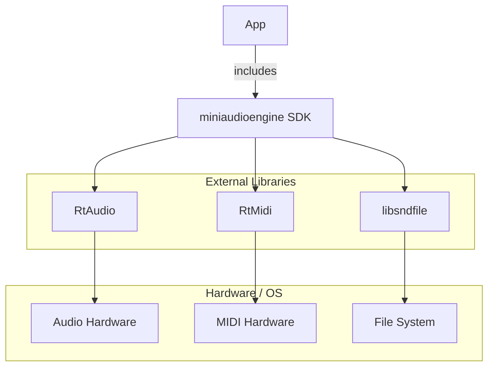

\newpage

## 3.2. Composition View

Describe the composition of the **miniaudioengine** SDK software libraries.

| Design Concern | |
| -- | -- |
| **DC-17** | Package software as an SDK used by third-party software. |
| **DC-18** | Third-party software developers manage audio tracks, system audio/MIDI devices, and filesystem. |

### 3.2.1. miniaudioengine SDK

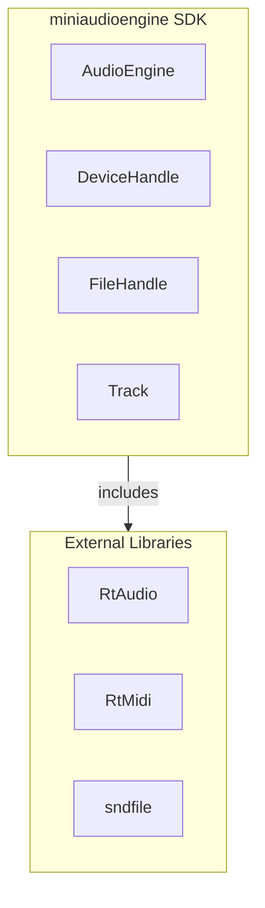

\newpage

## 3.3. Logical View

### 3.3.1. Record Audio Input

| Design Concern |     |
| -------------- | --- |
| **DC-01** | Monitor audio input device.
| **DC-02** | Monitor MIDI input device.

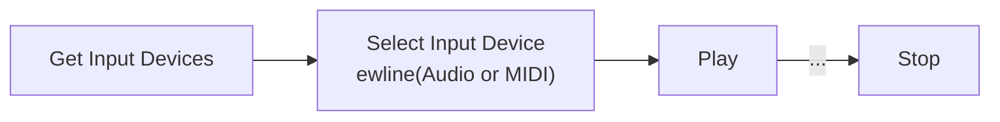

### 3.3.2. Play Audio File

| Design Concern | |
| -- | -- |
| **DC-03** | Open and read WAV audio files.
| **DC-04** | Open and read MIDI files.


### 3.3.3. Play to Audio Output Device

| Design Concern |     |
| -------------- | --- |
| **DC-05** | Route audio to output device.
| **DC-06** | Route MIDI to output device.


### 3.3.4. Read MIDI Messages

| Design Concern | |
| -- | -- |
| **DC-07** | Processing incoming MIDI messages.

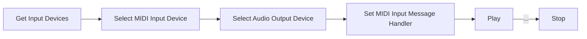

\newpage

### 3.3.5. Audio Processing

| Design Concern | |
| -- | -- |
| **DC-08** | Processing incoming audio streams.

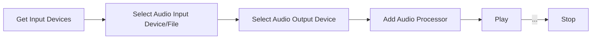

\newpage

### 3.3.6. Multiple Tracks

| Design Concern |                                               |
| -------------- | --------------------------------------------- |
| **DC-09**      | Manage multiple audio tracks.                 |
| **DC-10**      | Add one audio or MIDI input to a track.       |
| **DC-11**      | Attach one audio or MIDI output to a track.   |
| **DC-12**      | Chain multiple audio processors in one track. |

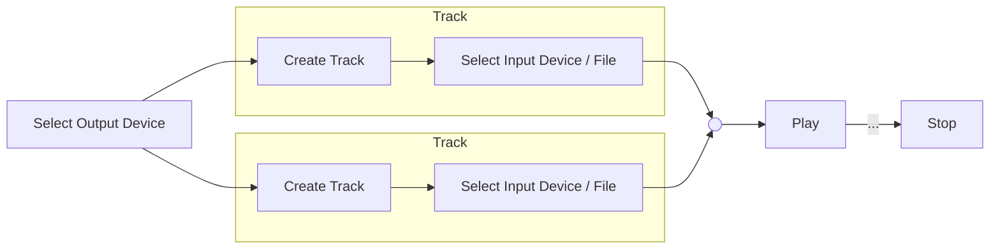

\newpage

## 3.4. Dependency View

The components in this SDK depend on the file system, audio and MIDI devices on the host system.
Separating devices and files into different services divides the dependency.

### 3.4.1. Layer Hierarchy

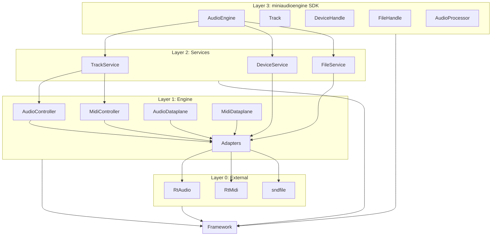

\newpage

## 3.5. Information View

### 3.5.1. Devices

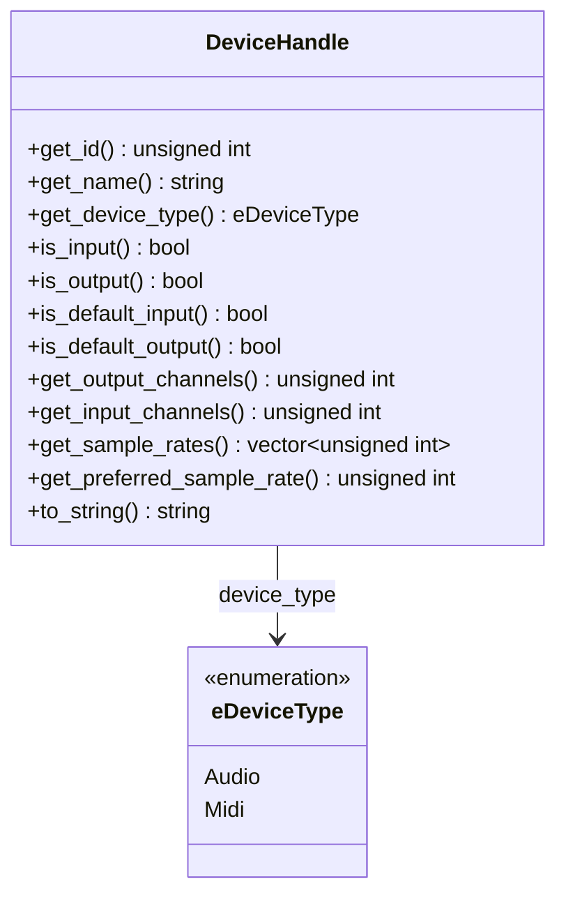

### 3.5.2. Files

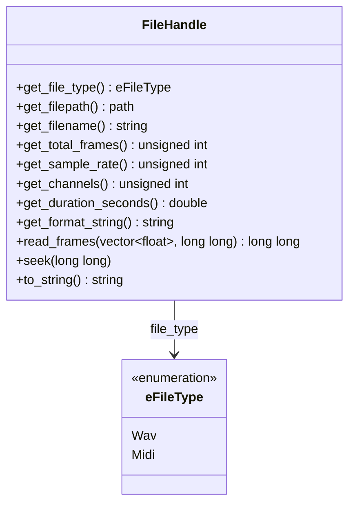

### 3.5.3. Tracks

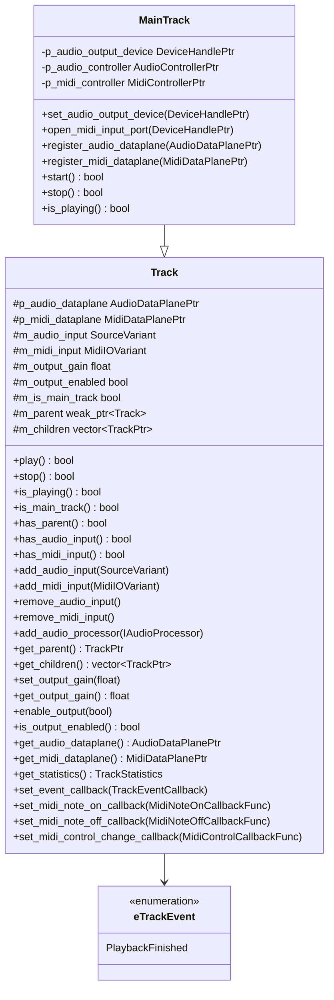

\newpage

## 3.6. Interface View

### 3.6.1. Public SDK

The user uses the software via the main `miniaudioengine` SDK library.

The following types need to be accessible to the user:\newline
- `DeviceHandle`\newline
- `FileHandle`\newline
- `Track`\newline
- `Processor`\newline

The following operations need to be accessible to the user:\newline
- Get audio/MIDI devices.\newline
- Get audio/MIDI files.\newline
- Set audio/MIDI device as input or output.\newline
- Set audio/MIDI file as input or output.\newline
- Add a new track.
- Add and audio or MIDI processor to a track.\newline
- Start/stop playback.\newline
- Start/stop recording.\newline
- Start/stop monitoring.\newline

\newpage

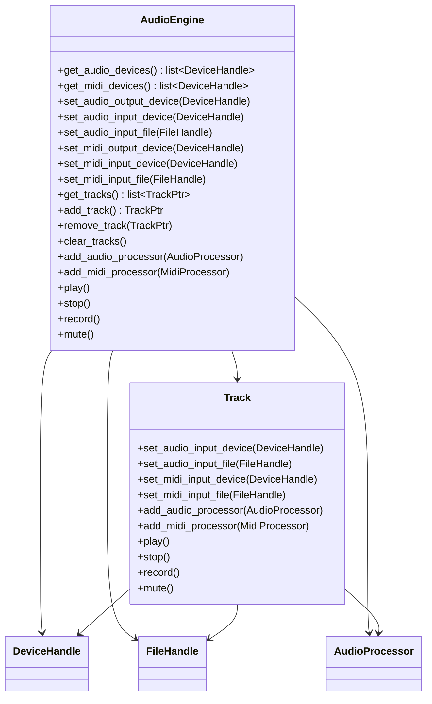

## 3.7. Interaction View

### 3.7.1. Audio Input to Audio Output

**Control Plane**

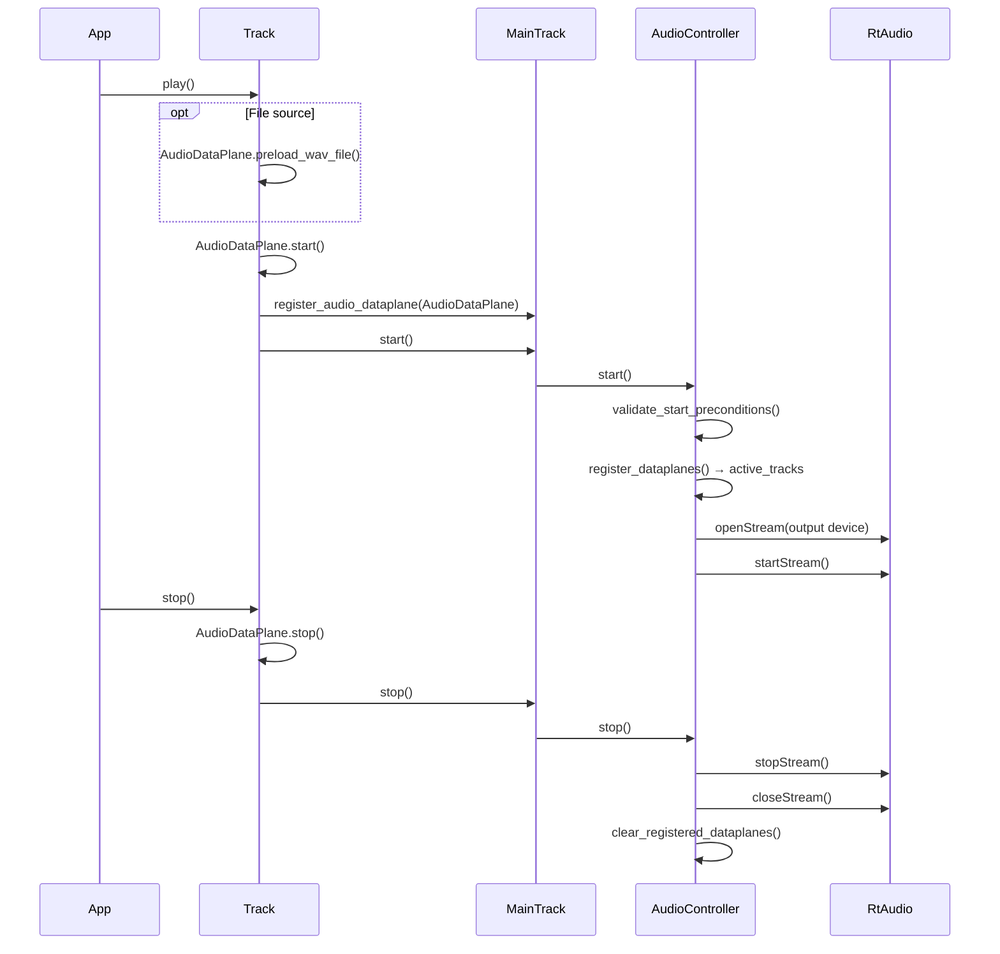

\newpage

**Data Plane**

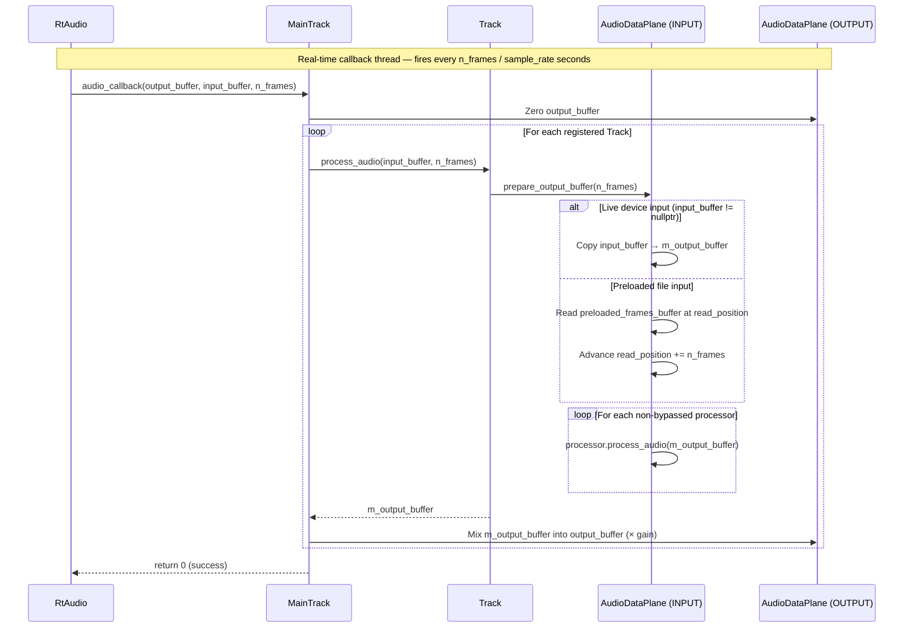

\newpage

### 3.7.2. MIDI Input Processing

**Control Plane**

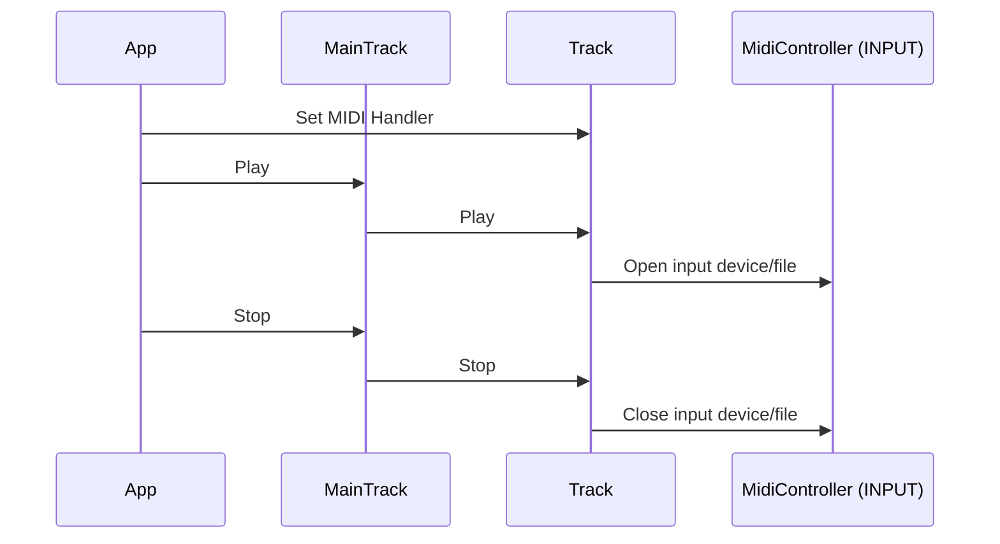

\newpage

## 3.8. Structure View

### 3.8.1. Library Structure

| Library | Description |
|---|---|
| framework |
| services |
| adapters |
| RtAudio |
| RtMidi |
| sndfile |

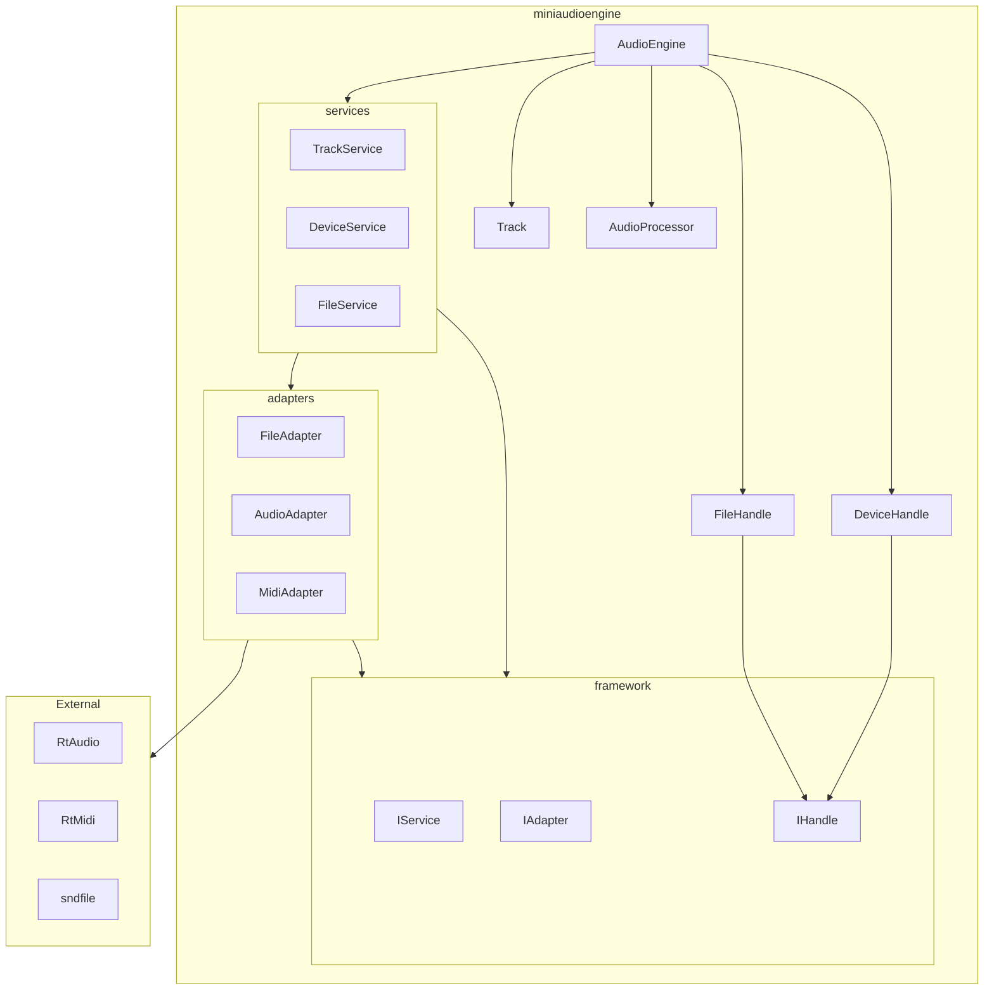


### 3.8.2. Project Structure

```bash
examples/                   # Example programs using miniaudioengine SDK
samples/
include/
    miniaudioengine/
        miniaudioengine.h   # Public facing SDK
src/
    framework/
    services/
    adapters/
tests/
```

### 3.8.3. Thread Structure

| Thread | Description |
|---|---|
| Main | Main execution thread.
| RtAudio | Real-time audio data processing.
| RtMidi | Real-time MIDI message handling. 


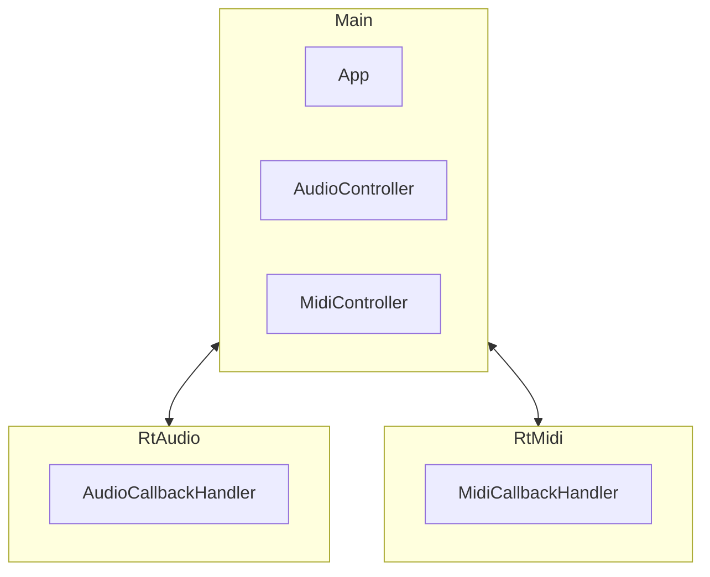

\newpage

# 4. Design Rationale

## 4.1. Architectural Design

### 4.1.1. Layered Architecture

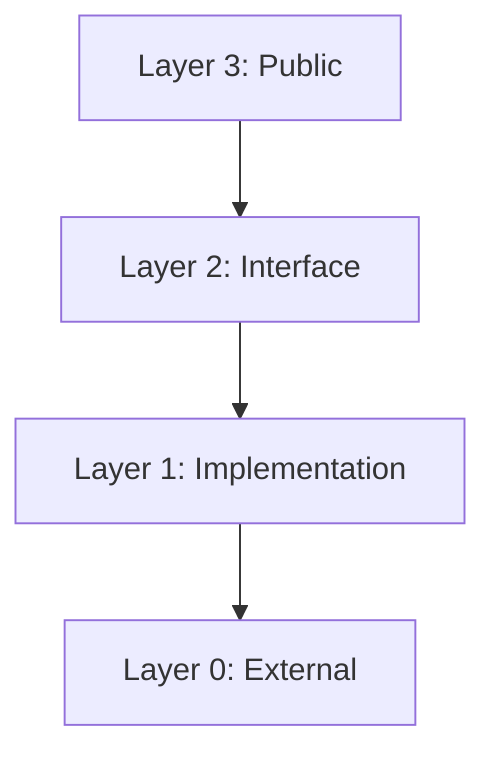

### 4.1.2. Track Hierarchy

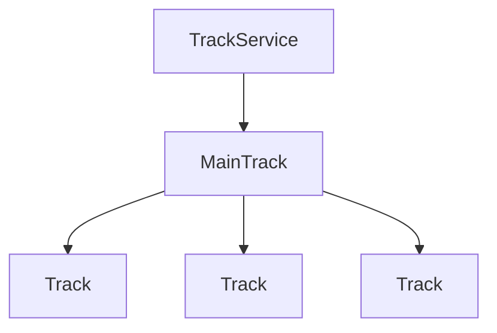

### 4.1.3. Software Design Patterns

**C++ PImpl**

**Singleton**

This SDK uses the Singleton pattern for the `AudioEngine` component. There should only ever be one instance of `AudioEngine`. It owns all other components used in this SDK.

```mermaid
classDiagram
    class ISingleton {
        -instance
        +instance() *ISingleton
        -ISingleton()
    }
```

*AudioEngine:*

```mermaid
classDiagram

    class ISingleton

    class AudioEngine {
        -device_service : DeviceService
        -file_service : FileService
    }

    class DeviceService
    class FileService

    ISingleton <|-- AudioEngine

    AudioEngine --> DeviceService
    AudioEngine --> FileService

```
**Facade**

**Adapter**

**Factory**

This SDK uses the Factory pattern to create `DeviceHandle`, `FileHandle`, and `Track` objects.

```mermaid
classDiagram

    class IFactory {
        +createObject() IObject
    }

    class IObject {
        -IObject()
    }

    class Factory {
        +createObject() Object
    }

    class Object {
        -data
        +method()
    }

    IFactory <|-- Factory
    IObject <|-- Object

    IFactory --> IObject
    
    Factory --> Object
```

*e.g.*

```mermaid
classDiagram

    class IFactory
    class IObject

    class DeviceAdapter

    IFactory <|-- DeviceAdapter
    IObject <|-- DeviceHandle

    DeviceAdapter --> DeviceHandle
```

**Proxy**

This SDK uses the Proxy pattern. The `User` interacts with the `DeviceService` and `FileService` via the `AudioEngine`

Client requests data from a Service via a Proxy.

```mermaid
graph LR

    Client -->|request| Proxy
    Proxy -->|request| ServiceA
    Proxy -->|request| ServiceB

    ServiceA -->|respond| Proxy
    ServiceB -->|respond| Proxy
    Proxy -->|respond| Client
```

*e.g.*
```mermaid
graph LR

    User --> AudioEngine
    AudioEngine --> User
    AudioEngine --> DeviceService
    DeviceService --> AudioEngine
    AudioEngine --> FileService
    FileService --> AudioEngine
```

*Note:* The request method in this example is blocking.

```mermaid
classDiagram

    class IProxy {
        -services : list~IService~
        +register_service(service : IService)
        +unregister_service(service : IService)
        +request(message : IRequest) IResponse
    }

    class IService {
        -proxy : IProxy
        +request(message: IRequest) IResponse
    }

    class IClient {
        -proxy : IProxy
    }

    class IRequest {

    }

    class IResponse {

    }

    IProxy --> IService
    IProxy --> IClient

    IProxy --> IRequest
    IProxy --> IResponse
```

*Device Service:*

```mermaid
classDiagram

    class IService
    class IRequest
    class IResponse

    class DeviceService {
        +request(message: DeviceRequest) DeviceResponse
    }

    class DeviceRequest
    class DeviceResponse

    DeviceService <|-- IService
    DeviceRequest <|-- IRequest
    DeviceResponse <|-- IResponse
    DeviceService --> DeviceRequest
    DeviceService --> DeviceResponse
```

*File Service:*

```mermaid
classDiagram

    class IService
    class IRequest
    class IResponse

    class FileService {
        +request(message: FileRequest) FileResponse
    }

    class FileRequest
    class FileResponse

    FileService <|-- IService
    FileRequest <|-- IRequest
    FileResponse <|-- IResponse
    FileService --> FileRequest
    FileService --> FileResponse
```

## 4.2. External Libraries
