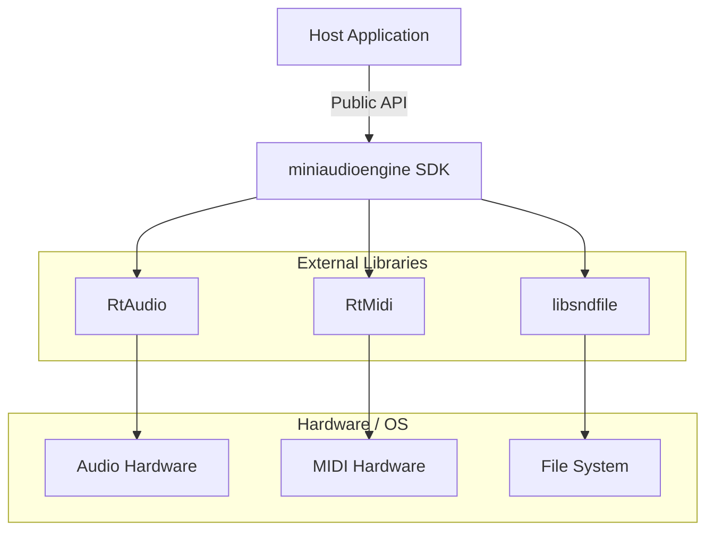
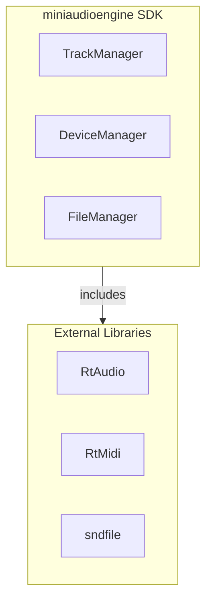
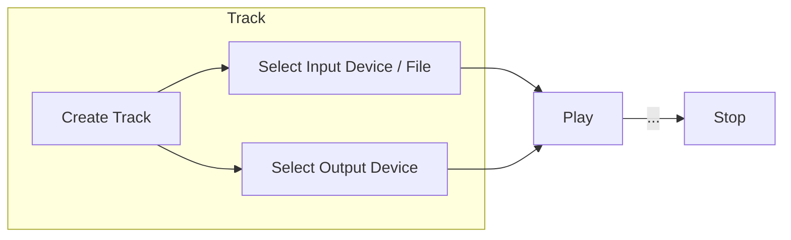

# Software Design Description - miniaudioengine

## Table of Contents

- [Software Design Description - miniaudioengine](#software-design-description---miniaudioengine)
  - [Table of Contents](#table-of-contents)
  - [1 Introduction](#1-introduction)
  - [2 Stakeholders and Design Concerns](#2-stakeholders-and-design-concerns)
    - [2.1 Stakeholders](#21-stakeholders)
    - [2.2 Design Concerns](#22-design-concerns)
  - [3 Design Views](#3-design-views)
    - [3.1 Context View](#31-context-view)
    - [3.2 Composition View](#32-composition-view)
    - [3.3 Logical View](#33-logical-view)
      - [3.4.1 Monitor Input Device Flow](#341-monitor-input-device-flow)
      - [3.4.2 Open File Flow](#342-open-file-flow)
      - [3.4.3 Play to Output Device Flow](#343-play-to-output-device-flow)
      - [3.4.4 Multiple Track Flow](#344-multiple-track-flow)
      - [3.4.5 MIDI Message Flow](#345-midi-message-flow)
      - [3.4.6 Audio Processing Flow](#346-audio-processing-flow)
    - [3.4 Dependency View](#34-dependency-view)
    - [3.5 Information View](#35-information-view)
    - [3.6 Interface View](#36-interface-view)
    - [3.7 Interaction View](#37-interaction-view)
    - [3.8 Structure View](#38-structure-view)
  - [4 Design Rationale](#4-design-rationale)

## 1 Introduction

## 2 Stakeholders and Design Concerns

### 2.1 Stakeholders

| Stakeholder | Responsibilities | Design Concerns |
| -- | -- | -- |
| Software User | - Monitor audio input device. - Monitor MIDI input device. - Read audio files - Play audio to output device. - Play MIDI to output device. | DC-01 DC-02 DC-03 DC-04 DC-05 DC-06 |
| Third-Party Developer | - Include SDK in C++ software application. - Handle incoming MIDI messages. - Process audio input. - Route processed audio to output device. - Manage audio in multiple tracks. | DC-07 DC-08 DC-09 DC-10 DC-11 DC-12 DC-13 DC-14 DC-17 DC-18 |
| Maintainer | - Maintain CI/CD pipeline. - Manage code repo. - Manage software releases. | DC-13 DC-14 DC-15 DC-16 DC-17 |
| Hardware | - Run on a Windows desktop. - Run on an embedded Linux platform. | DC-13 DC-14 |

### 2.2 Design Concerns

| ID | Description | Relevant Views |
| -- | -- | -- |
| **DC-01** | Monitor audio input device. | Logical
| **DC-02** | Monitor MIDI input device. | Logical
| **DC-03** | Open and read WAV audio files. | Logical
| **DC-04** | Open and read MIDI files. | Logical
| **DC-05** | Route audio to output device. | Logical
| **DC-06** | Route MIDI to output device. | Logical
| **DC-07** | Processing incoming MIDI messages. | Logical
| **DC-08** | Processing incoming audio streams. | Logical
| **DC-09** | Manage multiple audio tracks. | Logical
| **DC-10** | Add one audio or MIDI input to a track. | Logical
| **DC-11** | Attach one audio or MIDI output to a track. | Logical
| **DC-12** | Chain multiple audio processors in one track. | Logical
| **DC-13** | Build software SDK on Windows and Linux. | Context
| **DC-14** | Build software SDK on x86_64 and ARM64 platforms. |
| **DC-15** | CI/CD pipeline builds and packages software on all compatible platforms. |
| **DC-16** | Complete unit testing and code coverage. |
| **DC-17** | Package software as an SDK used by third-party software. | Context, Composition
| **DC-18** | Third-party software developers manage audio tracks, system audio/MIDI devices, and filesystem. | Composition

## 3 Design Views

### 3.1 Context View

Describes the software in context with its external environment. Define users, external components, and the interactions between.

| Design Concern | |
| -- | -- |
| **DC-13** | Build software SDK on Windows and Linux. |
| **DC-17** | Package software as an SDK used by third-party software. |

### 3.2 Composition View

Describe the composition of the **miniaudioengine** SDK software libraries.

| Design Concern | |
| -- | -- |
| **DC-17** | Package software as an SDK used by third-party software. |
| **DC-18** | Third-party software developers manage audio tracks, system audio/MIDI devices, and filesystem. |

### 3.3 Logical View

#### 3.4.1 Monitor Input Device Flow

| Design Concern |     |
| -------------- | --- |
| **DC-01** | Monitor audio input device.
| **DC-02** | Monitor MIDI input device.

#### 3.4.2 Open File Flow

| Design Concern | |
| -- | -- |
| **DC-03** | Open and read WAV audio files.
| **DC-04** | Open and read MIDI files.

#### 3.4.3 Play to Output Device Flow

| Design Concern |     |
| -------------- | --- |
| **DC-05** | Route audio to output device.
| **DC-06** | Route MIDI to output device.

#### 3.4.4 Multiple Track Flow

| Design Concern | |
| -- | -- |
| **DC-09** | Manage multiple audio tracks.
| **DC-10** | Add one audio or MIDI input to a track.
| **DC-11** | Attach one audio or MIDI output to a track.
| **DC-12** | Chain multiple audio processors in one track.

#### 3.4.5 MIDI Message Flow

| Design Concern | |
| -- | -- |
| **DC-07** | Processing incoming MIDI messages.

#### 3.4.6 Audio Processing Flow

| Design Concern | |
| -- | -- |
| **DC-08** | Processing incoming audio streams.

### 3.4 Dependency View

### 3.5 Information View

### 3.6 Interface View

### 3.7 Interaction View

### 3.8 Structure View

## 4 Design Rationale