\newpage

# 1. Introduction

\newpage

# 2. Stakeholders and Design Concerns

## 2.1. Stakeholders

| Stakeholder | Responsibilities | Design Concerns |
| -- | -- | -- |
| Software User | - Monitor audio input device.\newline- Monitor MIDI input device.\newline- Read audio files\newline- Play audio to output device.\newline- Play MIDI to output device. | DC-01\newline DC-02\newline DC-03\newline DC-04\newline DC-05\newline DC-06 |
| Third-Party Developer | - Include SDK in C++ software application.\newline- Entity incoming MIDI messages.\newline- Process audio input.\newline- Route processed audio to output device.\newline- Manage audio in multiple tracks. | DC-07\newline DC-08\newline DC-09\newline DC-10\newline DC-11\newline DC-12\newline DC-13\newline DC-14\newline DC-17\newline DC-18 |
| Maintainer | - Maintain CI/CD pipeline.\newline- Manage code repo.\newline- Manage software releases. | DC-13\newline DC-14\newline DC-15\newline DC-16\newline DC-17 |
| Hardware | - Run on a Windows desktop.\newline- Run on an embedded Linux platform. | DC-13\newline DC-14 |

## 2.2. Design Concerns

| ID | Description | Relevant Views |
| -- | -- | -- |
| **DC-01** | Monitor audio input device. | Logical, Interface, Interaction
| **DC-02** | Monitor MIDI input device. | Logical, Interface, Interaction
| **DC-03** | Open and read WAV audio files. | Logical, Information, Interaction
| **DC-04** | Open and read MIDI files. | Logical, Information
| **DC-05** | Route audio to output device. | Logical, Interface, Interaction
| **DC-06** | Route MIDI to output device. | Logical, Interface
| **DC-07** | Processing incoming MIDI messages. | Logical, Interface
| **DC-08** | Processing incoming audio streams. | Logical, Information, Interface
| **DC-09** | Manage multiple audio tracks. | Logical, Information, Interface, Interaction
| **DC-10** | Add one audio or MIDI input to a track. | Logical, Information, Interface
| **DC-11** | Attach one audio or MIDI output to a track. | Logical, Information, Interface
| **DC-12** | Chain multiple audio processors in one track. | Logical, Information, Interface
| **DC-13** | Build software SDK on Windows and Linux. | Context, Structure
| **DC-14** | Build software SDK on x86_64 and ARM64 platforms. | Context, Structure
| **DC-15** | CI/CD pipeline builds and packages software on all compatible platforms. | Structure
| **DC-16** | Complete unit testing and code coverage. | Structure
| **DC-17** | Package software as an SDK used by third-party software. | Context, Composition, Structure
| **DC-18** | Third-party software developers manage audio tracks, system audio/MIDI devices, and filesystem. | Composition, Interface, Interaction

\newpage

# 3. Design Views

## 3.1. Context View

Describes the software in context with its external environment. Define users, external components, and the interactions between.

| Design Concern | |
| -- | -- |
| **DC-13** | Build software SDK on Windows and Linux. |
| **DC-14** | Build software SDK on x86_64 and ARM64 platforms. |
| **DC-17** | Package software as an SDK used by third-party software. |

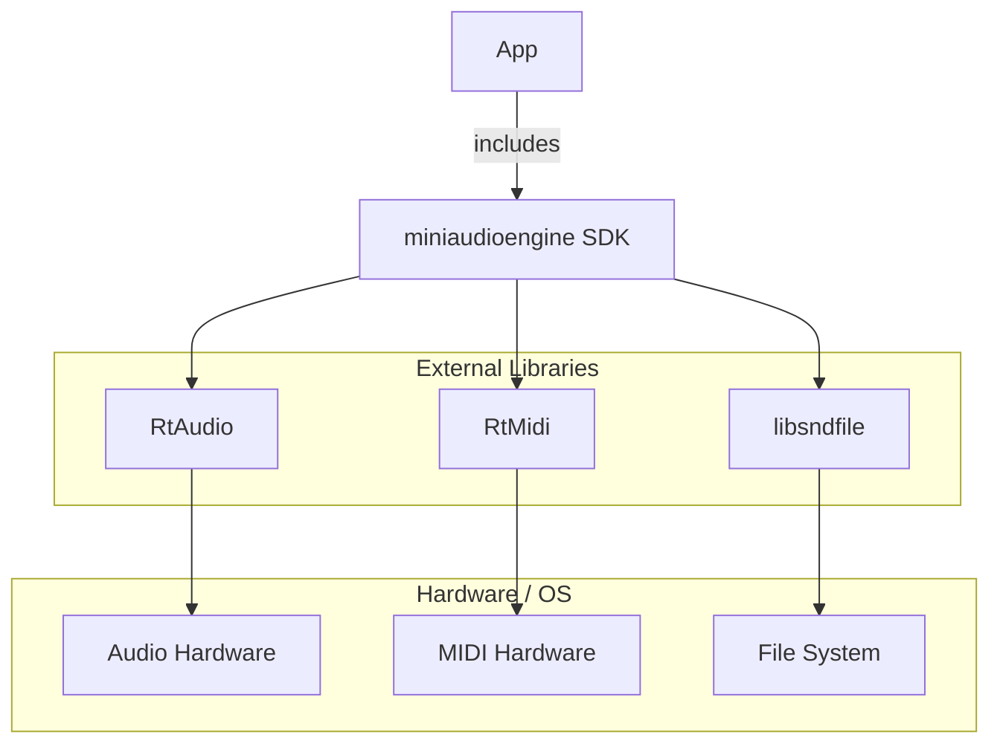
```mermaid caption="miniaudioengine SDK environment context" width=80%
graph TD
    App["App"]
    SDK["miniaudioengine SDK"]

    subgraph Libraries[External Libraries]
        RtA["RtAudio"]
        RtM["RtMidi"]
        SND["libsndfile"]
    end

    subgraph HW[Hardware / OS]
        AudioHW["Audio Hardware"]
        MIDIHW["MIDI Hardware"]
        FS["File System"]
    end

    App -->|includes| SDK
    SDK --> RtA
    SDK --> RtM
    SDK --> SND
    RtA --> AudioHW
    RtM --> MIDIHW
    SND --> FS
```

\newpage

## 3.2. Composition View

### 3.2.1. SDK Components

Describe the composition of the **miniaudioengine** SDK software libraries.

| Design Concern | |
| -- | -- |
| **DC-17** | Package software as an SDK used by third-party software. |
| **DC-18** | Third-party software developers manage audio tracks, system audio/MIDI devices, and filesystem. |

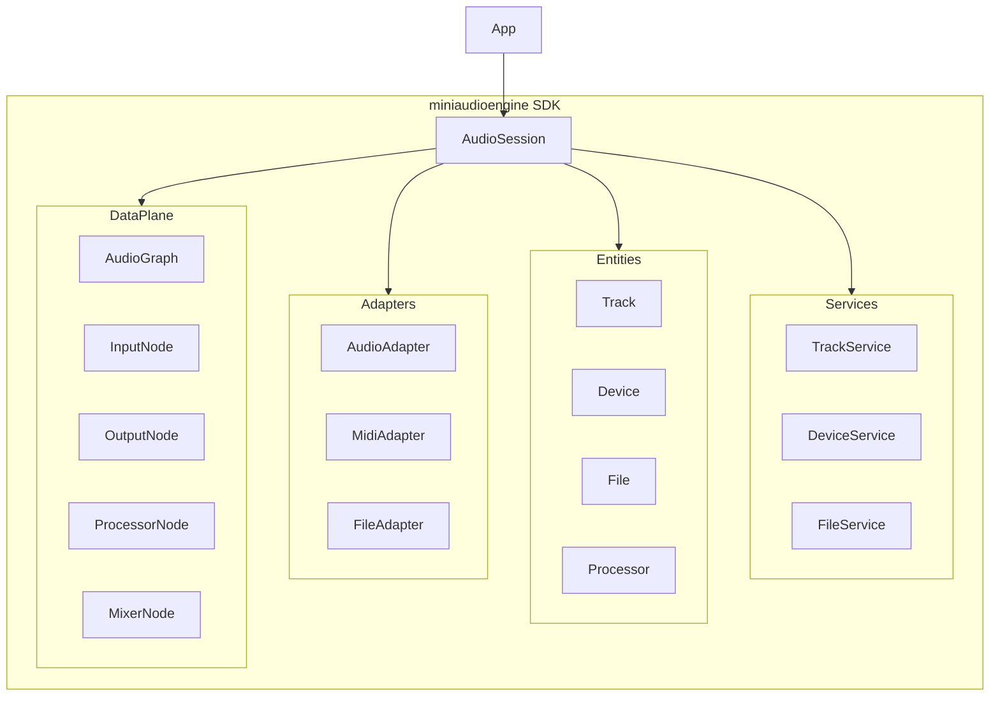
```mermaid caption="miniaudioengine SDK composition" width=100%
graph TD
    subgraph SDK["miniaudioengine SDK"]
        AudioSession

        subgraph Services
            TrackService
            DeviceService
            FileService
        end

        subgraph Entities
            Track
            Device
            File
            Processor
        end

        subgraph Adapters
            AudioAdapter
            MidiAdapter
            FileAdapter
        end

        subgraph DataPlane
            AudioGraph
            InputNode
            OutputNode
            ProcessorNode
            MixerNode
        end
    end

    App --> AudioSession

    AudioSession --> Services
    AudioSession --> Entities
    AudioSession --> Adapters
    AudioSession --> DataPlane
```

\newpage

## 3.3. Logical View

### 3.3.1. Record Audio/MIDI Input

| Design Concern |     |
| -------------- | --- |
| **DC-01** | Monitor audio input device.
| **DC-02** | Monitor MIDI input device.

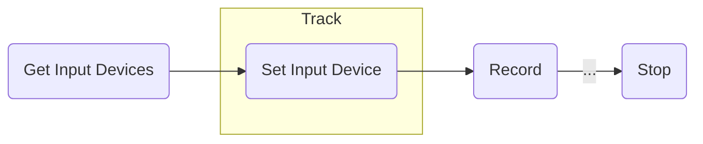
```mermaid caption="Record Audio/MIDI Input" width=80%
flowchart LR

    getInputDevices("Get Input Devices")

    subgraph Track
        selectInputDevice("Set Input Device")
    end

    record("Record")
    stop("Stop")

    getInputDevices --> selectInputDevice
    selectInputDevice --> record
    record -->|...| stop
```

### 3.3.2. Play Audio/MIDI File

| Design Concern | |
| -- | -- |
| **DC-03** | Open and read WAV audio files.
| **DC-04** | Open and read MIDI files.

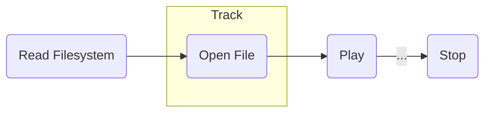
```mermaid caption="Play Audio/MIDI File" width=80%
flowchart LR

    readFiles("Read Filesystem")

    subgraph Track
        openFile("Open File")
    end

    play("Play")
    stop("Stop")

    readFiles --> openFile
    openFile --> play
    play -->|...| stop
```

\newpage

### 3.3.3. Playback to Output Device

| Design Concern |     |
| -------------- | --- |
| **DC-05** | Route audio to output device.
| **DC-06** | Route MIDI to output device.

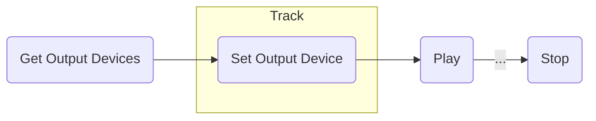
```mermaid caption="Playback to Output Device" width=80%
flowchart LR

    getOutputDevices("Get Output Devices")

    subgraph Track
        selectOutputDevice("Set Output Device")
    end

    play("Play")
    stop("Stop")

    getOutputDevices --> selectOutputDevice
    selectOutputDevice --> play
    play -->|...| stop
```

### 3.3.4. Audio/MIDI Processing

| Design Concern | |
| -- | -- |
| **DC-07** | Processing incoming MIDI messages.
| **DC-08** | Processing incoming audio streams.

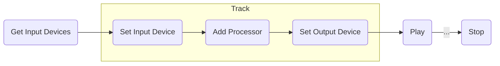
```mermaid caption="Audio/MIDI Processing"
flowchart LR

    getInputDevices("Get Input Devices")

    subgraph Track
        selectInputDevice("Set Input Device")
        addProcessor("Add Processor")
        selectOutputDevice("Set Output Device")
    end

    play("Play")
    stop("Stop")

    getInputDevices --> selectInputDevice
    selectInputDevice --> addProcessor
    addProcessor --> selectOutputDevice
    selectOutputDevice --> play
    play --> |...|stop
```

\newpage

### 3.3.5. Multiple Tracks

| Design Concern |                                               |
| -------------- | --------------------------------------------- |
| **DC-09**      | Manage multiple audio tracks.                 |
| **DC-10**      | Add one audio or MIDI input to a track.       |
| **DC-11**      | Attach one audio or MIDI output to a track.   |
| **DC-12**      | Chain multiple audio processors in one track. |

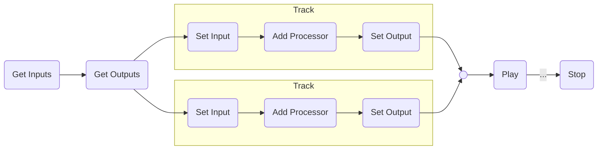
```mermaid caption="Multiple Tracks"
flowchart LR

    getInputs("Get Inputs")
    getOutputs("Get Outputs")

    subgraph track1["Track"]
        selectInputTrack1("Set Input")
        addProcessorTrack1("Add Processor")
        selectOutputTrack1("Set Output")
    end

    subgraph track2["Track"]
        selectInputTrack2("Set Input")
        addProcessorTrack2("Add Processor")
        selectOutputTrack2("Set Output")
    end

    J((" "))

    play("Play")
    stop("Stop")

    getInputs --> getOutputs
    getOutputs --> selectInputTrack1
    getOutputs --> selectInputTrack2

    selectInputTrack1 --> addProcessorTrack1
    addProcessorTrack1 --> selectOutputTrack1

    selectInputTrack2 --> addProcessorTrack2
    addProcessorTrack2 --> selectOutputTrack2

    play -->|...| stop

    selectOutputTrack1 --> J
    selectOutputTrack2 --> J

    J --> play
```

\newpage

## 3.4. Dependency View

The components in this SDK depend on the file system, audio and MIDI devices on the host system.
Separating devices and files into different services divides the dependency.

### 3.4.1. Layer Hierarchy

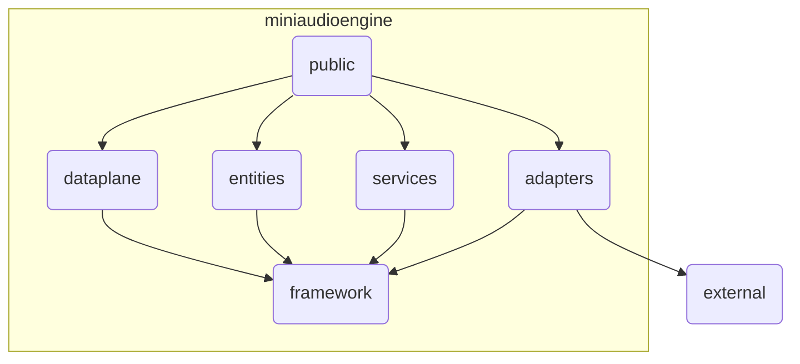
```mermaid caption="Library Layer Hierarchy" width=100%
graph TD

    subgraph miniaudioengine
        public("public")
        services("services")
        entities("entities")
        dataplane("dataplane")
        adapters("adapters")
        framework("framework")
    end

    public --> adapters
    public --> services
    public --> entities
    public --> dataplane

    adapters --> framework
    services --> framework
    entities --> framework
    dataplane --> framework

    adapters --> external("external")
```

\newpage

### 3.4.2. External Library Adapters

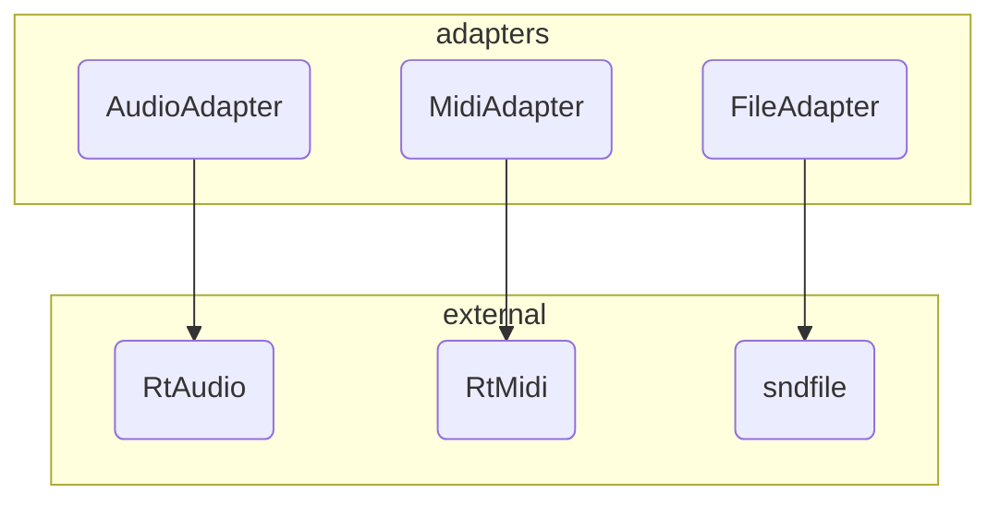
```mermaid caption="External Library Adapters"
graph TD

    subgraph adapters
        AudioAdapter("AudioAdapter")
        MidiAdapter("MidiAdapter")
        FileAdapter("FileAdapter")
    end

    subgraph external
        RtAudio("RtAudio")
        RtMidi("RtMidi")
        sndfile("sndfile")
    end

    AudioAdapter --> RtAudio
    MidiAdapter --> RtMidi
    FileAdapter --> sndfile
```

\newpage

## 3.5. Information View

| Design Concern | |
| -- | -- |
| **DC-03** | Open and read WAV audio files. |
| **DC-04** | Open and read MIDI files. |
| **DC-08** | Processing incoming audio streams. |
| **DC-09** | Manage multiple audio tracks. |
| **DC-10** | Add one audio or MIDI input to a track. |
| **DC-11** | Attach one audio or MIDI output to a track. |
| **DC-12** | Chain multiple audio processors in one track. |

### 3.5.1. Audio Session

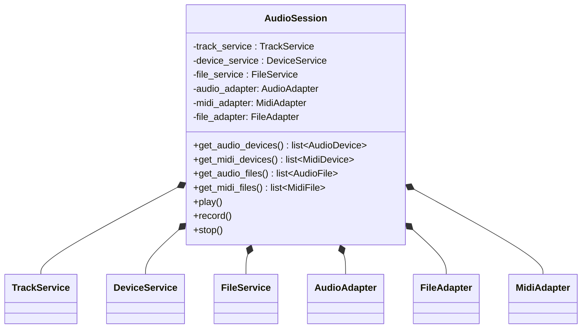
```mermaid
classDiagram

    class AudioSession {
        -track_service : TrackService
        -device_service : DeviceService
        -file_service : FileService
        -audio_adapter: AudioAdapter
        -midi_adapter: MidiAdapter
        -file_adapter: FileAdapter
        +get_audio_devices() list~AudioDevice~
        +get_midi_devices() list~MidiDevice~
        +get_audio_files() list~AudioFile~
        +get_midi_files() list~MidiFile~
        +play()
        +record()
        +stop()
    }

    AudioSession *-- TrackService
    AudioSession *-- DeviceService
    AudioSession *-- FileService
    AudioSession *-- AudioAdapter
    AudioSession *-- FileAdapter
    AudioSession *-- MidiAdapter
```

\newpage

### 3.5.2. Services

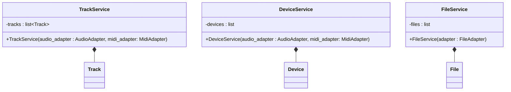
```mermaid
classDiagram

    class TrackService {
        -tracks : list~Track~
        +TrackService(audio_adapter : AudioAdapter, midi_adapter: MidiAdapter)
    }

    class DeviceService {
        -devices : list<Device>
        +DeviceService(audio_adapter : AudioAdapter, midi_adapter: MidiAdapter)
    }

    class FileService {
        -files : list<File>
        +FileService(adapter : FileAdapter)
    }

    TrackService *-- Track
    DeviceService *-- Device
    FileService *-- File
```

\newpage

### 3.5.3. Tracks

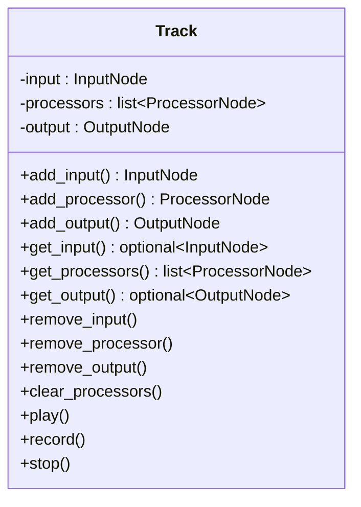
```mermaid
classDiagram

    class Track {
        -input : InputNode
        -processors : list~ProcessorNode~
        -output : OutputNode

        +add_input() InputNode
        +add_processor() ProcessorNode
        +add_output() OutputNode

        +get_input() optional~InputNode~
        +get_processors() list~ProcessorNode~
        +get_output() optional~OutputNode~

        +remove_input()
        +remove_processor()
        +remove_output()

        +clear_processors()

        +play()
        +record()
        +stop()
    }
```

\newpage

### 3.5.4. Devices

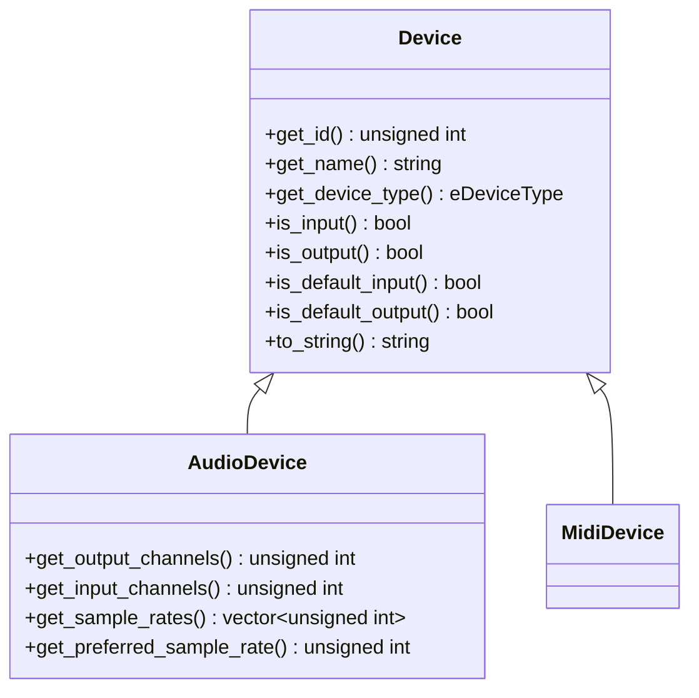
```mermaid
classDiagram

    class Device {
        +get_id() unsigned int
        +get_name() string
        +get_device_type() eDeviceType
        +is_input() bool
        +is_output() bool
        +is_default_input() bool
        +is_default_output() bool
        +to_string() string
    }

    class AudioDevice {
        +get_output_channels() unsigned int
        +get_input_channels() unsigned int
        +get_sample_rates() vector~unsigned int~
        +get_preferred_sample_rate() unsigned int
    }

    class MidiDevice {

    }

    Device <|-- AudioDevice
    Device <|-- MidiDevice
```

\newpage

### 3.5.5. Files

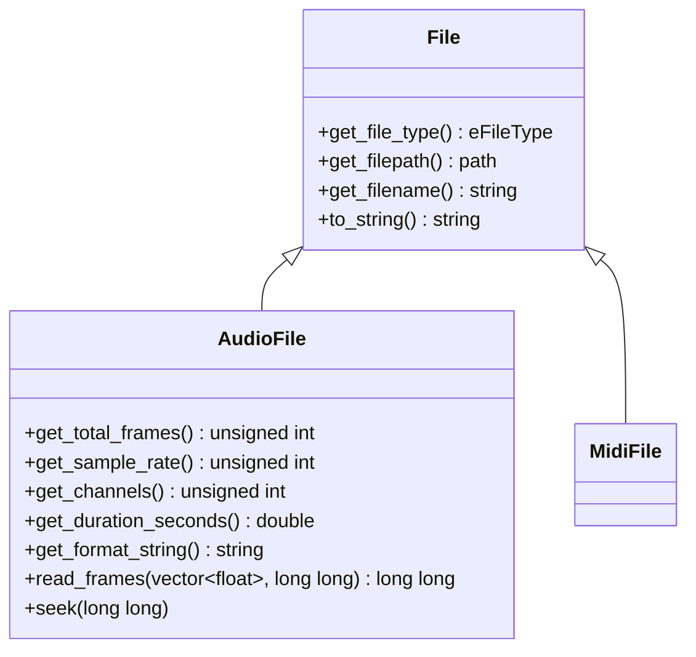
```mermaid
classDiagram

    class File {
        +get_file_type() eFileType
        +get_filepath() path
        +get_filename() string
        +to_string() string
    }

    class AudioFile {
        +get_total_frames() unsigned int
        +get_sample_rate() unsigned int
        +get_channels() unsigned int
        +get_duration_seconds() double
        +get_format_string() string
        +read_frames(vector~float~, long long) long long
        +seek(long long)
    }

    class MidiFile {

    }

    File <|-- AudioFile
    File <|-- MidiFile
```

\newpage

### 3.5.6. Data Plane

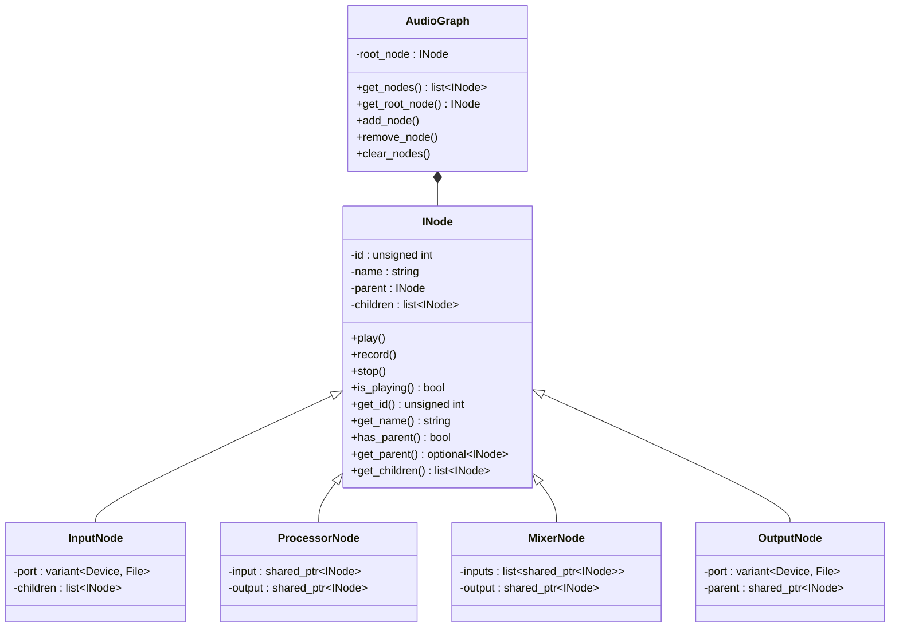
```mermaid
classDiagram

    class AudioGraph {
        -root_node : INode

        +get_nodes() list~INode~
        +get_root_node() INode
        +add_node()
        +remove_node()
        +clear_nodes()
    }

    class INode {
        -id : unsigned int
        -name : string
        -parent : INode
        -children : list~INode~

        +play()
        +record()
        +stop()
        
        +is_playing() bool

        +get_id() unsigned int
        +get_name() string

        +has_parent() bool
        +get_parent() optional~INode~
        +get_children() list~INode~
    }

    class InputNode {
        -port : variant~Device, File~
        -children : list~INode~
    }

    class OutputNode {
        -port : variant~Device, File~
        -parent : shared_ptr~INode~
    }

    class ProcessorNode {
        -input : shared_ptr~INode~
        -output : shared_ptr~INode~
    }

    class MixerNode {
        -inputs : list~shared_ptr~INode~~
        -output : shared_ptr~INode~
    }

    AudioGraph *-- INode

    INode <|-- InputNode
    INode <|-- ProcessorNode
    INode <|-- MixerNode
    INode <|-- OutputNode
```

\newpage

## 3.6. Interface View

| Design Concern | |
| -- | -- |
| **DC-01** | Monitor audio input device. |
| **DC-02** | Monitor MIDI input device. |
| **DC-05** | Route audio to output device. |
| **DC-06** | Route MIDI to output device. |
| **DC-07** | Processing incoming MIDI messages. |
| **DC-08** | Processing incoming audio streams. |
| **DC-09** | Manage multiple audio tracks. |
| **DC-10** | Add one audio or MIDI input to a track. |
| **DC-11** | Attach one audio or MIDI output to a track. |
| **DC-12** | Chain multiple audio processors in one track. |
| **DC-18** | Third-party software developers manage audio tracks, system audio/MIDI devices, and filesystem. |

The user uses the software via the main `miniaudioengine` SDK library.

\newpage

The following types need to be accessible to the user:

| Component      | Description | Location |
| -------------- | ----------- | -------- |
| `AudioSession` |             |
| `Device`       |             |
| `File`         |             |
| `Track`        |             |
| `Processor`    |             |

The following operations need to be accessible to the user:

| Operation                                  | Component                |
| ------------------------------------------ | ------------------------ |
| Get audio/MIDI devices                     | `AudioSession`, `Device` |
| Get audio/MIDI files                       | `AudioSession`, `File`   |
| Set audio/MIDI device as input or output   | `Track`                  |
| Set audio/MIDI file as input or output     | `Track`                  |
| Add a new track                            | `AudioSession`, `Track`  |
| Add and audio or MIDI processor to a track | `Track`, `Processor`     |
| Start/stop playback                        | `AudioSession`           |
| Start/stop recording                       | `AudioSession`           |

\newpage

### 3.6.1. Audio Session

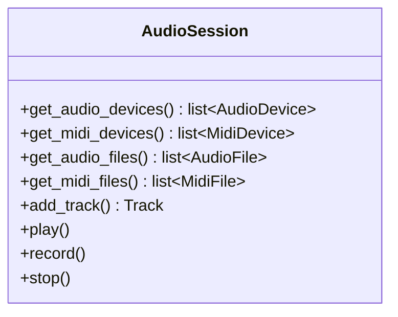
```mermaid width=50%
classDiagram

    class AudioSession {
        +get_audio_devices() list~AudioDevice~
        +get_midi_devices() list~MidiDevice~
        +get_audio_files() list~AudioFile~
        +get_midi_files() list~MidiFile~
        +add_track() Track
        +play()
        +record()
        +stop()
    }
```

### 3.6.2. Track

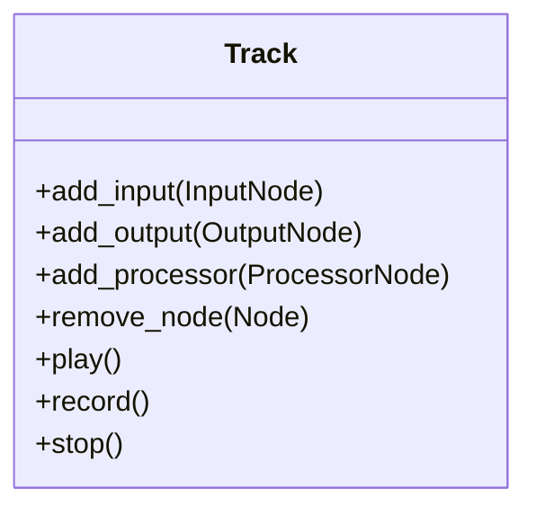
```mermaid width=50%
classDiagram

    class Track {
        +add_input(InputNode)
        +add_output(OutputNode)
        +add_processor(ProcessorNode)
        +remove_node(Node)
        +play()
        +record()
        +stop()
    }
```

\newpage

### 3.6.3. Device

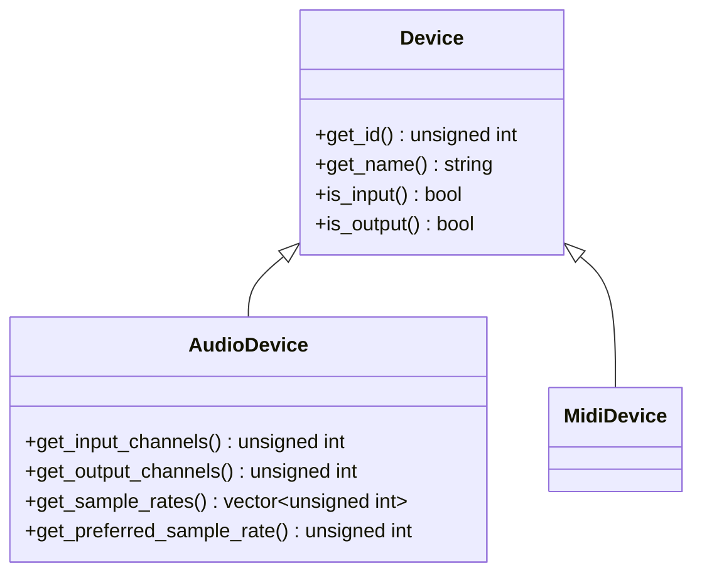
```mermaid width=80%
classDiagram

    class Device {
        +get_id() unsigned int
        +get_name() string
        +is_input() bool
        +is_output() bool
    }

    class AudioDevice {
        +get_input_channels() unsigned int
        +get_output_channels() unsigned int
        +get_sample_rates() vector~unsigned int~
        +get_preferred_sample_rate() unsigned int
    }

    class MidiDevice {
    }

    Device<|--AudioDevice
    Device<|--MidiDevice
```

\newpage

### 3.6.4. File

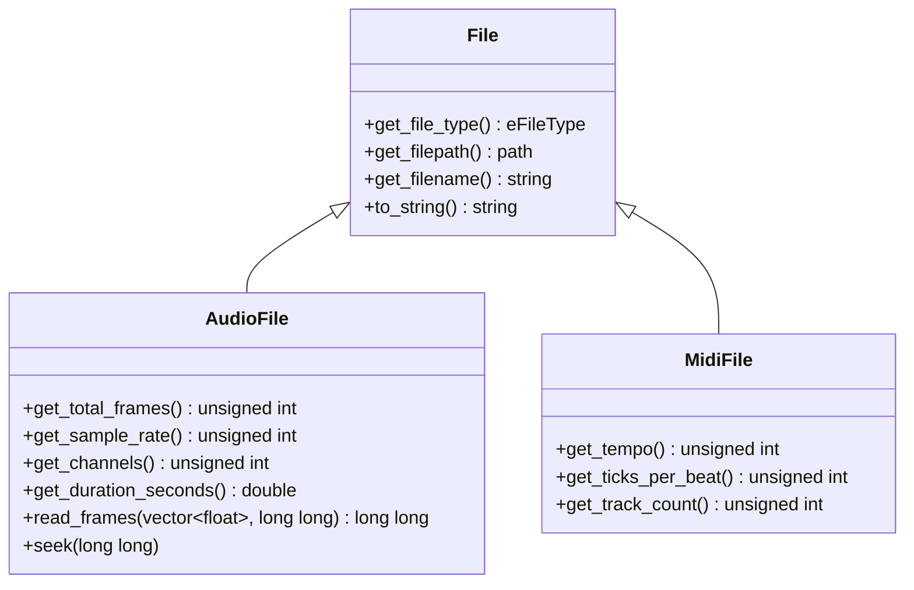
```mermaid width=80%
classDiagram

    class File {
        +get_file_type() eFileType
        +get_filepath() path
        +get_filename() string
        +to_string() string
    }

    class AudioFile {
        +get_total_frames() unsigned int
        +get_sample_rate() unsigned int
        +get_channels() unsigned int
        +get_duration_seconds() double
        +read_frames(vector~float~, long long) long long
        +seek(long long)
    }

    class MidiFile {
        +get_tempo() unsigned int
        +get_ticks_per_beat() unsigned int
        +get_track_count() unsigned int
    }

    File<|--AudioFile
    File<|--MidiFile
```

\newpage

## 3.7. Interaction View

| Design Concern |                                                                                                 |
| -------------- | ----------------------------------------------------------------------------------------------- |
| **DC-03**      | Open and read WAV audio files.                                                                  |
| **DC-05**      | Route audio to output device.                                                                   |
| **DC-09**      | Manage multiple audio tracks.                                                                   |
| **DC-18**      | Third-party software developers manage audio tracks, system audio/MIDI devices, and filesystem. |

### 3.7.1. Control Plane

| Operation                                  |
| ------------------------------------------ |
| Get audio/MIDI devices                     |
| Get audio/MIDI files                       |
| Set audio/MIDI device as input or output   |
| Set audio/MIDI file as input or output     |
| Add a new track                            |
| Add and audio or MIDI processor to a track |
| Start/stop playback                        |
| Start/stop recording                       |

\newpage

*e.g. Play Audio File to Output Device*

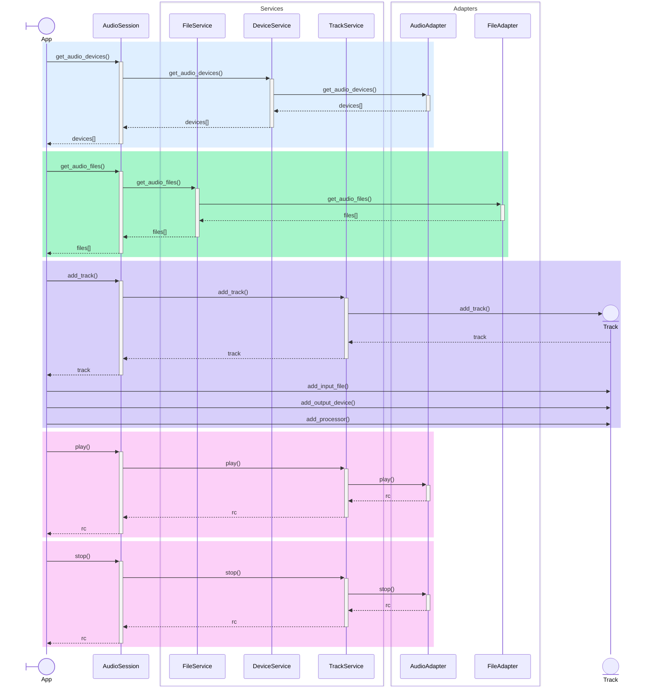
```mermaid caption="Play Audio File to Output Device"
sequenceDiagram

    participant App@{ "type": "boundary" }
    participant AudioSession

    box Services
      participant FileService
      participant DeviceService
      participant TrackService
    end

    box Adapters
      participant AudioAdapter
      participant FileAdapter
    end

    rect rgba(191, 223, 255, 0.5)
      App->>+AudioSession: get_audio_devices()
      AudioSession->>+DeviceService: get_audio_devices()
      DeviceService->>+AudioAdapter: get_audio_devices()

      AudioAdapter-->>-DeviceService: devices[]
      DeviceService-->>-AudioSession: devices[]
      AudioSession-->>-App: devices[]
    end

    rect rgba(33, 231, 122, 0.4)
      App->>+AudioSession: get_audio_files()
      AudioSession->>+FileService: get_audio_files()
      FileService->>+FileAdapter: get_audio_files()

      FileAdapter-->>-FileService: files[]
      FileService-->>-AudioSession: files[]
      AudioSession-->>-App: files[]
    end

    rect rgba(102, 72, 235, 0.26)
      App->>+AudioSession: add_track()
      AudioSession->>+TrackService: add_track()
      create participant Track@{ "type": "entity" }
      TrackService->>Track: add_track()

      Track-->>TrackService: track
      TrackService-->>-AudioSession: track
      AudioSession-->>-App: track

      App->>Track: add_input_file()
      App->>Track: add_output_device()
      App->>Track: add_processor()
    end

    rect rgba(241, 76, 228, 0.26)
      App->>+AudioSession: play()
      AudioSession->>+TrackService: play()
      TrackService->>+AudioAdapter: play()

      AudioAdapter-->>-TrackService: rc
      TrackService-->>-AudioSession: rc
      AudioSession-->>-App: rc
    end

    rect rgba(241, 76, 228, 0.26)
      App->>+AudioSession: stop()
      AudioSession->>+TrackService: stop()
      TrackService->>+AudioAdapter: stop()
    
      AudioAdapter-->>-TrackService: rc
      TrackService-->>-AudioSession: rc
      AudioSession-->>-App: rc
    end
```

\newpage

### 3.7.2. Audio Data Plane

The data plane components are compiled into an acyclic graph as shown below. The `RtAudio` callback a depth-first traversal over the `AudioGraph` to process audio.

```mermaid width=80%
graph TD

    TrackService --> AudioCallbackHandler
    AudioCallbackHandler --> Mixer("MixerNode")

    subgraph AudioGraph
        Mixer --> OutputNode1("OutputNode")
        Mixer --> OutputNode2("OutputNode")

        subgraph Track1["Track"]
            OutputNode1 --> ProcessorNode1("ProcessorNode")
            ProcessorNode1 --> InputNode1("InputNode")
        end

        subgraph Track2["Track"]
            OutputNode2 --> ProcessorNode2("ProcessorNode")
            ProcessorNode2 --> InputNode2("InputNode")
        end
    end
```

\newpage

```mermaid
sequenceDiagram

    participant RtAudio@{ "type": "boundary" }
    participant AudioCallbackHandler

    box rgba(99, 240, 228, 0.23) AudioGraph
      participant MixerNode@{ "type" : "entity" }
    end

    box rgba(99, 199, 245, 0.32) Track
      participant OutputNode@{ "type" : "entity" }
      participant ProcessorList@{ "type" : "entity" } as ProcessorList<ProcessorNode>
      participant InputNode@{ "type" : "entity" }
    end

    participant Input@{ "type": "boundary", "alias": "Input" } as Input Device/File

    RtAudio->>+AudioCallbackHandler: process_audio()
    AudioCallbackHandler->>+MixerNode: process_audio()

    loop for each Track
      Note over MixerNode: Process Tracks in parallel
      MixerNode->>+OutputNode: process_audio()

      OutputNode->>+ProcessorList: process_audio()
      Note over ProcessorList: Process ProcessorNodes in series

      ProcessorList->>+InputNode: process_audio()

      InputNode->>+Input: process_audio()
      Note over InputNode,Input: Read audio input data
      Input-->-InputNode: output_buffer[]

      InputNode-->>-ProcessorList: output_buffer[]
      ProcessorList-->>-OutputNode: output_buffer[]

      OutputNode-->>-MixerNode: output_buffer[]
    end

    MixerNode-->>-AudioCallbackHandler: output_buffer[]
    AudioCallbackHandler-->>-RtAudio: output_buffer[]
```

\newpage

## 3.8. Structure View

| Design Concern |                                                                          |
| -------------- | ------------------------------------------------------------------------ |
| **DC-13**      | Build software SDK on Windows and Linux.                                 |
| **DC-14**      | Build software SDK on x86_64 and ARM64 platforms.                        |
| **DC-15**      | CI/CD pipeline builds and packages software on all compatible platforms. |
| **DC-16**      | Complete unit testing and code coverage.                                 |
| **DC-17**      | Package software as an SDK used by third-party software.                 |

### 3.8.1. Library Structure

| Internal Library | Components                                                            | Namespace                    |
| ---------------- | --------------------------------------------------------------------- | ---------------------------- |
| miniaudioengine  | `AudioSession`                                                        | `miniaudioengine`            |
| entities         | `Track`, `Device`, `File`, `Processor`                                | `miniaudioengine`            |
| services         | `TrackService`, `DeviceService`, `FileService`                        | `miniaudioengine::services`  |
| adapters         | `AudioAdapter`, `MidiAdapter`, `FileAdapter`                          | `miniaudioengine::adapters`  |
| dataplane        | `AudioGraph`, `InputNode`, `OutputNode`, `ProcessorNode`, `MixerNode` | `miniaudioengine::dataplane` |
| framework        | `IService`, `IAdapter`, `IEntity`, `INode`                            | `miniaudioengine::framework` |

\newpage

### 3.8.2. Project Structure

```bash
examples/           # Example programs using miniaudioengine SDK
include/
    miniaudioengine/
        audiosession.h          # using namespace miniaudioengine
        track.h
        audiodevice.h
        mididevice.h
        audiofile.h
        midifile.h
        audioprocessor.h
        midiprocessor.h
src/
    framework/
    services/
    entities/
    adapters/
tests/
```

### 3.8.3. Thread Structure

| Thread | Description |
|---|---|
| Main | Main execution thread.
| RtAudio | Real-time audio data processing.
| RtMidi | Real-time MIDI message handling. 


```mermaid
graph TD
    subgraph Main
        App
    end

    subgraph RtAudio
        AudioCallbackHandler
    end

    subgraph RtMidi
        MidiCallbackHandler
    end

    Main <--> RtAudio
    Main <--> RtMidi
```

\newpage

# 4. Design Rationale

## 4.1. Architectural Design

I am keeping the control and data components of this library separate. The main component of the control section is the `AudioSession`. The `AudioSession` owns `Services` for different functionalities. `AudioSession` wraps function calls to the internal `Services` and exposes them to the programmer. `Services` own `Adapters` to interface with external hardware / libraries. `Services` return `Entity` objects for the programmer to interact with.

The programmer can create parallel audio chains using `Tracks` created by the `AudioSession`. `Tracks` have an assigned `Input` and `Output` and can have a list of `Processors` that execute in series.

The data plane is implemented in the `AudioGraph` structure. `AudioGraph` is a tree where the root node is a `MixerNode`. The `MixerNode` may have `OutputNodes`, `ProcessorNodes`, or `InputNodes` as children. `InputNodes` have no children.

### 4.1.1. Audio Session

This library uses the **Facade** pattern for the `AudioSession` object. `AudioSession` is a wrapper around the internal logic exposed to the programmer. An `AudioSession` owns a `DeviceService`, `FileService`, and `TrackService` that divides and implements the internal engine logic.

```mermaid caption="Facade design pattern" width=20%
classDiagram

    class IFacade {
        +foo() int
        -object : IObject
    }

    class IObject {
        +foo() int
    }

    IFacade *-- IObject
```

```cpp
int IFacade::foo() {
    return object.foo();
}
```

*e.g.*

```mermaid width=50%
classDiagram

    App *-- AudioSession

    AudioSession *-- DeviceService
    AudioSession *-- FileService
    AudioSession *-- TrackService
```

\newpage

### 4.1.2. Services

This library uses the **Factory** pattern for `Services` to create `Entities`.

\newpage

### 4.1.3. Adapters

This library uses the **Adapter** pattern to interface with external hardware / libraries. This adds an abstraction layer between the library and the external dependendies, providing isolation of implementation.

\newpage

### 4.1.4. Entities

\newpage

### 4.1.5. Data Plane

\newpage

## 4.2. External Libraries
