\newpage

# 1. Introduction

This document describes the software design for a **looper application** built on the [miniaudioengine SDK](DESIGN_DOC.md). The looper targets embedded Linux platforms (e.g. Raspberry Pi) connected to a USB or I²S audio interface. It allows a user to record repeating audio loops quantised to a metronome beat, layer multiple loops on top of each other across independent tracks, and route the combined mix to the audio interface output.

The design reuses the SDK's `TrackService`, `DeviceService`, and `Track` hierarchy without modification. All looper-specific logic — timing, state management, and recording — lives in a new application layer above the SDK.

\newpage

# 2. Stakeholders and Design Concerns

## 2.1. Stakeholders

| Stakeholder | Responsibilities | Design Concerns |
| -- | -- | -- |
| End User (Musician) | - Set metronome BPM.\newline- Record audio loops from an audio interface.\newline- Overdub additional loops on top of existing recordings.\newline- Mute / unmute individual loops.\newline- Delete individual loops or all loops.\newline- Monitor combined playback through the audio interface output. | DC-L01\newline DC-L02\newline DC-L03\newline DC-L04\newline DC-L05\newline DC-L06\newline DC-L07 |
| Embedded Platform (Raspberry Pi) | - Run real-time audio processing under Linux.\newline- Provide stable, low-latency audio I/O via an attached audio interface. | DC-L08\newline DC-L09 |
| miniaudioengine SDK | - Supply audio device enumeration, track management, and real-time audio routing primitives. | DC-L09\newline DC-L10 |

\newpage

## 2.2. Design Concerns

| ID | Description | Relevant Views |
| -- | -- | -- |
| **DC-L01** | User can configure a metronome BPM. | Logical, Information |
| **DC-L02** | User can start and stop the metronome. | Logical, Interaction |
| **DC-L03** | User can record a loop from the audio interface input, quantised to the metronome bar boundary. | Logical, Interaction |
| **DC-L04** | User can play back a recorded loop in a repeating cycle. | Logical, Interaction |
| **DC-L05** | User can overdub additional loops by recording on additional tracks simultaneously with existing playback. | Logical, Interaction |
| **DC-L06** | User can mute or unmute any individual loop. | Logical, Information |
| **DC-L07** | User can delete an individual loop or clear all loops. | Logical, Interaction |
| **DC-L08** | Looper runs on Linux (Raspberry Pi); audio I/O via an audio interface device. | Context |
| **DC-L09** | Looper integrates the miniaudioengine SDK for all audio device access, track management, and real-time mixing. | Context, Dependency |
| **DC-L10** | Loop boundaries are always aligned to a bar-length time window determined by BPM and beats-per-bar. | Logical, Interaction |

\newpage

# 3. Design Views

## 3.1. Context View

Describes the looper application in context with its external environment.

| Design Concern | |
| -- | -- |
| **DC-L08** | Looper runs on Linux (Raspberry Pi); audio I/O via an audio interface device. |
| **DC-L09** | Looper integrates the miniaudioengine SDK for all audio device access and routing. |

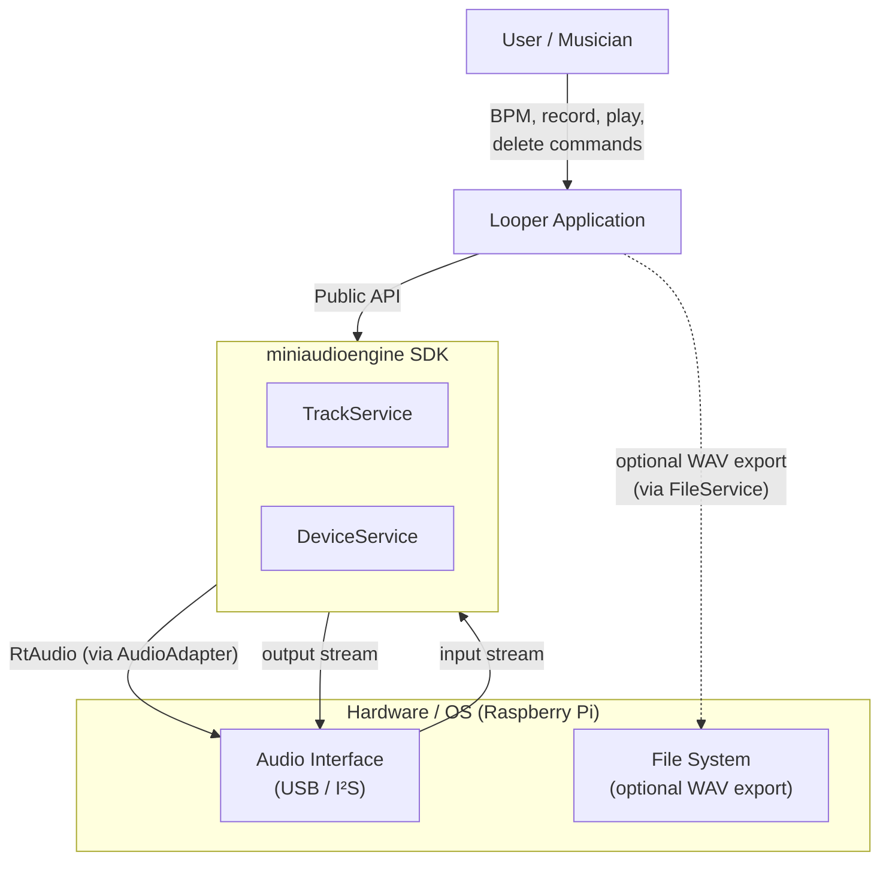
```mermaid caption="Loop Context View" width=90%
graph TD
    User["User / Musician"]
    Looper["Looper Application"]

    subgraph SDK["miniaudioengine SDK"]
        TrackService
        DeviceService
    end

    subgraph HW["Hardware / OS (Raspberry Pi)"]
        AudioInterface["Audio Interface\n(USB / I²S)"]
        FS["File System\n(optional WAV export)"]
    end

    User -->|"BPM, record, play,\ndelete commands"| Looper
    Looper -->|"Public API"| SDK
    SDK -->|"RtAudio (via AudioAdapter)"| AudioInterface
    AudioInterface -->|"input stream"| SDK
    SDK -->|"output stream"| AudioInterface
    Looper -.->|"optional WAV export\n(via FileService)"| FS
```

\newpage

## 3.2. Composition View

### 3.2.1. Looper Application Components

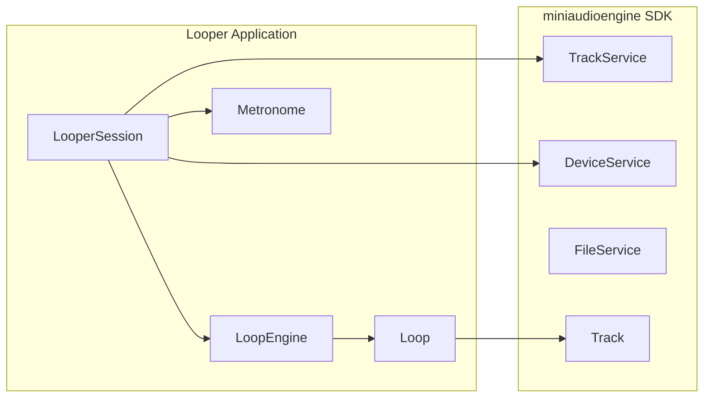
```mermaid caption="Looper Application Components View"
graph LR

    subgraph LooperApp["Looper Application"]
        LooperSession
        LoopEngine
        Metronome
        Loop
    end

    subgraph SDK["miniaudioengine SDK"]
        TrackService
        DeviceService
        FileService
        Track
    end

    LooperSession --> LoopEngine
    LooperSession --> Metronome
    LoopEngine --> Loop
    Loop --> Track
    LooperSession --> TrackService
    LooperSession --> DeviceService
```

\newpage

### 3.2.2. Loop Collection

Each active loop maps to one child `Track` under the SDK's `MainTrack`.

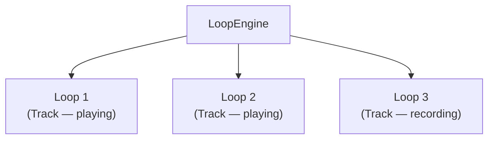
```mermaid caption="Loop Collection View"
graph TD

    LoopEngine

    LoopEngine --> L1["Loop 1\n(Track — playing)"]
    LoopEngine --> L2["Loop 2\n(Track — playing)"]
    LoopEngine --> L3["Loop 3\n(Track — recording)"]
```

### 3.2.3. SDK Track Hierarchy (runtime)

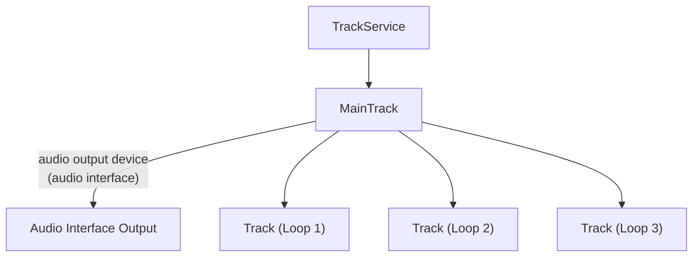
```mermaid caption="SDK Track Hierarchy View"
graph TD

    TrackService

    TrackService --> MainTrack
    MainTrack -->|"audio output device\n(audio interface)"| AudioInterface["Audio Interface Output"]
    MainTrack --> T1["Track (Loop 1)"]
    MainTrack --> T2["Track (Loop 2)"]
    MainTrack --> T3["Track (Loop 3)"]
```

\newpage

## 3.3. Logical View

### 3.3.1. Metronome Flow

| Design Concern | |
| -- | -- |
| **DC-L01** | User can configure a metronome BPM. |
| **DC-L02** | User can start and stop the metronome. |

The `Metronome` tracks the current beat and bar position in time. It fires a `on_bar_start` callback at the beginning of every bar. The loop length is derived from BPM and beats-per-bar.

```
loop_duration_s = (60.0 / BPM) × beats_per_bar × bars_per_loop
```

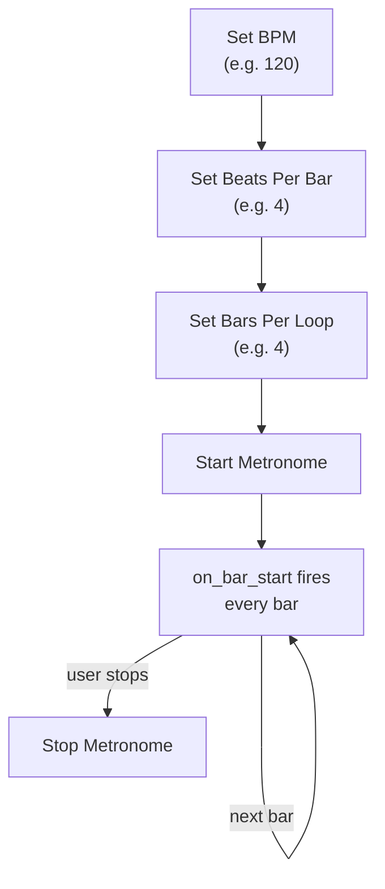
```mermaid caption="Metronome Flow" height=55%
flowchart TD

    S1["Set BPM\n(e.g. 120)"]
    S2["Set Beats Per Bar\n(e.g. 4)"]
    S3["Set Bars Per Loop\n(e.g. 4)"]
    S4["Start Metronome"]
    S5["on_bar_start fires\nevery bar"]
    S6["Stop Metronome"]

    S1 --> S2 --> S3 --> S4 --> S5 -->|"next bar"| S5
    S5 -->|"user stops"| S6
```

\newpage

### 3.3.2. Record Loop Flow

| Design Concern | |
| -- | -- |
| **DC-L03** | User can record a loop from the audio interface input, quantised to the metronome bar boundary. |
| **DC-L10** | Loop boundaries align to the bar-length window. |

Recording does not begin immediately when the user presses record. Instead the `LoopEngine` arms the next loop and begins capture precisely when the next bar starts.

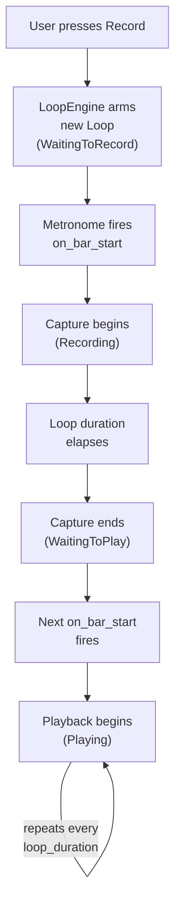
```mermaid caption="Record Loop Flow" height=65%
flowchart TD

    S1["User presses Record"]
    S2["LoopEngine arms\nnew Loop\n(WaitingToRecord)"]
    S3["Metronome fires\non_bar_start"]
    S4["Capture begins\n(Recording)"]
    S5["Loop duration\nelapses"]
    S6["Capture ends\n(WaitingToPlay)"]
    S7["Next on_bar_start\nfires"]
    S8["Playback begins\n(Playing)"]

    S1 --> S2 --> S3 --> S4 --> S5 --> S6 --> S7 --> S8
    S8 -->|"repeats every\nloop_duration"| S8
```

\newpage

### 3.3.3. Overdub Flow

| Design Concern | |
| -- | -- |
| **DC-L05** | User can overdub additional loops on top of existing playback. |

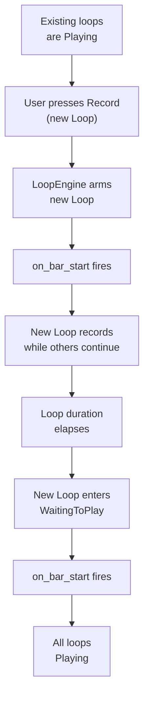
```mermaid caption="Overdub Flow" height=75%
flowchart TD

    S1["Existing loops\nare Playing"]
    S2["User presses Record\n(new Loop)"]
    S3["LoopEngine arms\nnew Loop"]
    S4["on_bar_start fires"]
    S5["New Loop records\nwhile others continue"]
    S6["Loop duration\nelapses"]
    S7["New Loop enters\nWaitingToPlay"]
    S8["on_bar_start fires"]
    S9["All loops\nPlaying"]

    S1 --> S2 --> S3 --> S4 --> S5 --> S6 --> S7 --> S8 --> S9
```

\newpage

### 3.3.4. Delete Loop Flow

| Design Concern | |
| -- | -- |
| **DC-L07** | User can delete an individual loop or clear all loops. |

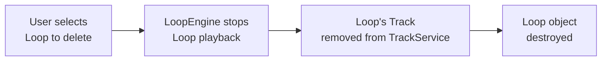
```mermaid
flowchart LR

    S1["User selects\nLoop to delete"]
    S2["LoopEngine stops\nLoop playback"]
    S3["Loop's Track\nremoved from TrackService"]
    S4["Loop object\ndestroyed"]

    S1 --> S2 --> S3 --> S4
```

\newpage

### 3.3.5. Loop State Machine

Each `Loop` has an independent state machine.

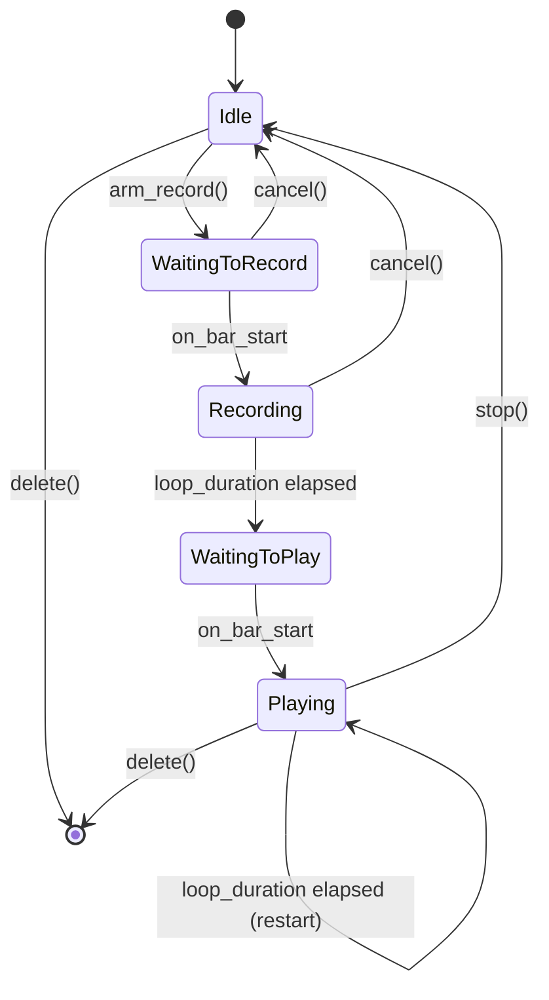
```mermaid height=80%
stateDiagram-v2
    [*] --> Idle

    Idle --> WaitingToRecord : arm_record()
    WaitingToRecord --> Recording : on_bar_start
    Recording --> WaitingToPlay : loop_duration elapsed
    WaitingToPlay --> Playing : on_bar_start
    Playing --> Playing : loop_duration elapsed (restart)
    Playing --> Idle : stop()
    WaitingToRecord --> Idle : cancel()
    Recording --> Idle : cancel()
    Idle --> [*] : delete()
    Playing --> [*] : delete()
```

\newpage

## 3.4. Dependency View

The looper application sits above the miniaudioengine SDK. It does not depend on any SDK-internal layer; all access is through the SDK's public header files in `include/miniaudioengine/`.

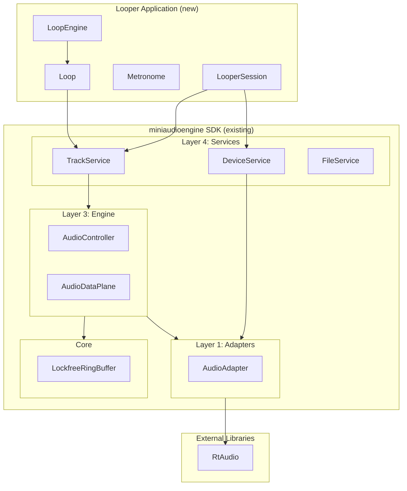
```mermaid height=80%
graph TD

    subgraph LooperApp["Looper Application (new)"]
        LooperSession
        LoopEngine
        Metronome
        Loop
    end

    subgraph SDK["miniaudioengine SDK (existing)"]
        subgraph Services["Layer 4: Services"]
            TrackService
            DeviceService
            FileService
        end

        subgraph Engine["Layer 3: Engine"]
            AudioController
            AudioDataPlane
        end

        subgraph Adapters["Layer 1: Adapters"]
            AudioAdapter
        end

        subgraph Core["Core"]
            LockfreeRingBuffer
        end
    end

    subgraph External["External Libraries"]
        RtAudio
    end

    LooperSession --> TrackService
    LooperSession --> DeviceService
    LoopEngine --> Loop
    Loop --> TrackService

    TrackService --> Engine
    DeviceService --> Adapters
    Engine --> Adapters
    Engine --> Core
    Adapters --> RtAudio
```

\newpage

## 3.5. Information View

### 3.5.1. Metronome

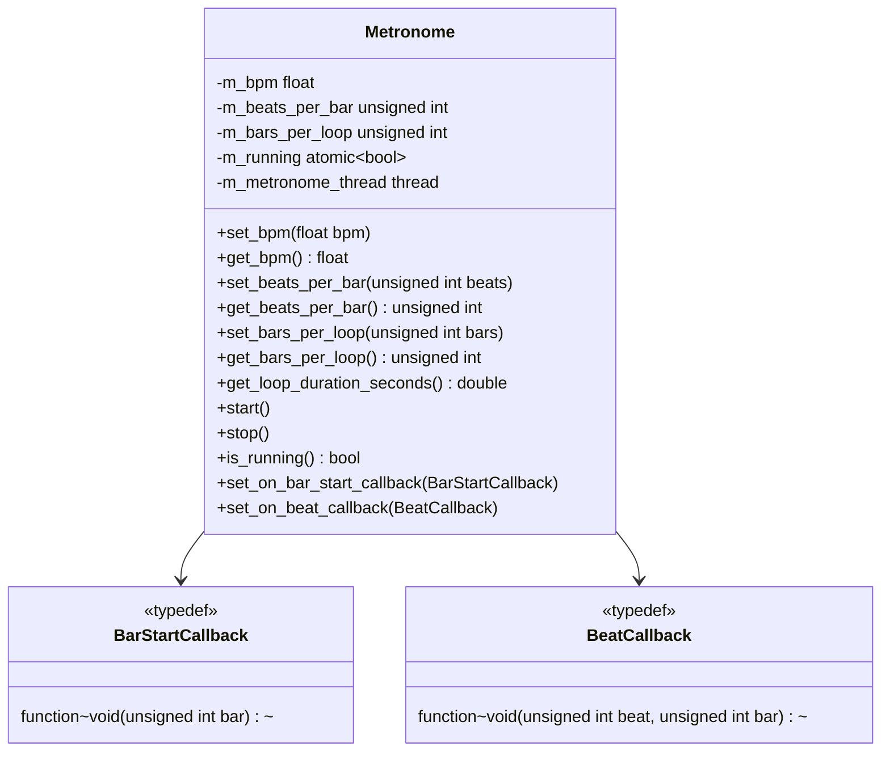
```mermaid
classDiagram

    class Metronome {
        +set_bpm(float bpm)
        +get_bpm() float
        +set_beats_per_bar(unsigned int beats)
        +get_beats_per_bar() unsigned int
        +set_bars_per_loop(unsigned int bars)
        +get_bars_per_loop() unsigned int
        +get_loop_duration_seconds() double
        +start()
        +stop()
        +is_running() bool
        +set_on_bar_start_callback(BarStartCallback)
        +set_on_beat_callback(BeatCallback)
        -m_bpm float
        -m_beats_per_bar unsigned int
        -m_bars_per_loop unsigned int
        -m_running atomic~bool~
        -m_metronome_thread thread
    }

    class BarStartCallback {
        <<typedef>>
        function~void(unsigned int bar)~
    }

    class BeatCallback {
        <<typedef>>
        function~void(unsigned int beat, unsigned int bar)~
    }

    Metronome --> BarStartCallback
    Metronome --> BeatCallback
```

\newpage

### 3.5.2. Loop

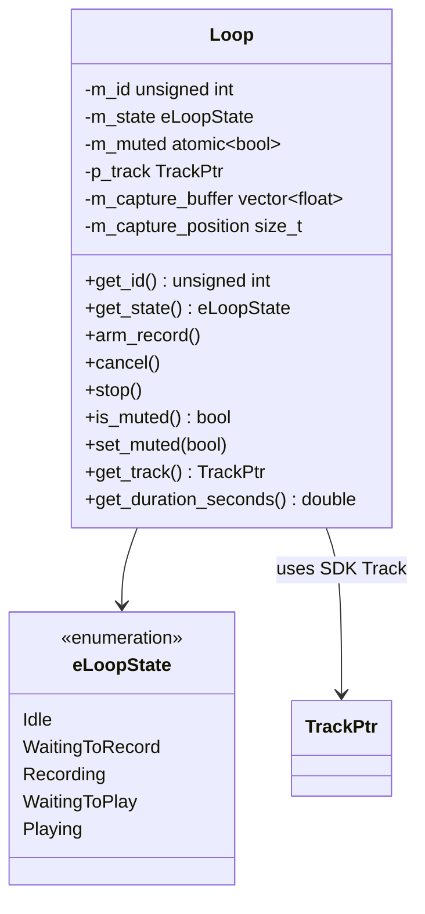
```mermaid
classDiagram

    class Loop {
        +get_id() unsigned int
        +get_state() eLoopState
        +arm_record()
        +cancel()
        +stop()
        +is_muted() bool
        +set_muted(bool)
        +get_track() TrackPtr
        +get_duration_seconds() double
        -m_id unsigned int
        -m_state eLoopState
        -m_muted atomic~bool~
        -p_track TrackPtr
        -m_capture_buffer vector~float~
        -m_capture_position size_t
    }

    class eLoopState {
        <<enumeration>>
        Idle
        WaitingToRecord
        Recording
        WaitingToPlay
        Playing
    }

    Loop --> eLoopState
    Loop --> TrackPtr : uses SDK Track
```

\newpage

### 3.5.3. LoopEngine

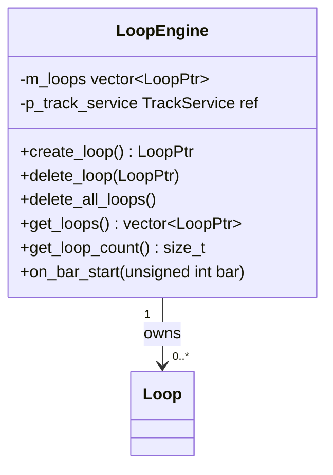
```mermaid caption="Loop Engine Class Diagram" width=50%
classDiagram

    class LoopEngine {
        +create_loop() LoopPtr
        +delete_loop(LoopPtr)
        +delete_all_loops()
        +get_loops() vector~LoopPtr~
        +get_loop_count() size_t
        +on_bar_start(unsigned int bar)
        -m_loops vector~LoopPtr~
        -p_track_service TrackService ref
    }

    LoopEngine "1" --> "0..*" Loop : owns
```

\newpage

### 3.5.4. LooperSession

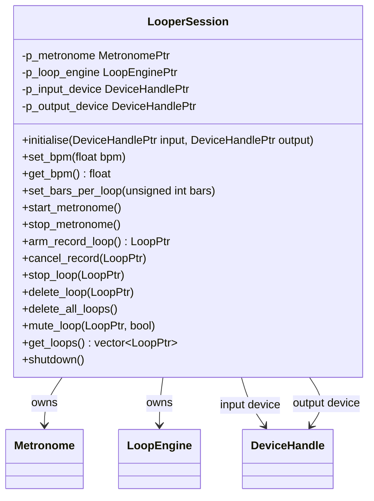
```mermaid caption="LooperSession Class Diagram" width=80%
classDiagram

    class LooperSession {
        +initialise(DeviceHandlePtr input, DeviceHandlePtr output)
        +set_bpm(float bpm)
        +get_bpm() float
        +set_bars_per_loop(unsigned int bars)
        +start_metronome()
        +stop_metronome()
        +arm_record_loop() LoopPtr
        +cancel_record(LoopPtr)
        +stop_loop(LoopPtr)
        +delete_loop(LoopPtr)
        +delete_all_loops()
        +mute_loop(LoopPtr, bool)
        +get_loops() vector~LoopPtr~
        +shutdown()
        -p_metronome MetronomePtr
        -p_loop_engine LoopEnginePtr
        -p_input_device DeviceHandlePtr
        -p_output_device DeviceHandlePtr
    }

    LooperSession --> Metronome : owns
    LooperSession --> LoopEngine : owns
    LooperSession --> DeviceHandle : input device
    LooperSession --> DeviceHandle : output device
```

\newpage

## 3.6. Interface View

### 3.6.1. User-Facing Operations

| Operation | Method | Notes |
| -- | -- | -- |
| Set BPM | `LooperSession::set_bpm(float)` | Any time before or after metronome starts; takes effect on next bar. |
| Set loop length | `LooperSession::set_bars_per_loop(unsigned int)` | Default: 4 bars. |
| Start metronome | `LooperSession::start_metronome()` | Launches metronome thread; begins firing bar-start callbacks. |
| Stop metronome | `LooperSession::stop_metronome()` | Stops timing; in-progress recording is cancelled. |
| Arm loop record | `LooperSession::arm_record_loop()` | Returns a `LoopPtr`; capture begins at next bar boundary. |
| Stop loop | `LooperSession::stop_loop(LoopPtr)` | Halts playback; loop enters `Idle`. |
| Mute loop | `LooperSession::mute_loop(LoopPtr, bool)` | Toggles `Track::enable_output(bool)` on the underlying SDK track. |
| Delete loop | `LooperSession::delete_loop(LoopPtr)` | Removes the loop and its SDK track. |
| Delete all | `LooperSession::delete_all_loops()` | Removes all loops and tracks. |

\newpage

### 3.6.2. SDK API Touchpoints

| Looper Component | SDK Call | Purpose |
| -- | -- | -- |
| `LooperSession::initialise()` | `DeviceService::get_audio_devices()` | Enumerate audio interface devices. |
| `LooperSession::initialise()` | `TrackService::set_audio_output_device()` | Route mix to audio interface output. |
| `LoopEngine::create_loop()` | `TrackService::create_child_track()` | Allocate a new SDK track for the loop. |
| `LoopEngine::delete_loop()` | `TrackService::remove_track()` | Release the SDK track. |
| Recording start | `Track::add_audio_input(DeviceHandlePtr)` | Route audio interface input to loop's track. |
| Playback start | `Track::add_audio_input(FileHandlePtr)` | Feed captured audio back via SDK (or in-memory buffer). |
| Mute | `Track::enable_output(bool)` | Silence a loop without stopping it. |
| Gain | `Track::set_output_gain(float)` | Per-loop volume control. |

\newpage

## 3.7. Interaction View

### 3.7.1. Session Initialisation

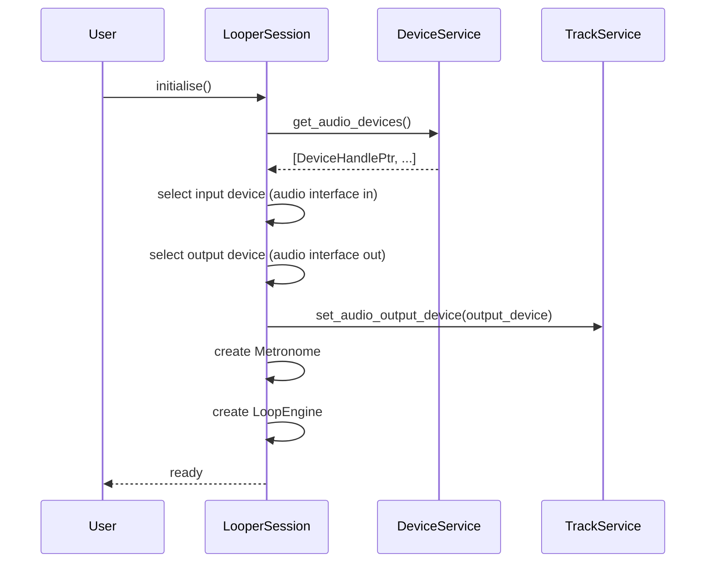
```mermaid
sequenceDiagram

    participant User
    participant LooperSession
    participant DeviceService
    participant TrackService

    User->>LooperSession: initialise()
    LooperSession->>DeviceService: get_audio_devices()
    DeviceService-->>LooperSession: [DeviceHandlePtr, ...]
    LooperSession->>LooperSession: select input device (audio interface in)
    LooperSession->>LooperSession: select output device (audio interface out)
    LooperSession->>TrackService: set_audio_output_device(output_device)
    LooperSession->>LooperSession: create Metronome
    LooperSession->>LooperSession: create LoopEngine
    LooperSession-->>User: ready
```

\newpage

### 3.7.2. First Loop Recording and Playback

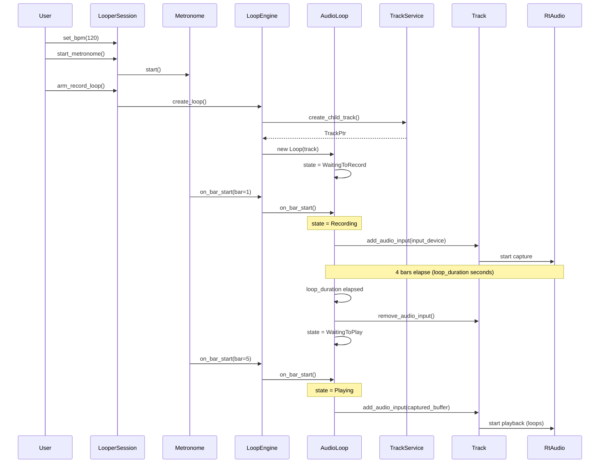
```mermaid
sequenceDiagram

    participant User
    participant LooperSession
    participant Metronome
    participant LoopEngine
    participant AudioLoop
    participant TrackService
    participant Track
    participant RtAudio

    User->>LooperSession: set_bpm(120)
    User->>LooperSession: start_metronome()
    LooperSession->>Metronome: start()

    User->>LooperSession: arm_record_loop()
    LooperSession->>LoopEngine: create_loop()
    LoopEngine->>TrackService: create_child_track()
    TrackService-->>LoopEngine: TrackPtr
    LoopEngine->>AudioLoop: new Loop(track)
    AudioLoop->>AudioLoop: state = WaitingToRecord

    Metronome->>LoopEngine: on_bar_start(bar=1)
    LoopEngine->>AudioLoop: on_bar_start()
    Note over AudioLoop: state = Recording
    AudioLoop->>Track: add_audio_input(input_device)
    Track->>RtAudio: start capture

    Note over RtAudio,AudioLoop: 4 bars elapse (loop_duration seconds)

    AudioLoop->>AudioLoop: loop_duration elapsed
    AudioLoop->>Track: remove_audio_input()
    AudioLoop->>AudioLoop: state = WaitingToPlay

    Metronome->>LoopEngine: on_bar_start(bar=5)
    LoopEngine->>AudioLoop: on_bar_start()
    Note over AudioLoop: state = Playing
    AudioLoop->>Track: add_audio_input(captured_buffer)
    Track->>RtAudio: start playback (loops)
```

\newpage

### 3.7.3. Overdub (Second Loop)

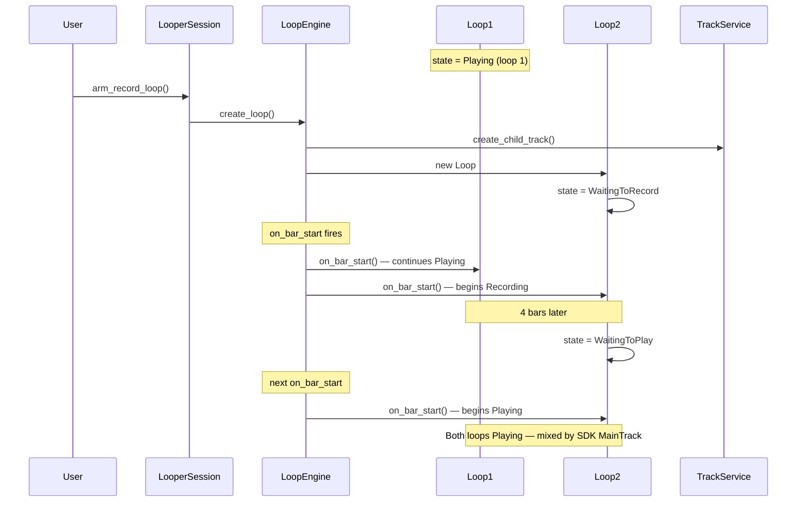
```mermaid
sequenceDiagram

    participant User
    participant LooperSession
    participant LoopEngine
    participant Loop1
    participant Loop2
    participant TrackService

    Note over Loop1: state = Playing (loop 1)

    User->>LooperSession: arm_record_loop()
    LooperSession->>LoopEngine: create_loop()
    LoopEngine->>TrackService: create_child_track()
    LoopEngine->>Loop2: new Loop
    Loop2->>Loop2: state = WaitingToRecord

    Note over LoopEngine: on_bar_start fires
    LoopEngine->>Loop1: on_bar_start() — continues Playing
    LoopEngine->>Loop2: on_bar_start() — begins Recording

    Note over Loop1,Loop2: 4 bars later
    Loop2->>Loop2: state = WaitingToPlay

    Note over LoopEngine: next on_bar_start
    LoopEngine->>Loop2: on_bar_start() — begins Playing

    Note over Loop1,Loop2: Both loops Playing — mixed by SDK MainTrack
```

\newpage

### 3.7.4. Delete a Loop

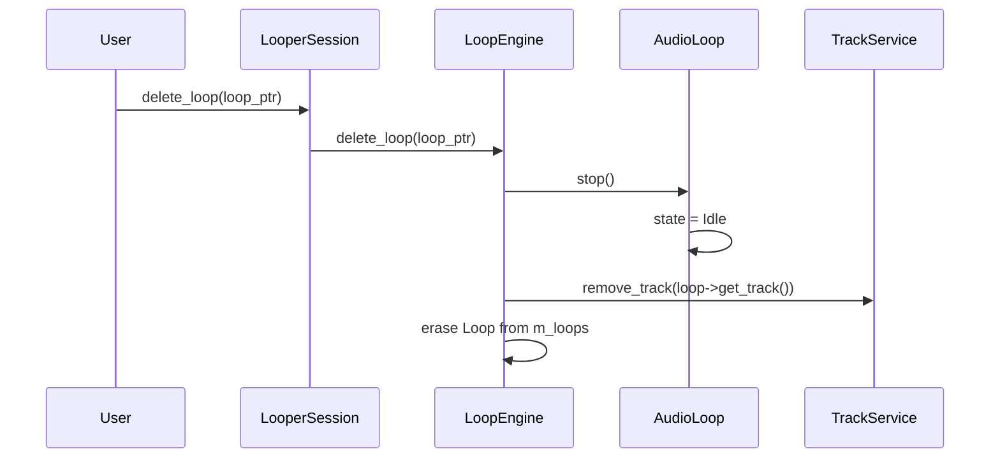
```mermaid
sequenceDiagram

    participant User
    participant LooperSession
    participant LoopEngine
    participant AudioLoop
    participant TrackService

    User->>LooperSession: delete_loop(loop_ptr)
    LooperSession->>LoopEngine: delete_loop(loop_ptr)
    LoopEngine->>AudioLoop: stop()
    AudioLoop->>AudioLoop: state = Idle
    LoopEngine->>TrackService: remove_track(loop->get_track())
    LoopEngine->>LoopEngine: erase Loop from m_loops
```

\newpage

## 3.8. Structure View

### 3.8.1. Project Structure

```bash
looper/
    CMakeLists.txt
    include/
        metronome.h         # Metronome — timing, BPM, bar callbacks
        loop.h              # Loop — state machine, capture buffer
        loop_engine.h       # LoopEngine — manages collection of Loops
        looper_session.h    # LooperSession — top-level API for the application
    src/
        metronome.cpp
        loop.cpp
        loop_engine.cpp
        looper_session.cpp
    main.cpp                # Entry point — CLI or GPIO input handling
```

The looper links against the installed `miniaudioengine` SDK target from CMake. It does not add any files inside `src/` of the SDK.

\newpage

### 3.8.2. Thread Structure

| Thread | Owner | Description |
| -- | -- | -- |
| Main | OS | User command handling, session control. Non-real-time. |
| Metronome | `Metronome` | High-priority thread; sleeps with `std::this_thread::sleep_until` to fire bar and beat callbacks. |
| RtAudio callback | RtAudio (via SDK) | Real-time audio I/O thread; calls SDK `AudioController` internals. No looper logic runs here. |

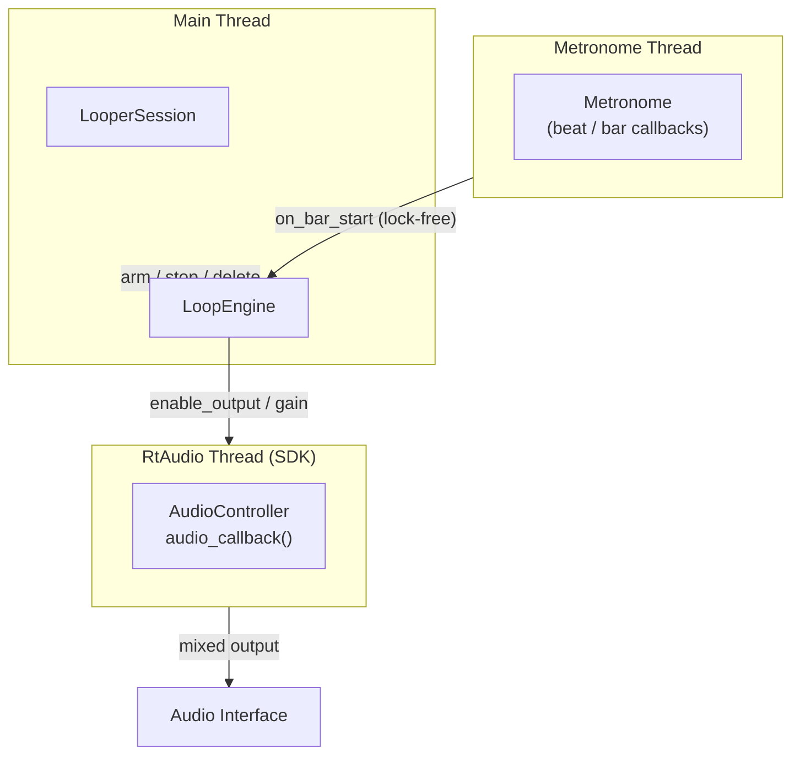
```mermaid
graph TD
    subgraph Main["Main Thread"]
        LooperSession
        LoopEngine
    end

    subgraph MetronomeThread["Metronome Thread"]
        MetronomeTimer["Metronome\n(beat / bar callbacks)"]
    end

    subgraph RtAudio["RtAudio Thread (SDK)"]
        AudioCallback["AudioController\naudio_callback()"]
    end

    Main -->|"arm / stop / delete"| LoopEngine
    MetronomeThread -->|"on_bar_start (lock-free)"| LoopEngine
    LoopEngine -->|"enable_output / gain"| RtAudio
    RtAudio -->|"mixed output"| AudioInterface["Audio Interface"]
```

\newpage

### 3.8.3. Real-Time Safety Boundary

The looper application does **not** execute any code directly inside the RtAudio callback. All state transitions (`WaitingToRecord → Recording`, capture buffer management, track enable/disable) happen on the Metronome thread, which is separated from the real-time audio thread. The SDK's `Track::enable_output()` uses `std::atomic` and is therefore safe to call from the Metronome thread concurrently with the RtAudio callback.

\newpage

# 4. Design Rationale

## 4.1. Why a Separate Application Layer?

The looper introduces concepts — metronome-quantised recording, capture buffers, loop state machines — that are not part of the audio engine's responsibilities. Keeping this logic in a dedicated application layer above the SDK preserves the SDK's generality and avoids modifying tested, stable code.

## 4.2. Quantisation to Bar Boundaries

Recording loops that are not aligned to a bar boundary would create phase drift between layers. By arming the recorder on user input and starting capture only when `on_bar_start` fires, every loop is guaranteed to be exactly `loop_duration_seconds` long, and all loops remain in phase regardless of when the user pressed the button.

## 4.3. In-Memory Capture Buffer

Rather than writing recordings to a temporary WAV file and reloading them through `FileService`, the `Loop` object owns a `std::vector<float>` capture buffer that is populated sample-by-sample during recording. On transition to `Playing`, the same buffer is fed back into the SDK track as a pre-loaded audio source. This avoids file system latency on the embedded platform and removes the need for temporary file cleanup.

The capture buffer is pre-allocated at `LoopEngine::create_loop()` time (sized to `loop_duration_seconds × sample_rate × channels`) to avoid heap allocation during the recording phase.

## 4.4. Mute via SDK `enable_output`

Loop muting does not stop the underlying track or reset the playback position — the SDK track continues to process audio internally, but `Track::enable_output(false)` prevents its output buffer from being mixed into the master output. This ensures that un-muting a loop re-enters playback phase-locked with all other active loops.

## 4.5. Metronome Thread vs. Real-Time Callback

The Metronome runs on a dedicated thread using `std::this_thread::sleep_until` for timing, not inside the RtAudio callback. This means bar-start events are delivered with normal thread-scheduling precision (~1–5 ms jitter on a standard Linux kernel). For a musician-facing looper on a Raspberry Pi this is an acceptable trade-off. If sub-millisecond boundary accuracy is required in future, the bar-start trigger can be moved into the RtAudio callback by tracking elapsed frame counts and comparing against the pre-computed loop-length frame count.

## 4.6. Single Audio Input Device

The looper uses a single audio input device (the audio interface input) shared by all loops. Recording is serialised: only one loop can be in `Recording` state at any given time. Multiple loops can be simultaneously in `Playing` state; the SDK's `MainTrack` audio callback mixes them.
